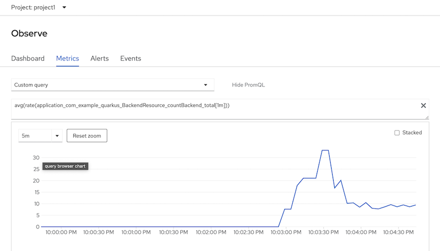
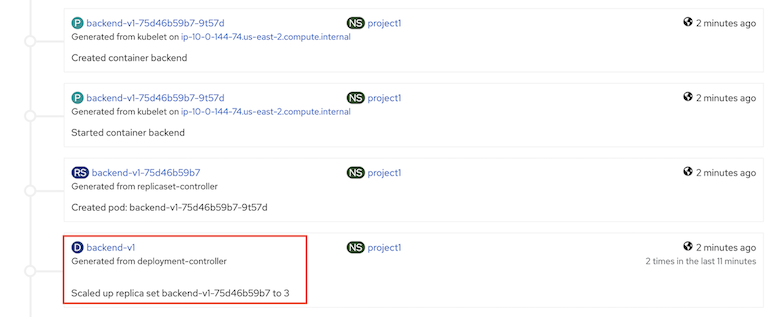
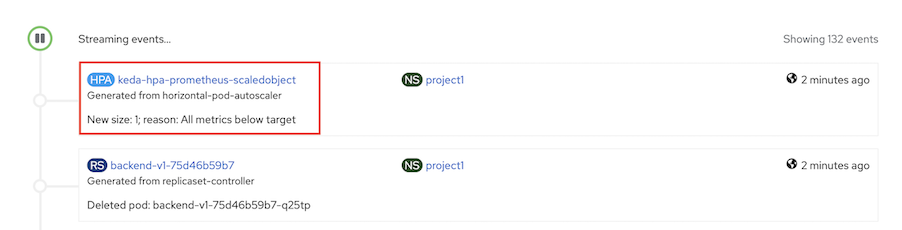
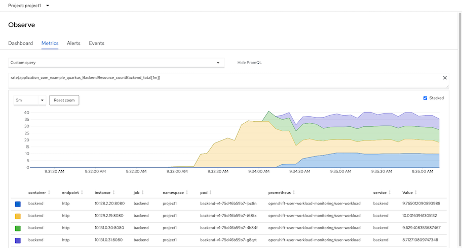

# KEDA
- [KEDA](#keda)
  - [Install Operator](#install-operator)
  - [Scale by Application Metrics](#scale-by-application-metrics)
    - [Prepare Application](#prepare-application)
    - [Configure ScaledObject](#configure-scaledobject)
    - [Test](#test)

## Install Operator

- install KEDA Operator
  
  

- create [KEDA controller](manifests/keda-controller.yaml) in namesapce keda
  
  ```bash
  oc create -f manifests/keda-controller.yaml
  ```
  
  Verify controller pod is rum and running.

  ```bash
  oc -n keda get pods
  ```

  output
  
  ```bash
  NAME                                     READY   STATUS    RESTARTS   AGE
  keda-metrics-apiserver-d9df8cc9c-h9t7m   1/1     Running   0          1m
  keda-olm-operator-785f98bc6d-6lvbw       1/1     Running   0          29s
  keda-operator-75bf78b6fb-kjzzd           1/1     Running   0          1m
  ```

## Scale by Application Metrics

### Prepare Application
- Enable [user workload monitoring](application-metrics.md#prerequisites) if your cluster still not enable this feature.
- Deploy frontend-v1 and backend-v1 application to namespace project1
  
  ```bash
  oc apply -f manifests/frontend.yaml -n project1
  oc apply -f manifests/backend.yaml -n project1
  oc set env deployment/frontend-v1 BACKEND_URL=http://backend:8080/ -n project1
  oc set env deployment/frontend-v2 BACKEND_URL=http://backend:8080/ -n project1
  oc delete deployment frontend-v2 -n project1
  oc delete deployment backend-v2 -n project1
  ```
- Create [service monitor](manifests/backend-monitor.yaml) to monitor backend service
  
  ```bash
  oc apply -f manifests/backend-monitor.yaml -n project1
  ```

### Configure ScaledObject

- Create Service Account *app-monitor* for KEDA to use for query Thanos
  
  ```bash
  oc create sa app-monitor
  ```

- Add role *cluster-monitoring-view* to service account *app-monitor*
  
  ```bash
  oc adm policy add-cluster-role-to-user cluster-monitoring-view \
  -z app-monitor -n project1
  ```

- Let's say we want to scale backend by concurrent request of each pod. Following PromQL will average concurrent request/min for each pod
  
  ```
  avg(rate(application_com_example_quarkus_BackendResource_countBackend_total[1m]))
  ```

  Test by generate load to application with 50 concurrent request.

  Use K6

  ```bash
    oc run load-test -n project1 -i --rm \
    --image=loadimpact/k6 --rm=true --restart=Never \
    --  run -  < manifests/load-test-k6.js \
    -e URL=https://$(oc get route frontend -n project1 -o jsonpath='{.spec.host}') \
    -e THREADS=50 -e DURATION=5m -e RAMPUP=1s -e RAMPDOWN=0s
  ```

  Use *siege* CLI

  ```bash
  siege -c 50 -t 5m https://$(oc get route frontend -n project1 -o jsonpath='{.spec.host}')
  ```
  
  Check on Developer console and navigate to Observe -> Metrics -> Custom Query and input following PromQL

  ```
  avg(rate(application_com_example_quarkus_BackendResource_countBackend_total[1m]))
  ```
  
  Following graph show average request/min from all backend pods in namesapce project1

  

- Create [ScaledObject](manifests/keda-prometheus-scaledout.yaml)
Review ScaledObject YAML
  - scaleTargetRef is configure to monitor deployment object name backend-v1
  - Prometheus address is configure to OpenShift's Thanos Querier in namespace openshift-monitoring
  - Bearer token for access OpenShift's Thanos Querier stored in secret name keda-prom-creds
  - Check for average request/min of backend pods if exceed 10

  ```yaml
  spec:
    pollingInterval: 10
    cooldownPeriod: 120
    minReplicaCount: 1
    maxReplicaCount: 20
    scaleTargetRef:
      kind: Deployment  
      name: backend-v1  # Monitor for Deployment named backend-v1
    triggers:
      - type: prometheus
        metadata:
          serverAddress: https://thanos-querier.openshift-monitoring.svc.cluster.local:9091
          metricName: application_com_example_quarkus_BackendResource_countBackend_total
          metricType: Value
          threshold: '10'
          query: avg(rate(application_com_example_quarkus_BackendResource_countBackend_total[1m]))
          authModes: "bearer"
          namespace: project1
        authenticationRef:
          name: keda-prom-creds
  ```

  We need to configure bearer token and root CA for ScaledObject to access OpenShift's Thanos in namesapce openshift-monitoring.

  ```bash
  BEARER_TOKEN=$(oc serviceaccounts get-token  app-monitor -n project1|base64)
  CUSTOM_CA_CERT=$(oc get -n openshift-monitoring secret thanos-querier-tls -o jsonpath="{.data['tls\.crt']}")
  cat manifests/keda-prometheus-scaledout.yaml| \
  sed 's/BEARER_TOKEN/'$BEARER_TOKEN'/'| \
  sed 's/CUSTOM_CA_CERT/'$CUSTOM_CA_CERT'/'| \
  oc create -n project1 -f -
  ```

  Verify that ScaledObject is ready

  ```bash
  oc get -n project1 scaledobject.keda.sh/prometheus-scaledobject
  ```

  Output

  ```bash
  NAME                      SCALETARGETKIND      SCALETARGETNAME   MIN   MAX   TRIGGERS     AUTHENTICATION    READY   ACTIVE   FALLBACK   AGE
  prometheus-scaledobject   apps/v1.Deployment   backend-v1        1     20    prometheus   keda-prom-creds   True    False    False      2m
  ```

### Test

- Create 50 concurrent request to application. KEDA will scale up backend pods when average request/min of pods is exceed 10
  
  - Use K6
    
    ```bash
    oc run load-test -n project1 -i --rm \
    --image=loadimpact/k6 --rm=true --restart=Never \
    --  run -  < manifests/load-test-k6.js \
    -e URL=https://$(oc get route frontend -n project1 -o jsonpath='{.spec.host}') \
    -e THREADS=50 -e DURATION=5m -e RAMPUP=1s -e RAMPDOWN=0s
    ```

  - Use siege
  
    ```bash
    siege -c 50 -t 5m https://$(oc get route frontend -n project1 -o jsonpath='{.spec.host}')
    ```


- Check event from Developer console
  
  

  check backend pods

  ```bash
  watch oc get pods -n project1 -l app=backend
  ```

  Output

  ```bash
  NAME                          READY   STATUS    RESTARTS   AGE
  backend-v1-75d46b59b7-4h84f   1/1     Running   0          48s
  backend-v1-75d46b59b7-g8qrt   1/1     Running   0          33s
  backend-v1-75d46b59b7-lpc8n   1/1     Running   0          33s
  backend-v1-75d46b59b7-t68tx   1/1     Running   1          11h
  ```

- KEDA will scale down backend pods when average request/min of pods is below 10 after 2 minutes. This duration is configured by *spec.colldownPeriod*
  
  ```yaml
  spec:
    pollingInterval: 10
    cooldownPeriod: 120
    minReplicaCount: 1
    maxReplicaCount: 20  
  ```

  
  check event from Developer console

  

  check that each pod request/min is around 10

  