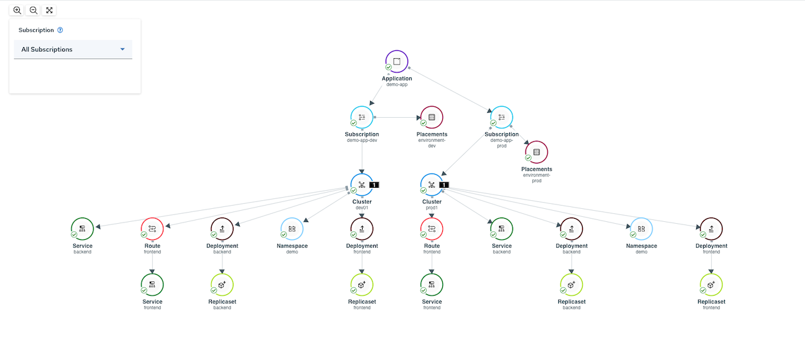
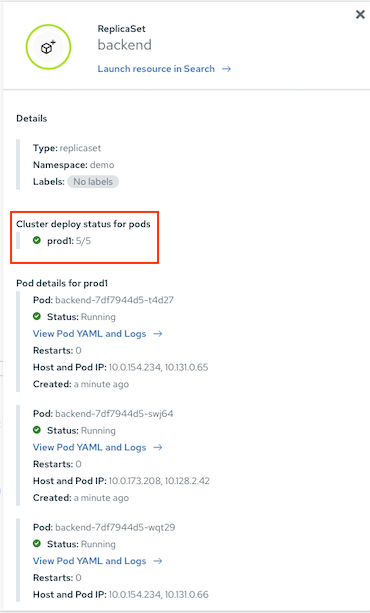
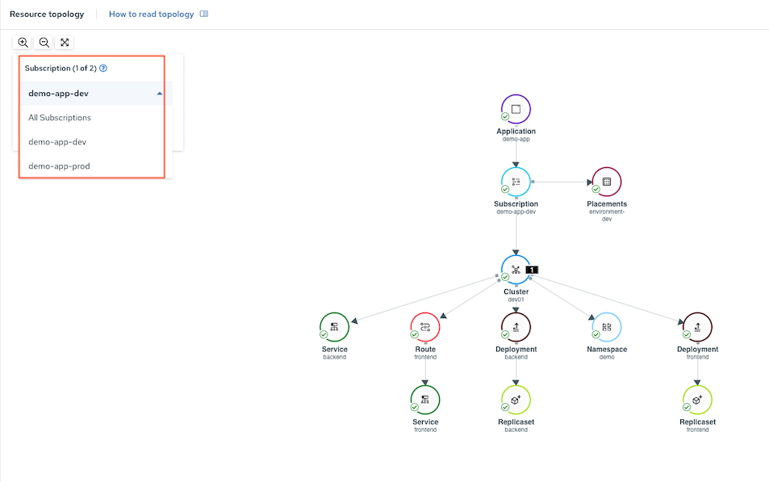

# Application Management with RHACM
- [Application Management with RHACM](#application-management-with-rhacm)
  - [RHACM Environment](#rhacm-environment)
  - [Demo Application with Kustomize](#demo-application-with-kustomize)
  - [RHACM Configuration](#rhacm-configuration)
  - [ACM Console](#acm-console)

## RHACM Environment

RHACM with 2 managed clusters 
- Production Cluster(s) labeled with *environment=prod*
- Development Cluster(s) labled with *environment=dev*

## Demo Application with Kustomize

- [Frontend/Backend App](manifests/apps-kustomize) with 2 overlays for *dev* and *prod*
  - Number of replicas
  - Backend's environment variables
  - Frontend's environment variables

  ```bash
    .
    ├── base
    │   ├── backend-service.yaml
    │   ├── backend.yaml
    │   ├── frontend-service.yaml
    │   ├── frontend.yaml
    │   ├── kustomization.yaml
    │   ├── namespace.yaml
    │   └── route.yaml
    └── overlays
        ├── dev
        │   ├── backend.yaml
        │   ├── frontend.yaml
        │   └── kustomization.yaml
        └── prod
            ├── backend.yaml
            ├── frontend.yaml
            └── kustomization.yaml
  ```

## RHACM Configuration
- RHACM application managment configuration
  - Create [Namespace](manifests/acm-app-management/01_namespace.yaml)
  - Create [Channel](manifests/acm-app-management/02_channel.yaml)
  - Create [Applicatoion](manifests/acm-app-management/03_application_demo_app.yaml) 
  - Create subscription for [production](manifests/acm-app-management/04_subscription_prod.yaml) and [development](manifests/acm-app-management/05_placement_dev.yaml) environment
  - Create placement rule for [production](manifests/acm-app-management/05_placement_prod.yaml) and [development](manifests/acm-app-management/05_placement_dev.yaml) environment

- Deploy
  
  ```bash
  oc apply -f manifests/acm-app-management/01_namespace.yaml
  oc apply -f manifests/acm-app-management/02_channel.yaml
  oc apply -f manifests/acm-app-management/03_application_demo_app.yaml
  oc apply -f manifests/acm-app-management/04_subscription_dev.yaml
  oc apply -f manifests/acm-app-management/04_subscription_prod.yaml
  oc apply -f manifests/acm-app-management/05_placement_dev.yaml
  oc apply -f manifests/acm-app-management/05_placement_prod.yaml
  ```

  or

  ```bash
  for i in $(ls -1 manifests/acm-app-management)
  do
    oc apply -f manifests/acm-app-management/$i
  done
  ```

## ACM Console
- Demo App topology

  

- Check number of replicas for prod

   

- Filter by subscription

  
 