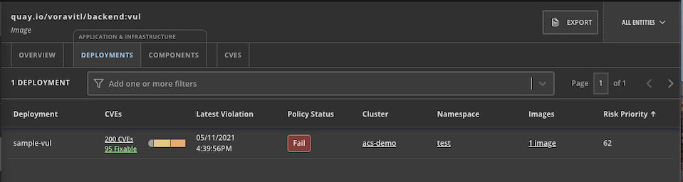
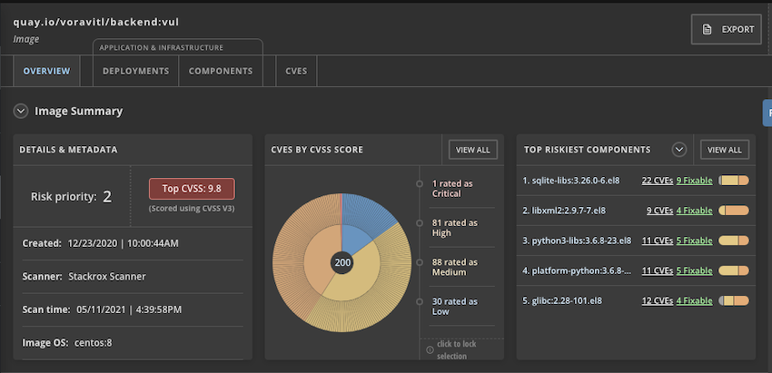

# ACS
- [ACS](#acs)
  - [Installation](#installation)
    - [CLI](#cli)
    - [Configure helm repo](#configure-helm-repo)
    - [Central](#central)
    - [Secured Cluster Services](#secured-cluster-services)
    - [Test](#test)

## Installation
### CLI

- Install roxctl CLI on OSX

  ```bash
  curl -O https://mirror.openshift.com/pub/rhacs/assets/3.0.59.1/bin/Darwin/roxctl
  ```
### Configure helm repo
- Set helm repo

    ```bash
    helm repo add rhacs https://mirror.openshift.com/pub/rhacs/charts/
    helm search repo -l rhacs/
    helm repo update
    ```
### Central

- Install on OpenShift

    ```bash
    helm install -n stackrox --create-namespace \
    stackrox-central-services rhacs/central-services \
    --set imagePullSecrets.allowNone=true \
    --set central.exposure.route.enabled=true
    ```

    Install with cert
    
    ```bash
    helm install -n stackrox --create-namespace \
    stackrox-central-services rhacs/central-services \
    --set imagePullSecrets.allowNone=true \
    --set central.exposure.route.enabled=true \
    --set-file central.defaultTLS.cert=/path/to/tls-cert.pem \
    --set-file central.defaultTLS.key=/path/to/tls-key.pem
    ```

- Save user/password
  
    ```bash
    StackRox 3.0.59.1 has been installed.

    An administrator password has been generated automatically. Use username 'admin' and the following
    password to log in for initial setup:

    Ixd3*********************Pw***
    ```
- Check Stackrox's Central pods
    
    ```bash
    oc get pods -n stackrox
    ```

    Output

    ```bash
    NAME                          READY   STATUS    RESTARTS   AGE
    central-99db969b8-fpbrh       1/1     Running   0          46s
    scanner-5b4689dd74-9n64m      1/1     Running   0          46s
    scanner-5b4689dd74-kkqdz      0/1     Running   0          46s
    scanner-5b4689dd74-qbnqp      0/1     Running   0          46s
    scanner-db-6bdb7845b4-qksgc   1/1     Running   0          46s
    ```

- Check for Central's route
  
    ```bash
    echo "https://$(oc get route central -n stackrox -o jsonpath='{.spec.host}')"
    ```

### Secured Cluster Services
- Create *authentication token*
  - Login to Central
  - Platform Configuration -> Integrations -> Authentication Tokens Select StackRox API Token then generate token and copy token to clipboard
    - Token Name: admin
    - Role: Admin

- Set environment variable
    
    ```bash
    export ROX_API_TOKEN=<api-token>
    export ROX_CENTRAL_ADDRESS=$(oc get route central -n stackrox -o jsonpath='{.spec.host}'):443
    ```


- Install Secure Cluster Services on local cluster
  - Generate cluster init bundle
  
    ```bash
    CLUSTER_NAME=cluster1
    roxctl --insecure-skip-tls-verify -e "$ROX_CENTRAL_ADDRESS" central init-bundles generate $CLUSTER_NAME \
    --output $CLUSTER_NAME-init-bundle.yaml
    ```

  - Create collectors
    
    ```bash
    helm install -n stackrox --create-namespace stackrox-secured-cluster-services rhacs/secured-cluster-services \
    -f ${CLUSTER_NAME}-init-bundle.yaml \
    --set clusterName=${CLUSTER_NAME} \
    --set imagePullSecrets.allowNone=true
    ```
    
-  Install Secure Cluster Services on Remote cluster
  - Generate cluster init bundle
  
    ```bash
    CLUSTER_NAME=cluster2
    roxctl --insecure-skip-tls-verify -e "$ROX_CENTRAL_ADDRESS" central init-bundles generate $CLUSTER_NAME \
    --output $CLUSTER_NAME-init-bundle.yaml
    ```

  - Create collectors
    
    ```bash
    helm install -n stackrox --create-namespace stackrox-secured-cluster-services rhacs/secured-cluster-services \
    -f ${CLUSTER_NAME}-init-bundle.yaml \
    --set centralEndpoint=${ROX_CENTRAL_ADDRESS} \
    --set clusterName=${CLUSTER_NAME} \
    --set imagePullSecrets.allowNone=true
    ```

 - Check collector pods
  
    ```bash
    oc get pods -n stackrox -l app=collector,app.kubernetes.io/name=stackrox
    ```

    Output
    
    ```bash
    NAME              READY   STATUS    RESTARTS   AGE
    collector-5hmzt   2/2     Running   0          87s
    collector-dmpps   2/2     Running   0          87s
    collector-ffpdg   2/2     Running   0          87s
    collector-rfkq2   2/2     Running   0          87s
    collector-x4gtb   2/2     Running   0          87s
    ```
- Check managed clusters on ACS console. Platform Configuration -> Clusters
  
  

### Test
- Deploy sample application

    ```bash
    oc new-project test
    oc run sample-vul --labels=app=backend --image=quay.io/voravitl/backend:vul -n test 
    watch oc get pods -n test
    ```
- Check ACS console
  
  

  Details

  

- Scan with CLI
  
  ```bash
  roxctl --insecure-skip-tls-verify image check -e https://${ROX_CENTRAL_ADDRESS} --image quay.io/voravitl/backend:vul
  ```