# Advanced Cluster Security for Kubernetes (ACS)
- [Advanced Cluster Security for Kubernetes (ACS)](#advanced-cluster-security-for-kubernetes-acs)
  - [Installation](#installation)
    - [Central Installation](#central-installation)
      - [\[Optional\] Create Central at Infra Nodes](#optional-create-central-at-infra-nodes)
      - [Access Central](#access-central)
    - [Single Sign-On with OpenShift](#single-sign-on-with-openshift)
    - [Secured Cluster Services (Managed Cluster)](#secured-cluster-services-managed-cluster)
      - [Operator](#operator)
    - [Install Secure Cluster Services on remote cluster](#install-secure-cluster-services-on-remote-cluster)
      - [CLI roxctl and Helm](#cli-roxctl-and-helm)
      - [View Managed Cluster](#view-managed-cluster)
    - [Integration with Nexus](#integration-with-nexus)
      - [Setup Nexus](#setup-nexus)
      - [Config ACS](#config-acs)
  - [Container Image with Vulnerabilities](#container-image-with-vulnerabilities)
  - [Shift Left Security](#shift-left-security)
    - [kube-linter](#kube-linter)
    - [Scan and check image with roxctl](#scan-and-check-image-with-roxctl)
  - [Sample of Default Policies](#sample-of-default-policies)
  - [Enforce policy on Buid Stage](#enforce-policy-on-buid-stage)
    - [Use roxctl in Pipeline](#use-roxctl-in-pipeline)
    - [Stackrox Jenkins Plugin](#stackrox-jenkins-plugin)
    - [Enable Policy](#enable-policy)
  - [Enforce policy on Deployment Stage](#enforce-policy-on-deployment-stage)
  - [Enforce policy on Runtime Stage](#enforce-policy-on-runtime-stage)
    - [Exec into Pod](#exec-into-pod)
    - [NMAP](#nmap)
  - [Compliance](#compliance)
    - [Overall reports](#overall-reports)
    - [Compliance Operator](#compliance-operator)
  - [Network Graph](#network-graph)
    - [Sample Application](#sample-application)
    - [Network Policies](#network-policies)

## Installation

### Central Installation

- Install Operator 
  
  - Web Console
    - Select *Advanced Cluster Security for Kubernetes* 


    


    - Accept default parameters

    
    
  
  - Use CLI to install [operator](manifests/acs-subscription.yaml)
    
    ```bash
    oc create -f manifests/acs-subscription.yaml
    oc get csv -n rhacs-operator
    ```

    Output

    ```bash
    namespace/rhacs-operator created
    operatorgroup.operators.coreos.com/rhacs-operator-bqbtj created
    subscription.operators.coreos.com/rhacs-operator created
    NAME                    DISPLAY                                    VERSION   REPLACES                PHASE
    rhacs-operator.v4.2.2   Advanced Cluster Security for Kubernetes   4.2.2     rhacs-operator.v4.2.1   Succeeded
    ```
  
  Remark: It should be better if you choose *Manual* for *Update Approval* instead of *Automatic* for production environment

- Install *roxctl* CLI
  - Download latest binary from [here](https://mirror.openshift.com/pub/rhacs/assets/latest/bin/)
    
    - For OSX
      
      ```bash
      curl -O https://mirror.openshift.com/pub/rhacs/assets/latest/bin/Darwin/roxctl
      ```
    
    - Or use roxctl from container

    ```bash
    podman run docker://quay.io/stackrox-io/roxctl <parameter here>
    ```

<!-- - Create namespace for central server and scanner.

  ```bash
  oc new-project stackrox
  ``` -->

- Create ACS Central with [acs-central.yaml](manifests/acs-central.yaml)
  
  - If you want to use custom certificate storedfor central add following section to [acs-central.yaml](manifests/acs-central.yaml)
  
    ```yaml
    spec:
      central:
        defaultTLSSecret:
          name: acs-central
    ```

    <!-- - *Optional:* Copy default TLS from default router to secret name *acs-central*
    
      ```bash
      oc get secret $(oc get secret -n openshift-ingress -o=custom-columns="NAME:.metadata.name" --no-headers | grep ingress-certs) -n openshift-ingress -o yaml | sed 's/namespace: .*/namespace: stackrox/' | sed 's/name: .*/name: acs-central/' | oc apply -n stackrox  -f -
      ``` -->

- Create Central

  ```bash
  oc create -f manifests/acs-central.yaml 
  ```

  *Remark*
  - Central is configured with memory limit 8 Gi
  - Default RWO storage for central is 100 GB
  
  Output

  ```bash
  central.platform.stackrox.io/stackrox-central-services created
  ```
- Check status
  
  ```bash
  oc describe central/stackrox-central-services -n stackrox
  watch oc get pods -n stackrox
  ```

  Output
  
  ```bash
  NAME                          READY   STATUS    RESTARTS   AGE
  central-9c5567677-s9ggb       1/1     Running   0          2m44s
  central-db-77b8c8d6c9-2jcr2   1/1     Running   0          2m44s
  scanner-566f5f5b5b-d6t6d      1/1     Running   0          2m44s
  scanner-566f5f5b5b-tfgng      1/1     Running   0          2m44s
  scanner-db-69cd9c4949-hpc4f   1/1     Running   0          2m44s
  ```

  Check PVC

  ```bash
  oc get pvc -n stackrox
  ```

  Output

  ```bash
  NAME         STATUS   VOLUME                                     CAPACITY   ACCESS MODES   STORAGECLASS   AGE
  central-db   Bound    pvc-a4b5a0ec-7e28-495c-860c-c715aefd836c   100Gi      RWO            gp3-csi        100s
  ```

  Resources consumed by ACS central
  
  - CPU
  
    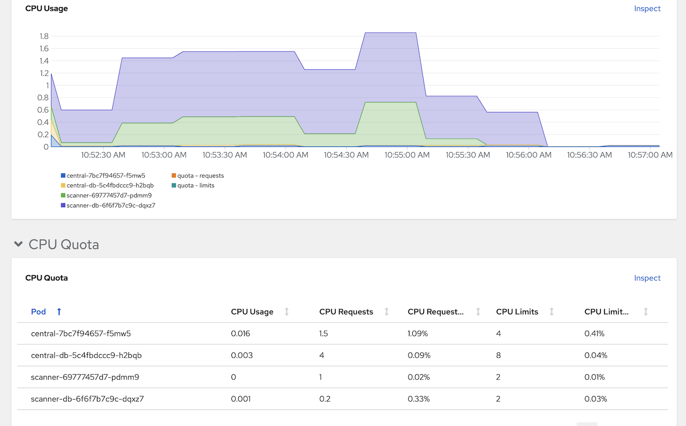

  - Memory
  
    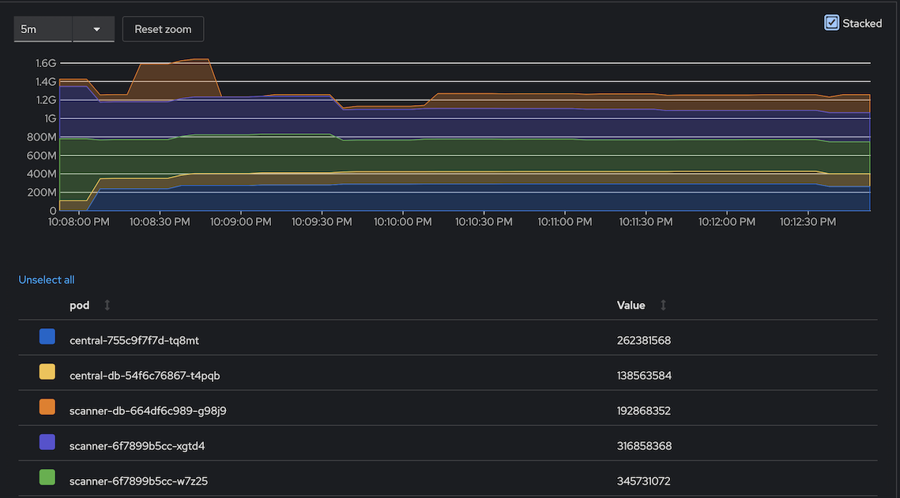

#### [Optional] Create Central at Infra Nodes
  - Infra Nodes preparation

    - Label Infra nodes
      
      ```bash
      oc label node <node> node-role.kubernetes.io/infra=""
      oc label node <node> node-role.kubernetes.io/acs=""
      ```
    
    - Taint infra nodes with *infra-acs*
      
      ```bash
      oc adm taint node <node> infra-acs=reserved:NoSchedule
      ```
  - Create Central with [acs-central-infra.yaml](manifests/acs-central-infra.yaml)
    
    ```bash
    oc create -f manifests/acs-central-infra.yaml -n stackrox
    ```

#### Access Central

- URL and password to access ACS Console
  
  ```bash
  ROX_URL=https://$(oc get route central -n stackrox -o jsonpath='{.spec.host}')
  ROX_CENTRAL_ADDRESS=$(oc get route central -n stackrox -o jsonpath='{.spec.host}'):443
  ROX_PASSWORD=$(oc get secret central-htpasswd -n stackrox -o jsonpath='{.data.password}'|base64 -d)
  ```

### Single Sign-On with OpenShift
- Navigate to Platform Configuration -> Access Control then click *Create auth Provider* and select *OpenShift Auth*

    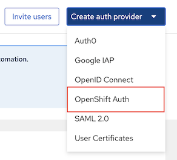

- Input configuration then click save
  - Name: OpenShift
  - Minium access role: Analyst
  - Rules: mapped spcific user to Admin role

    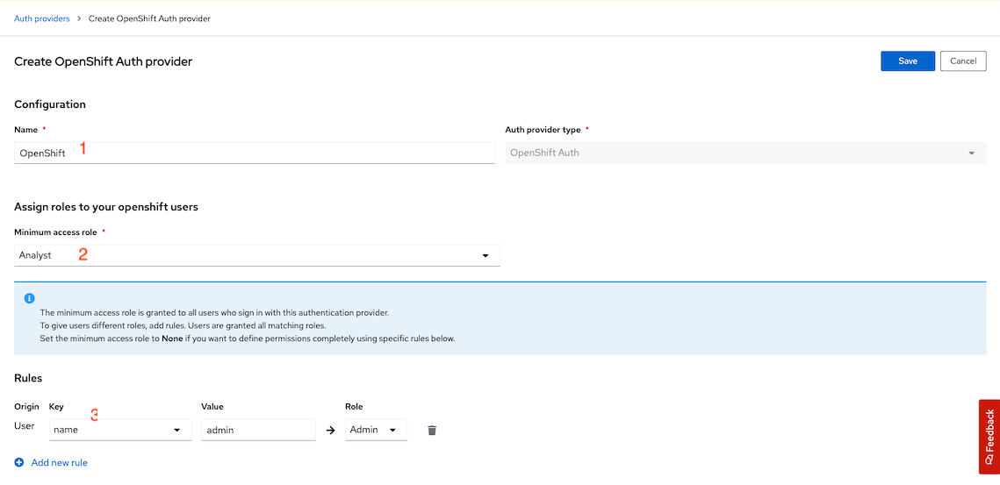
  
  - Logout and refresh your browser. OpenShift provider will be available for you to login with OpenShift's user account

    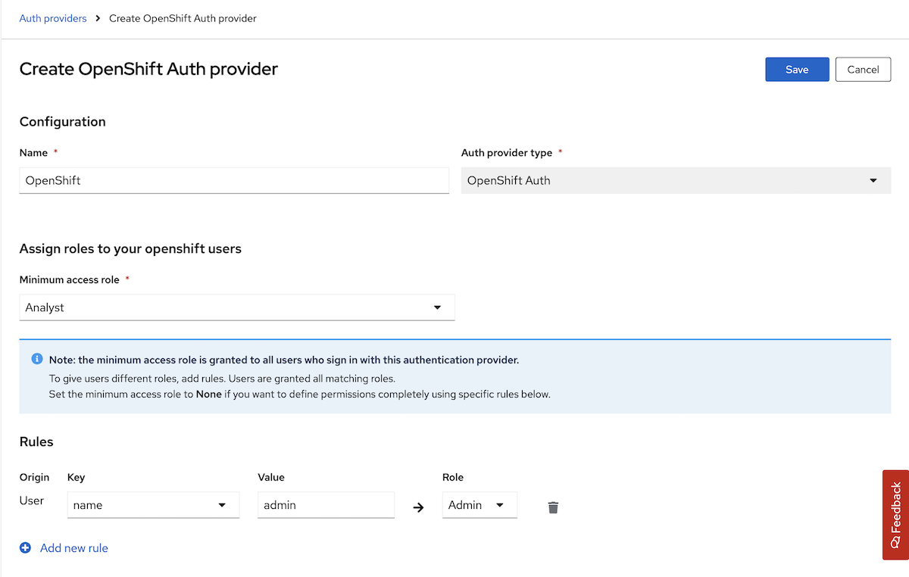


### Secured Cluster Services (Managed Cluster)

#### Operator

- Login to ACS console
- Generate cluster init bundle
  - Platform Configuration -> Integrations -> Cluster Init Bundle -> Generate Bundle

    

  - Input cluster name
  - download *Kubernetes Secrets file* for installation with *Operator* or *Helm values file* for installation with *roxctl*

- Create namespace for *Secured Cluster Services*
  
  ```bash
  oc new-project stackrox-secured-cluster
  ```

- Create secret from previously downloaded *Kubernetes Secrets file*
  
  ```bash
  oc create -f cluster1-cluster-init-secrets.yaml -n stackrox-secured-cluster
  ```

  Output

  ```bash
  secret/admission-control-tls created
  secret/collector-tls created
  secret/sensor-tls created
  ```

- Install Secure Cluster Services on local cluster

    - Create Secured Cluster Service with [acs-secured-cluster.yaml](manifests/acs-secured-cluster.yaml)
      
      ```bash
      oc create -f manifests/acs-secured-cluster.yaml -n stackrox-secured-cluster
      ```

      Remark: [acs-secured-cluster.yaml](manifests/acs-secured-cluster.yaml) is prepared for install Secured Cluster Service within the same cluster with Central.

      If you want Admission Control run on Infra Nodes with [acs-secured-cluster-infra.yaml](manifests/acs-secured-cluster-infra.yaml)

      ```bash
      oc create -f manifests/acs-secured-cluster-infra.yaml -n stackrox-secured-cluster
      ```

    - Check status
      
      ```bash
      oc get securedcluster/cluster1  -n stackrox-secured-cluster -o jsonpath='{.status.conditions[0]}'
      oc get pods -n stackrox-secured-cluster
      ```

      Output

      ```bash
      {"lastTransitionTime":"2023-11-07T06:13:02Z","message":"StackRox Secured Cluster Services 4.2.2 has been installed.\n\n\n\nThank you for using StackRox!\n","reason":"InstallSuccessful","status":"True","type":"Deployed"}
      NAME                                 READY   STATUS    RESTARTS        AGE
      admission-control-64487c7986-ff6j9   1/1     Running   0               10m
      admission-control-64487c7986-t25ng   1/1     Running   0               10m
      admission-control-64487c7986-wjl7w   1/1     Running   0               10m
      collector-dpjfk                      3/3     Running   0               10m
      collector-mj778                      3/3     Running   0               10m
      collector-n8cch                      3/3     Running   0               10m
      collector-z49pb                      3/3     Running   0               10m
      scanner-7f75dd5879-m6cfm             1/1     Running   0               10m
      scanner-7f75dd5879-vpkcj             1/1     Running   0               10m
      scanner-db-6c555b4b7d-x49hl          1/1     Running   0               10m
      sensor-65c777cf9f-c8zvx              1/1     Running   0               10m
      ```

      Remark
      - Adminission control is high availability with default 3 pods
      - Collector is run on every nodes including control plane

  Resources consumed by admission control and collector
  
  - CPU
  
    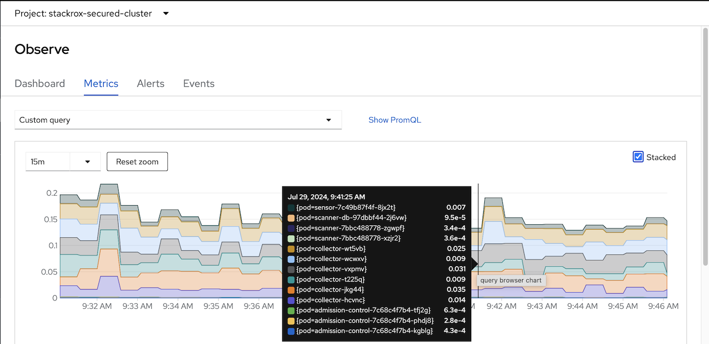

  - Memory
  
    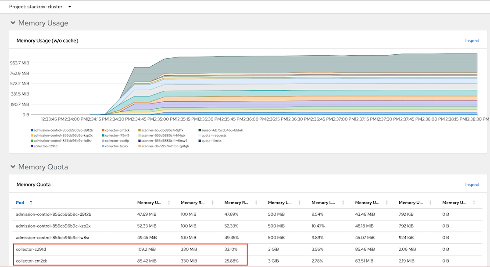

### Install Secure Cluster Services on remote cluster

  - Generate cluster init bundle
  - Create secret from previously downloaded *Kubernetes Secrets file* 
      
      ```bash
      oc new-project stackrox-secured-cluster
      oc create -f cluster2-cluster-init-secrets.yaml -n stackrox-secured-cluster
      ```
  - Install ACS operator
  - Create Secured Cluster Service with centralEndpoint set to Central's route. 
      
    Get Central's route and save to ROX_HOST environment variable

      ```bash
      ROX_HOST=$(oc get route central -n stackrox -o jsonpath='{.spec.host}')
      ```

    Login to remote cluster and run following command.

      ```bash
      cat manifests/acs-secured-cluster.yaml | \
      sed 's/central.stackrox.svc/'$ROX_HOST'/' | \
      sed s/cluster1/cluster2/ | \
      oc create -n stackrox-secured-cluster -f - 
      ```

#### CLI roxctl and Helm

- Create *authentication token*
  
  - Login to Central
    
    ```bash
    echo "ACS Console: https://$(oc get route central -n stackrox -o jsonpath='{.spec.host}')"
    ```

  - Platform Configuration -> Integrations -> Authentication Tokens. Select StackRox API Token then generate token and copy token to clipboard
  
      

    - Token Name: admin
    - Role: Admin

- Set environment variable
    
    ```bash
    export ROX_API_TOKEN=<api-token>
    export ROX_CENTRAL_ADDRESS=$(oc get route central -n stackrox -o jsonpath='{.spec.host}'):443
    ```

- Add Helm repository
  
  ```bash
  helm repo add rhacs https://mirror.openshift.com/pub/rhacs/charts/
  ```

- Install Secure Cluster Services on local cluster

    - Generate cluster init bundle
    
      ```bash
      CLUSTER_NAME=cluster1
      roxctl --insecure-skip-tls-verify -e "$ROX_CENTRAL_ADDRESS" central init-bundles generate $CLUSTER_NAME \
      --output $CLUSTER_NAME-init-bundle.yaml
      ```

      Example of output

      ```
      INFO:	Successfully generated new init bundle.

        Name:       cluster1
        Created at: 2022-05-22T07:43:47.645062387Z
        Expires at: 2023-05-22T07:44:00Z
        Created By: admin
        ID:         84c50c04-de36-450d-a5d6-7a23f1dd563c

      INFO:	The newly generated init bundle has been written to file "cluster1-init-bundle.yaml".
      INFO:	The init bundle needs to be stored securely, since it contains secrets.
      INFO:	It is not possible to retrieve previously generated init bundles.
      ```

    - Create collectors
      
      ```bash
      helm install -n stackrox-cluster --create-namespace stackrox-secured-cluster-services rhacs/secured-cluster-services \
      -f ${CLUSTER_NAME}-init-bundle.yaml \
      --set clusterName=${CLUSTER_NAME} \
      --set imagePullSecrets.allowNone=true
      ```
    
-  Install Secure Cluster Services on Remote cluster
  
     - Generate cluster init bundle
     
       ```bash
       CLUSTER_NAME=cluster2
       roxctl --insecure-skip-tls-verify -e "$ROX_CENTRAL_ADDRESS" central init-bundles generate $CLUSTER_NAME \
       --output $CLUSTER_NAME-init-bundle.yaml
       ```

     - Create collectors
       
       ```bash
       helm install -n stackrox --create-namespace stackrox-secured-cluster-services rhacs/secured-cluster-services \
       -f ${CLUSTER_NAME}-init-bundle.yaml \
       --set centralEndpoint=${ROX_CENTRAL_ADDRESS} \
       --set clusterName=${CLUSTER_NAME} \
       --set imagePullSecrets.allowNone=true
       ```

 - Check collector pods
  
    ```bash
    oc get pods -n stackrox -l app=collector,app.kubernetes.io/name=stackrox
    ```

    Output
    
    ```bash
    NAME              READY   STATUS    RESTARTS   AGE
    collector-5hmzt   2/2     Running   0          87s
    collector-dmpps   2/2     Running   0          87s
    collector-ffpdg   2/2     Running   0          87s
    collector-rfkq2   2/2     Running   0          87s
    collector-x4gtb   2/2     Running   0          87s
    ```

#### View Managed Cluster   

- Check ACS Console

  - Dashboard

    

  - Platform Configuration -> Clusters

    

    
    Overall status


    
    

    Dynamic configuration

    

    Helm-managed cluster

    


### Integration with Nexus
#### Setup Nexus
- Create namespace
  
  ```bash
  oc new-project ci-cd
  ```
- Create nexus
  
  ```bash
  cd bin
  ./setup_nexus.sh
  ```

  Example of output

  ```bash
  expose port 5000 for container registry
  service/nexus-registry exposed
  route.route.openshift.io/nexus-registry created
  NEXUS URL = nexus-ci-cd.apps.cluster-**tlc.com
  NEXUS User admin: *****
  NEXUS User jenkins: **********
  Nexus password is stored at nexus_password.txt
  ```

- Login to nexus with user admin and initial password and set new admin password.
- Browse repository
  

- Copy sample container images to nexus

  ```bash
  NEXUS=$(oc get route nexus-registry -n ci-cd -o jsonpath='{.spec.host}')/repository/container
  allImages=(backend:v1 backend:native backend:CVE-2020-36518 frontend-js:v1 frontend-js:node log4shell:latest backend-native:distroless)
  for image in $allImages
  do
    echo "############## Copy $image ##############"
    podman run quay.io/skopeo/stable \
    copy --src-tls-verify=true \
    --dest-tls-verify=false \
    --src-no-creds \
    --dest-username admin \
    --dest-password $NEXUS_PASSWORD \
    docker://quay.io/voravitl/$image \
    docker://$NEXUS/$image
    echo "##########################################"
  done
  ```

  Check Nexus docker repository

  


#### Config ACS 
- Login to ACS Central
- Platform Configuration -> Integrations -> Sonatype Nexus -> New Integration
  
  Check for Nexus Container Registry address
  
  ```bash
  echo "Endpoint: $(oc get route nexus-registry -n ci-cd -o jsonpath='{.spec.host}')"
  ```

  

  - Input User, Password and Nexus Registry address then click Test and Save

## Container Image with Vulnerabilities

- Deploy sample application

    ```bash
    oc new-project test
    oc run log4shell --labels=app=log4shell --image=$(oc get route nexus-registry -n ci-cd -o jsonpath='{.spec.host}')/log4shell:latest -n test
    oc run backend --labels=app=CVE-2020-36518 --image=$(oc get route nexus-registry -n ci-cd -o jsonpath='{.spec.host}')/backend:CVE-2020-36518 -n test
    watch oc get pods -n test
    ```

- Check ACS Dashboard. 
  
  - 1 Criticals violation will be found.
    
    

  - Drill down for more information


    


    CVE Information
    

    


    CVSS score: https://nvd.nist.gov/vuln-metrics/cvss

- Search by CVE. Vulnerability Management -> Dashboard -> IMAGES -> Search for *CVE-2021-44228*


  


  Details information


  

- Naviate to Violations, You will find Fixable at least important that is alert for deployment with fixable vulnerbilities on backend deployment
  
  

  Affected deployment

  

  Drilled down to integrated nexus

  

## Shift Left Security
### kube-linter

- Try kube-linter with deployment YAML
  
  ```bash
  kube-linter lint manifests/mr-white.yaml
  ```
  
  Download kube-linter from this [link](https://github.com/stackrox/kube-linter/releases)

- Sample recommendation
  
  ```
  KubeLinter 0.6.5

  manifests/mr-white.yaml: (object: <no namespace>/mr-white apps/v1, Kind=Deployment) environment variable SECRET in container "mr-white" found (check: env-var-secret, remediation: Do not use raw secrets in environment variables. Instead, either mount the secret as a file or use a secretKeyRef. Refer to https://kubernetes.io/docs/concepts/configuration/secret/#using-secrets for details.)

  manifests/mr-white.yaml: (object: <no namespace>/mr-white apps/v1, Kind=Deployment) The container "mr-white" is using an invalid container image, "quay.io/voravitl/mr-white:latest". Please use images that are not blocked by the `BlockList` criteria : [".*:(latest)$" "^[^:]*$" "(.*/[^:]+)$"] (check: latest-tag, remediation: Use a container image with a specific tag other than latest.)

  manifests/mr-white.yaml: (object: <no namespace>/mr-white apps/v1, Kind=Deployment) container "mr-white" does not have a read-only root file system (check: no-read-only-root-fs, remediation: Set readOnlyRootFilesystem to true in the container securityContext.)

  manifests/mr-white.yaml: (object: <no namespace>/mr-white apps/v1, Kind=Deployment) container "mr-white" is not set to runAsNonRoot (check: run-as-non-root, remediation: Set runAsUser to a non-zero number and runAsNonRoot to true in your pod or container securityContext. Refer to https://kubernetes.io/docs/tasks/configure-pod-container/security-context/ for details.)

  manifests/mr-white.yaml: (object: <no namespace>/mr-white apps/v1, Kind=Deployment) container "mr-white" has cpu request 0 (check: unset-cpu-requirements, remediation: Set CPU requests and limits for your container based on its requirements. Refer to https://kubernetes.io/docs/concepts/configuration/manage-resources-containers/#requests-and-limits for details.)

  manifests/mr-white.yaml: (object: <no namespace>/mr-white apps/v1, Kind=Deployment) container "mr-white" has cpu limit 0 (check: unset-cpu-requirements, remediation: Set CPU requests and limits for your container based on its requirements. Refer to https://kubernetes.io/docs/concepts/configuration/manage-resources-containers/#requests-and-limits for details.)

  manifests/mr-white.yaml: (object: <no namespace>/mr-white apps/v1, Kind=Deployment) container "mr-white" has memory request 0 (check: unset-memory-requirements, remediation: Set memory requests and limits for your container based on its requirements. Refer to https://kubernetes.io/docs/concepts/configuration/manage-resources-containers/#requests-and-limits for details.)

  manifests/mr-white.yaml: (object: <no namespace>/mr-white apps/v1, Kind=Deployment) container "mr-white" has memory limit 0 (check: unset-memory-requirements, remediation: Set memory requests and limits for your container based on its requirements. Refer to https://kubernetes.io/docs/concepts/configuration/manage-resources-containers/#requests-and-limits for details.)

Error: found 8 lint errors
  ```

- Try kube-linter with [backend-v1.yaml](manifests/backend-v1.yaml)
  
  ```bash
  kube-linter lint manifests/backend-v1.yaml
  ```

  Output

  ```bash
  manifests/backend.yaml: (object: <no namespace>/backend-v1 apps/v1, Kind=Deployment) container "backend" does not have a read-only root file system (check: no-read-only-root-fs, remediation: Set readOnlyRootFilesystem to true in the container securityContext.)
  ```
  
  Container "backend" still does not have a read-only root file system because Vert.X still need to write /tmp then try [backend deployment with emptyDir](manifests/backend-v1-emptyDir.yaml)

  Try agin with [backend-v1-emptyDir.yaml](manifests/backend-v1-emptyDir.yaml) which set *readOnlyRootFilesystem* to *true*

  ```bash
  kube-linter lint manifests/backend-v1-emptyDir.yaml
  ```

  Output

  ```bash
  KubeLinter 0.6.5

  No lint errors found!
  ```

### Scan and check image with roxctl

- Create token for DevOps tools
    
   - Navigate to Platform Configuration -> Integrations -> Authentication Token -> API Token
   - Click Generate Token
   - Input token name and select role Continuous Integration
   - Copy and save token.

- Set API token to environment variable 

  ```bash
  export ROX_API_TOKEN=<token>
  ROX_CENTRAL_ADDRESS=$(oc get route central -n stackrox -o jsonpath='{.spec.host}'):443
  ```
- Scan image to check for vulnerbilities
  
  ```bash
  roxctl --insecure-skip-tls-verify -e "$ROX_CENTRAL_ADDRESS" image scan --image $(oc get -n ci-cd route nexus-registry -o jsonpath='{.spec.host}')/backend:v1 --output=table
  roxctl --insecure-skip-tls-verify -e "$ROX_CENTRAL_ADDRESS" image scan --image $(oc get -n ci-cd route nexus-registry -o jsonpath='{.spec.host}')/backend:CVE-2020-36518 --output=json| jq '.result.summary.CRITICAL'
  ```

  Scan all images in Nexus registry

  ```bash
  ROX_CENTRAL_ADDRESS=$(oc get route central -n stackrox -o jsonpath='{.spec.host}'):443
  allImages=(backend:v1 backend:11-ubuntu backend:CVE-2020-36518 frontend-js:v1 frontend-js:node frontend-js:CVE-2020-28471 log4shell:latest backend-native:v1 backend-native:distroless)
  for image in $allImages
  do
      roxctl --insecure-skip-tls-verify -e "$ROX_CENTRAL_ADDRESS" image scan --image $(oc get -n ci-cd route nexus-registry -o jsonpath='{.spec.host}')/$image --output=table
  done
  ```

  Resources comsumed by ACS Central

  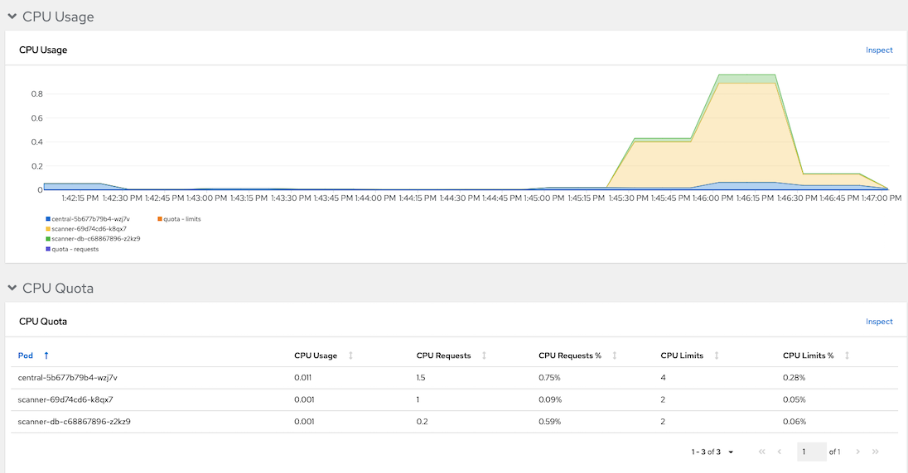
 
- Check images in image registry
  
  - Stackrox can check for vulnerbilities in libraries used by Java applicaion. Check for image backend:CVE-2020-36518
  
    ```bash
    roxctl --insecure-skip-tls-verify \
    -e "$ROX_CENTRAL_ADDRESS" image check \
    --image $(oc get -n ci-cd route nexus-registry -o jsonpath='{.spec.host}')/backend:CVE-2020-36518 \
    --output=table
    ```

    Output

    

    
    Remark: Column *BREAKS BUILD* indicate that this violation will be stop build process or not

  - Image backend:v1
  
    ```bash
    roxctl --insecure-skip-tls-verify \
    -e "$ROX_CENTRAL_ADDRESS" image check \
    --image $(oc get -n ci-cd route nexus-registry -o jsonpath='{.spec.host}')/backend:v1 \
    --output=table
    ```

    Output

    

- Deployment check

  ```bash
  roxctl --insecure-skip-tls-verify -e "$ROX_CENTRAL_ADDRESS" deployment check --file=manifests/backend-bad-example.yaml
  ```

  

  Remark: BREAKS DEPLOY column indicate that deployment will be blocked by ACS or not

<!-- - Custom check can be added for example we want to vaidate that only scanned imaged 
  
  - Search for Policy *Required Image Label* by select menu Platform Configuration -> Policies. Enter Policy, press tab then input label. 
    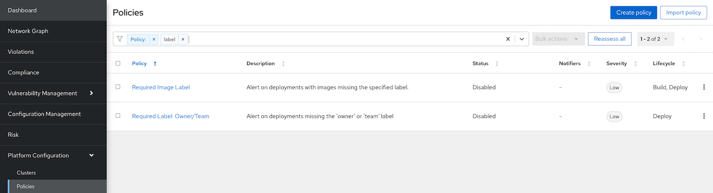

  - Clone policy
    - Input name and set severity
      
      
    
    - Set policy behavior for build time and runtime

      

    - Add criterias to check label app and version
    -  -->

<!-- - Stackrox can check for vulnerbilities in npm used by nodejs applicaion. Check for image frontend-js:CVE-2020-28471
  
    ```bash
      roxctl --insecure-skip-tls-verify -e "$ROX_CENTRAL_ADDRESS" image check --image $(oc get -n ci-cd route nexus-registry -o jsonpath='{.spec.host}')/frontend-js:CVE-2020-28471 --output=table
    ```

    Output

     -->
## Sample of Default Policies 
- Deploy [Mr.White](manifests/mr-white.yaml) to namespace *bad-ns*
  
  ```bash
  oc new-project bad-ns --display-name="This is Mr. White Namespace"
  oc apply -f manifests/mr-white.yaml -n bad-ns
  oc expose deploy mr-white -n bad-ns
  oc expose svc mr-white -n bad-ns
  MR_WHITE=$(oc get route mr-white -o jsonpath='{.spec.host}' -n bad-ns)
  ```
- Run following command
  
  ```

  curl http://$MR_WHITE/exec/whoami
  curl http://$MR_WHITE/exec/useradd%20jessy-pinkman
  curl http://$MR_WHITE/exec/groupadd%20van-cooking-station
  oc exec -n bad-ns $( oc get po -o custom-columns='Name:.metadata.name' -n bad-ns --no-headers) -- pwd
  ```

  Output

  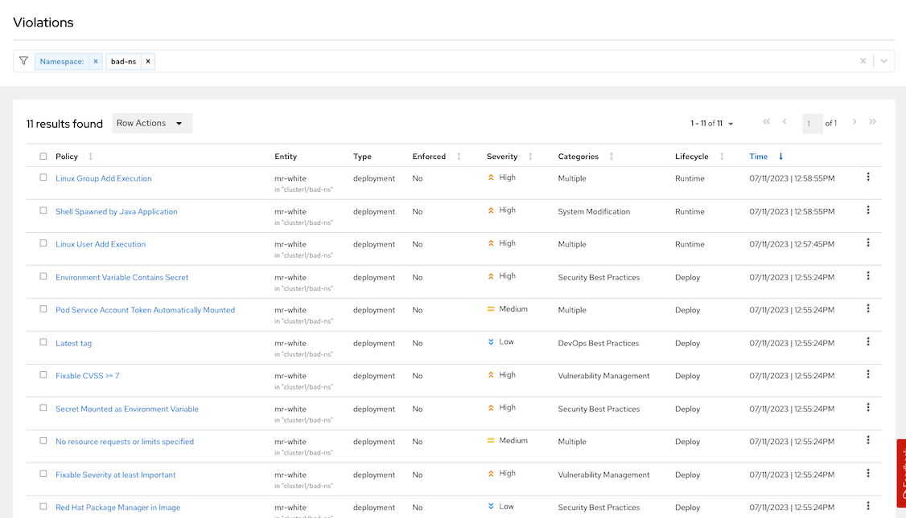

  Check for policies
  - Shell Spawned by Java Application
  - Linux Group Add Execution
  - Linux User Add Execution
  - Environment Variable Contains Secret
  - Secret Mounted as Environment Variable
  - Kubernetes Actions: Exec into Pod
  - Latest tag

## Enforce policy on Buid Stage
- Setup Jenkins and SonarQube
  
  ```bash
  cd bin
  ./setup_cicd_projects.sh
  ./setup_jenkins.sh
  ./setup_sonar.sh
  ```

  Remark: This demo need [Nexus](#setup-nexus)
  
### Use roxctl in Pipeline

- Create buildConfig [backend-build-stackrox-pipeline](manifests/backend-build-stackrox-pipeline.yaml)  with Jenkins. 
    
  ```yaml
  cat manifests/backend-build-stackrox-pipeline.yaml| \
  sed 's/value: NEXUS_REGISTRY/value: '$(oc get route nexus-registry -n ci-cd -o jsonpath='{.spec.host}')'/' | \
  oc create -n ci-cd -f -
  ```

  - Create [build config pipelines](manifests/backend-build-stackrox-pipeline.yaml)
  
    ```bash
    oc create -f manifests/backend-build-stackrox-pipeline.yaml -n ci-cd
    ```

- Create secret name stackrox-token in namespace ci-cd to store Stackrox API token 
  
  ```bash
  echo "...Token.." > token
  oc create secret generic stackrox-token -n ci-cd --from-file=token
  rm -f token
  ```

- Login to Jenkins
  
  ```bash
  echo "Jenkins URL: https://$(oc get route jenkins -n ci-cd -o jsonpath='{.spec.host}')"
  ```

- Start backend-build-stackrox-pipeline. Pipeline will failed because image contains CVEs and violate policy *Fixable Severity at least Important*
  
  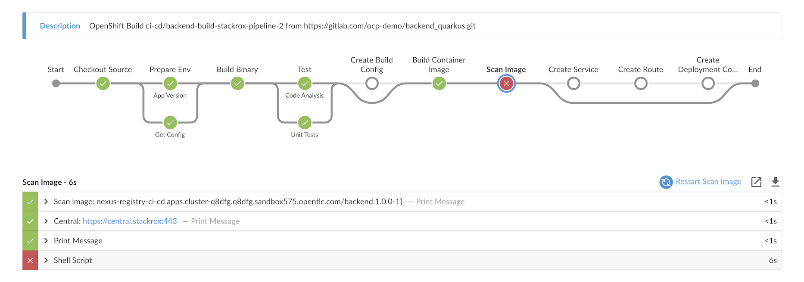

  Detail

  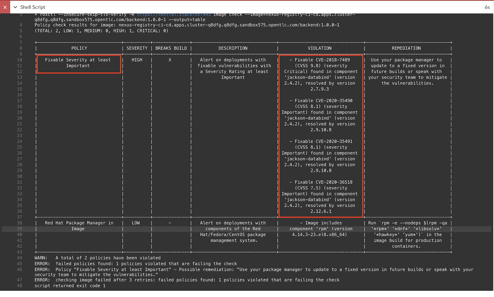
  

  Remark: 

  - Check backend-build-stackrox-pipeline [Jenkinsfile](https://gitlab.com/ocp-demo/backend_quarkus/-/blob/cve/Jenkinsfile/build-stackrox/Jenkinsfile) for roxctl command in Pipeline.
    
    ```groovy
      stage('Scan Image') {
          steps {    
            container("tools") {
              echo "Scan image: ${NEXUS_REGISTRY}/${imageName}:${devTag}}"
              echo "Central: ${env.ROX_CENTRAL_ADDRESS}"
              sh "export ROX_API_TOKEN=${ROX_API_TOKEN};roxctl --insecure-skip-tls-verify -e ${ROX_CENTRAL_ADDRESS} image check --image=${NEXUS_REGISTRY}/${imageName}:${devTag} --output=table"
           }
         }
      } 
    ```
    
  - backend app intentionally use jackson-bind that contains CVEs. You can check this in [pom.xml](https://gitlab.com/ocp-demo/backend_quarkus/-/blob/cve/code/pom.xml)
  - Change ref from cve to master for backend. Branch master already update jackson-bind to updated version.

    ```yaml
    source:
      contextDir: Jenkinsfile/build-stackrox
      git:
        ref: master
        uri: https://gitlab.com/ocp-demo/backend_quarkus.git
    ```

### Stackrox Jenkins Plugin

- Install Stackrox plugin and restart Jenkins
  
  

- Create buildConfig [backend-build-stackrox-with-plugin-pipeline](manifests/backend-build-stackrox-with-plugin-pipeline.yaml) with Jenkins. 

  ```yaml
  cat manifests/backend-build-stackrox-with-plugin-pipeline.yaml| \
  sed 's/value: NEXUS_REGISTRY/value: '$(oc get route nexus-registry -n ci-cd -o jsonpath='{.spec.host}')'/' | \
  oc create -n ci-cd -f -
  ```

- Start backend-build-stackrox-with-plugin-pipeline. Pipeline will failed because image contains CVEs and violate policy *Fixable Severity at least Important*
  
  

- Detailed report in Jenkins
  
  

  Remark: [Jenkinsfile](https://gitlab.com/ocp-demo/backend_quarkus/-/blob/cve/Jenkinsfile/build-stackrox-with-plugin/Jenkinsfile) for backend-build-stackrox-with-plugin-pipeline

  ```groovy
    stage('Scan Image') {
      steps {    
          script {
              echo "Scan image: ${NEXUS_REGISTRY}/${imageName}:${devTag}}"
              stackrox (
                    apiToken: "${ROX_API_TOKEN}",
                    caCertPEM: '',
                    enableTLSVerification: false,
                    failOnCriticalPluginError: true,
                    failOnPolicyEvalFailure: true,
                    portalAddress: "${env.ROX_CENTRAL_ADDRESS}",
                    imageNames: "${NEXUS_REGISTRY}/${imageName}:${devTag}"
              )
          }
        }
    } 
  ```


### Enable Policy
- Login to ACS Console, Select Menu Platform -> Configuration, type policy in search bar then input curl
  
  

- Select policy Curl in image and edit policy

  

- Select policy behavior
    - select inform and enforce
    - enable on build
  
    

- Enable policy curl in image
    
  
  
- Re-run Jenkins pipeline backend-build-stackrox-pipeline and check for report
    
  

## Enforce policy on Deployment Stage
- Create project demo
- Open ACS Central. Navigate to Platform Configuration->Policies 
- At the search filter. Search for policy *No resources requests or limits specified* 
  
  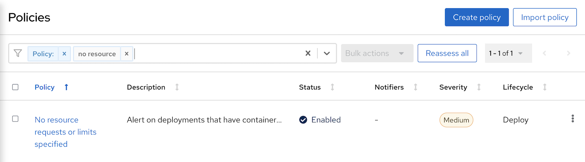

- Click *Action->Clone Policy* and set name to *Request and Limit are required*
- Edit *Policy behavior*  and set response method to *Inform and Enforce*
  
  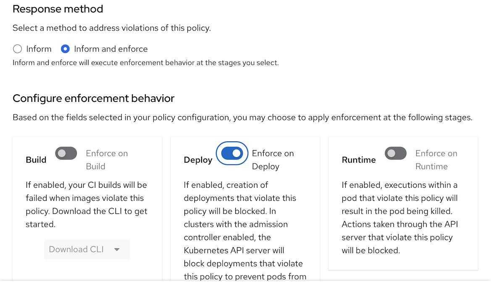

- Navigate to  *Policy Scope* and *Add inclusion scope* input following values
  - Cluster: Cluster1
  - Namespace: demo
- Navigate to *Policy Scope* and check for *Preview violations*
- Deploy following app
  
  ```bash
  oc create -f manifests/mr-white.yaml -n demo
  ```

  Output

  ```bash
  Error from server (Failed currently enforced policies from StackRox): error when creating "manifests/mr-white.yaml": admission webhook "policyeval.stackrox.io" denied the request:
  The attempted operation violated 1 enforced policy, described below:

  Policy: Request and Limit are required
  - Description:
      ↳ Alert on deployments that have containers without resource requests and limits
  - Rationale:
      ↳ If a container does not have resource requests or limits specified then the host
        may become over-provisioned.
  - Remediation:
      ↳ Specify the requests and limits of CPU and Memory for your deployment.
  - Violations:
      - CPU limit set to 0 cores for container 'mr-white'
      - CPU request set to 0 cores for container 'mr-white'
      - Memory limit set to 0 MB for container 'mr-white'
      - Memory request set to 0 MB for container 'mr-white'


  In case of emergency, add the annotation {"admission.stackrox.io/break-glass": "ticket-1234"} to your deployment with an updated ticket number
  ```
- ACS Console, navigate to Violations
  
  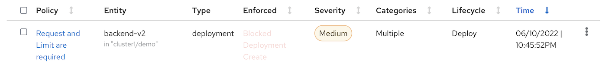

  
## Enforce policy on Runtime Stage
### Exec into Pod
- Platform configuration -> Policies
- Search for Policy Kubernetes Actions: Exec into Pod
- Click Action -> Edit Policy
- Click Next to Policy Behavior and enable Enforce on runtime. This will make ACS kill the offend pod that try to run exec.
  
  

- Save Policy
- Run curl inside backend's pod
  
    ```bash
    oc new-project project1
    oc apply -f manifests/backend-v1.yaml -n project1
    oc exec -n project1 $(oc get pods -n project1 -l app=backend --no-headers | head -n 1 | awk '{print $1}') -- curl -s http://backend:8080
    ```

    Output

    ```bash
    command terminated with exit code 6
    ```

- Check Console
  
  - Navigate to Dashboard -> Violation

    

  - Details information

    

### NMAP
- Platform configuration -> Policies
- Search for nmap Execution
- Verify that status is enabled
- Deploy container [tools](manifests/network-tools.yaml)
  
  ```bash
  oc apply -f manifests/network-tools.yaml -n project1
  ```

- Execute namp
  
  ```bash
  oc exec $(oc get pods -l app=network-tools --no-headers -n project1 | head -n 1 | awk '{print $1}') -n project1 -- nmap -v -Pn  backend.prod-app.svc
  ```

  Output

  ```bash
  Starting Nmap 7.70 ( https://nmap.org ) at 2022-05-26 02:05 UTC
  Initiating Parallel DNS resolution of 1 host. at 02:05
  Completed Parallel DNS resolution of 1 host. at 02:05, 0.00s elapsed
  Initiating Connect Scan at 02:05
  Scanning backend.prod-app.svc (172.30.14.34) [1000 ports]
  Discovered open port 8080/tcp on 172.30.14.34
  Completed Connect Scan at 02:05, 4.31s elapsed (1000 total ports)
  Nmap scan report for backend.prod-app.svc (172.30.14.34)
  Host is up (0.0019s latency).
  rDNS record for 172.30.14.34: backend.prod-app.svc.cluster.local
  Not shown: 999 filtered ports
  PORT     STATE SERVICE
  8080/tcp open  http-proxy

  Read data files from: /usr/bin/../share/nmap
  Nmap done: 1 IP address (1 host up) scanned in 4.44 seconds
  ```

- Check ACS Central. Navigate to Violations
  - nmap execution is detected
  
    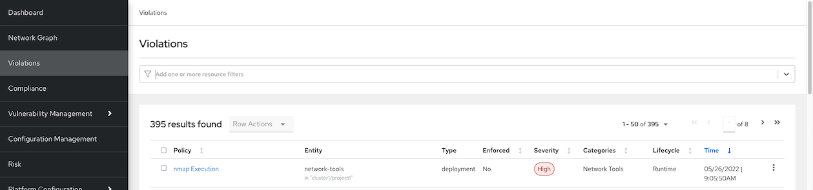

  - details information
    
    Violation

    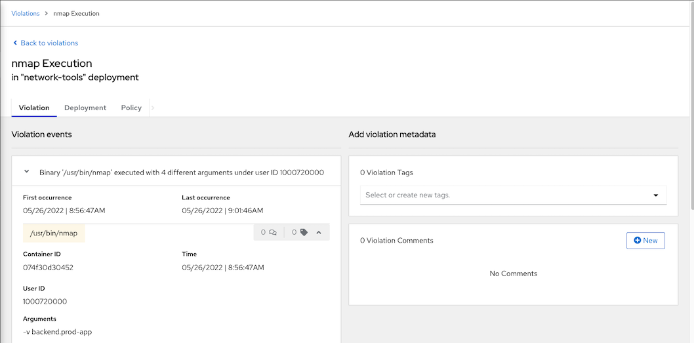

    Deployment

    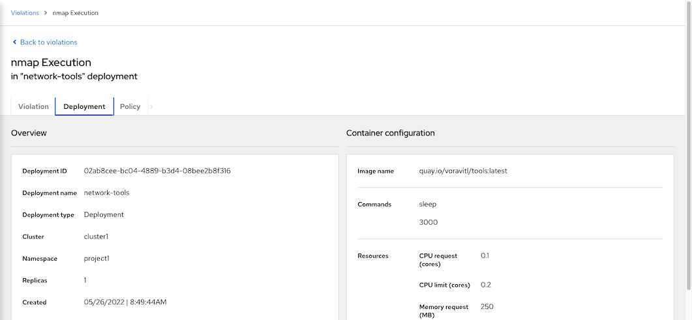

## Compliance

Initial compliance scan

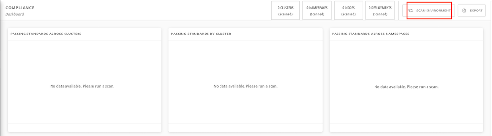

### Overall reports

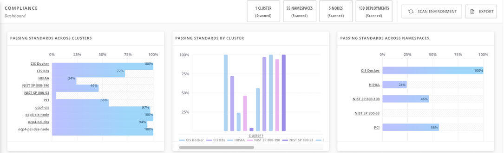

### Compliance Operator
- ACS integrated with OpenShift Compliance Operator. Following show result for OpenShift Compliance Operator with CIS profile and already remidiated by Operator

  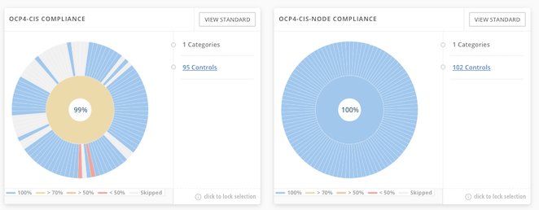


## Network Graph
### Sample Application
- Deploy frontend and backend app on namespace ui and api respectively
  
  ```bash
  oc new-project ui
  oc new-project api
  oc create -f manifests/frontend.yaml -n ui
  oc create -f manifests/backend-v1.yaml -n api
  oc expose deployment/backend-v1 -n api
  oc set env deployment/frontend-v1 BACKEND_URL=http://backend-v1.api.svc:8080 -n ui
  oc set env deployment/frontend-v2 BACKEND_URL=http://backend-v1.api.svc:8080 -n ui
  ```
- Check for frontend URL
  
  ```bash
  FRONTEND_URL=$(oc get route/frontend -o jsonpath='{.spec.host}' -n ui)
  ```
- Test with curl
  
  ```bash
  curl https://$FRONTEND_URL
  ```
### Network Policies

- Check Network Graph in ACS Console
  - Select *cluster1* then select namespace *ui* and *api*
  - Click deployment *backend-v1*
    
    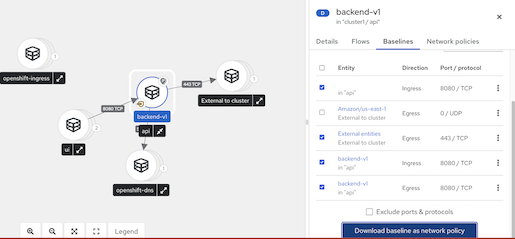

  - Select tab Flows

    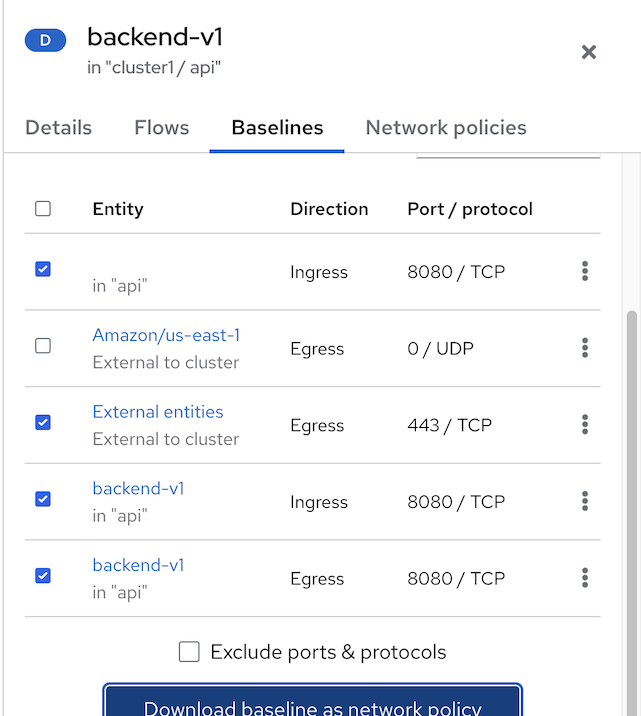

    - Ingress from frontend-v1 in namespace ui
    - Ingress from frontend-v2 in namespace ui
    - Egress from backend-v1 in namespace api
    - Egress from backend-v1 to external entities
    - Select above entries and *Add to Baseline*
  - Click tab *Baselines* then click Download baseline as network policy
  - Check network policies which created from actual traffic baseline
    
    ```yaml
    apiVersion: networking.k8s.io/v1
    kind: NetworkPolicy
    metadata:
      creationTimestamp: "2023-04-18T16:04:11Z"
      labels:
        network-policy-generator.stackrox.io/from-baseline: "true"
      name: stackrox-baseline-generated-backend-v1
      namespace: api
    spec:
      ingress:
      - from:
        - namespaceSelector:
            matchLabels:
              kubernetes.io/metadata.name: ui
          podSelector:
            matchLabels:
              app: frontend
              version: v2
        - namespaceSelector:
            matchLabels:
              kubernetes.io/metadata.name: ui
          podSelector:
            matchLabels:
              app: frontend
              version: v1
        - podSelector:
            matchLabels:
              app: backend
              version: v1
        ports:
        - port: 8080
          protocol: TCP
      podSelector:
        matchLabels:
          app: backend
          version: v1
      policyTypes:
      - Ingress
    status: {}
    ``` 
