# Advanced Cluster Security for Kubernetes (ACS)
- [Advanced Cluster Security for Kubernetes (ACS)](#advanced-cluster-security-for-kubernetes-acs)
  - [Installation](#installation)
    - [Central Installation](#central-installation)
      - [[Optional] Create Central at Infra Nodes](#optional-create-central-at-infra-nodes)
      - [Access Central](#access-central)
    - [Secured Cluster Services (Managed Cluster)](#secured-cluster-services-managed-cluster)
      - [Operator](#operator)
  - [Quick Test](#quick-test)
    - [Container Image with Vulnerabilities](#container-image-with-vulnerabilities)
    - [Detecting suspect behaviors](#detecting-suspect-behaviors)
    - [Shift Left Security](#shift-left-security)
      - [kube-linter](#kube-linter)
      - [Scan container images with roxctl](#scan-container-images-with-roxctl)
  - [Integration with Container Registry (WIP)](#integration-with-container-registry-wip)

## Installation

### Central Installation

- Install Operator 
  
  - Select *Advanced Cluster Security for Kubernetes* 


  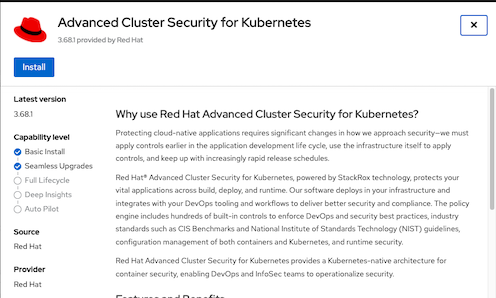


  - Accept default parameters

  
  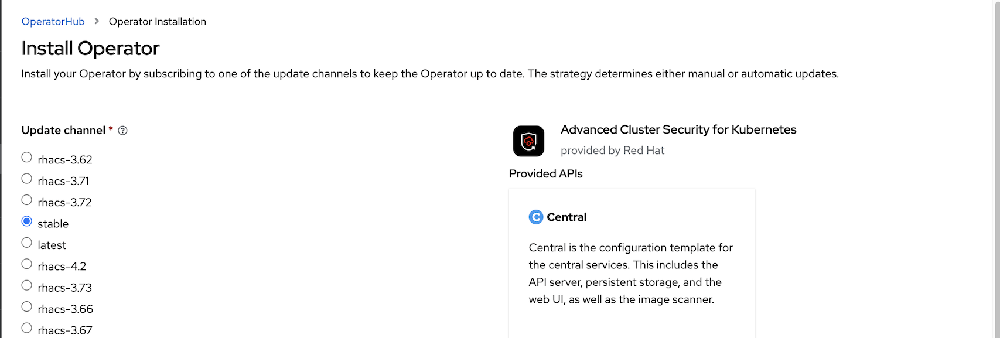

  
- Create namespace for central server and scanner.

  ```bash
  oc new-project stackrox
  ```

- Install *roxctl* CLI
  - Download latest binary from [here](https://mirror.openshift.com/pub/rhacs/assets/latest/bin/)
    
    - For OSX
      
      ```bash
      curl -O https://mirror.openshift.com/pub/rhacs/assets/latest/bin/Darwin/roxctl
      ```

- Create ACS Central with [acs-central.yaml](manifests/acs-central.yaml3)
  
  - If you want to use custom certificate storedfor central add following section to [acs-central.yaml](manifests/acs-central.yaml)
  
    ```yaml
    spec:
      central:
        defaultTLSSecret:
          name: acs-central
    ```

    - *Optional:* Copy default TLS from default router to secret name *acs-central*
    
      ```bash
      oc get secret $(oc get secret -n openshift-ingress -o=custom-columns="NAME:.metadata.name" --no-headers | grep ingress-certs) -n openshift-ingress -o yaml | sed 's/namespace: .*/namespace: stackrox/' | sed 's/name: .*/name: acs-central/' | oc apply -n stackrox  -f -
      ```

- Create Central

  ```bash
  oc create -f manifests/acs-central.yaml -n stackrox
  ```

  *Remark*
  - Central is configured with memory limit 8 Gi
  - Default RWO storage for central is 100 GB

- Check status
  
  ```bash
  oc describe central/stackrox-central-services
  watch oc get pods -n stackrox
  ```

  Output
  
  ```bash
  NAME                          READY   STATUS    RESTARTS   AGE
  central-768b975cb4-pznx2      1/1     Running   0          2m36s
  scanner-774867b7f5-vnlds      1/1     Running   0          3m17s
  scanner-db-7784db6d56-7kqvq   1/1     Running   0          3m17s
  ```

#### [Optional] Create Central at Infra Nodes
  - Infra Nodes preparation

    - Label Infra nodes
      
      ```bash
      oc label node <node> node-role.kubernetes.io/infra=""
      oc label node <node> node-role.kubernetes.io/acs=""
      ```
    
    - Taint infra nodes with *infra-acs*
      
      ```bash
      oc adm taint node <node> infra-acs=reserved:NoSchedule
      ```
  - Create Central with [acs-central-infra.yaml](manifests/acs-central-infra.yaml)
    
    ```bash
    oc create -f manifests/acs-central-infra.yaml -n stackrox
    ```

#### Access Central

- URL and password to access ACS Console
  
  ```bash
  ROX_URL=https://$(oc get route central -n stackrox -o jsonpath='{.spec.host}')
  ROX_CENTRAL_ADDRESS=$(oc get route central -n stackrox -o jsonpath='{.spec.host}'):443
  ROX_PASSWORD=$(oc -n stackrox get secret central-htpasswd -n stackrox -o go-template='{{index .data "password" | base64decode}}')
  ```

### Secured Cluster Services (Managed Cluster)

- Login to ACS console
- Generate cluster init bundle
  - Platform Configuration -> Integrations -> Cluster Init Bundle -> Generate Bundle

    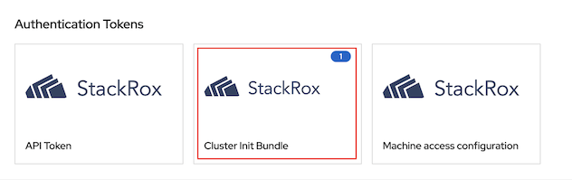

  - Input cluster name
  - download *Kubernetes Secrets file* for installation with *Operator* or *Helm values file* for installation with *roxctl*

#### Operator
- Create namespace for *Secured Cluster Services*
  
  ```bash
  oc new-project stackrox-cluster
  ```
- Create secret from previously downloaded *Kubernetes Secrets file*
  
  ```bash
   oc create -f cluster1-cluster-init-secrets.yaml -n stackrox-cluster
  ```

- Create Secured Cluster Service with [acs-secured-cluster.yaml](manifests/acs-secured-cluster.yaml)
  
  ```bash
  oc create -f manifests/acs-secured-cluster.yaml -n stackrox-cluster
  ```

  Remark: [acs-secured-cluster.yaml](manifests/acs-secured-cluster.yaml) is prepared for install Secured Cluster Service within the same cluster with Central.

  If you want Admission Control run on Infra Nodes with [acs-secured-cluster-infra.yaml](manifests/acs-secured-cluster-infra.yaml)

  ```bash
  oc create -f manifests/acs-secured-cluster-infra.yaml -n stackrox-cluster
  ```

- Check status
  
  ```bash
  oc describe securedcluster/cluster1  -n stackrox-cluster
  watch oc get pods -n stackrox-cluster
  ```

  Output

  ```bash
  NAME                                READY   STATUS    RESTARTS   AGE
  admission-control-cb5997c68-4ddp8   1/1     Running   0          28s
  admission-control-cb5997c68-7vtgh   1/1     Running   0          28s
  admission-control-cb5997c68-qhbqc   1/1     Running   0          28s
  collector-59kzw                     2/2     Running   0          28s
  collector-bx2w2                     2/2     Running   0          28s
  collector-kgp57                     2/2     Running   0          28s
  collector-tmscm                     2/2     Running   0          28s
  collector-x9h8n                     2/2     Running   0          28s
  ```

  Remark
  - Adminission control is high availability with default 3 pods
  - Collector is run on all nodes


- Check ACS Console

  - Dashboard

    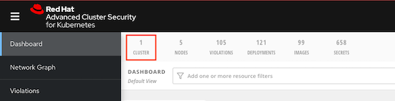

  - Platform Configuration -> Clusters

    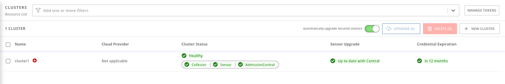

    
    Overall status


    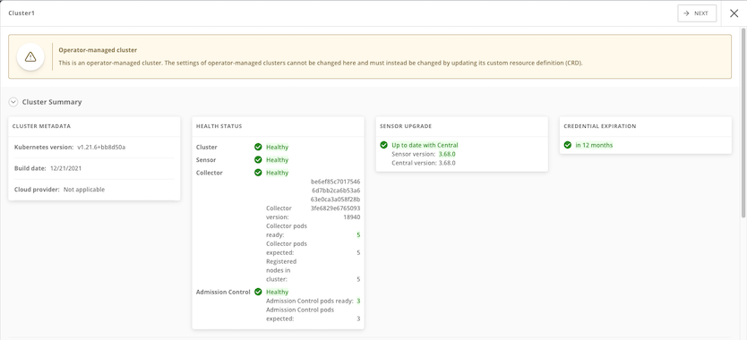
    

    Dynamic configuration

    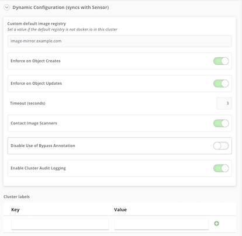


<!-- #### StackRox CLI
- Create *authentication token*
  - Login to Central
  - Platform Configuration -> Integrations -> Authentication Tokens Select StackRox API Token then generate token and copy token to clipboard
    - Token Name: admin
    - Role: Admin

- Set environment variable
    
    ```bash
    export ROX_API_TOKEN=<api-token>
    export ROX_CENTRAL_ADDRESS=$(oc get route central -n stackrox -o jsonpath='{.spec.host}'):443
    ```


- Install Secure Cluster Services on local cluster

    - Generate cluster init bundle
    
      ```bash
      CLUSTER_NAME=cluster1
      roxctl --insecure-skip-tls-verify -e "$ROX_CENTRAL_ADDRESS" central init-bundles generate $CLUSTER_NAME \
      --output $CLUSTER_NAME-init-bundle.yaml
      ```

    - Create collectors
      
      ```bash
      helm install -n stackrox --create-namespace stackrox-secured-cluster-services rhacs/secured-cluster-services \
      -f ${CLUSTER_NAME}-init-bundle.yaml \
      --set clusterName=${CLUSTER_NAME} \
      --set imagePullSecrets.allowNone=true
      ```
    
-  Install Secure Cluster Services on Remote cluster
  
     - Generate cluster init bundle
     
       ```bash
       CLUSTER_NAME=cluster2
       roxctl --insecure-skip-tls-verify -e "$ROX_CENTRAL_ADDRESS" central init-bundles generate $CLUSTER_NAME \
       --output $CLUSTER_NAME-init-bundle.yaml
       ```

     - Create collectors
       
       ```bash
       helm install -n stackrox --create-namespace stackrox-secured-cluster-services rhacs/secured-cluster-services \
       -f ${CLUSTER_NAME}-init-bundle.yaml \
       --set centralEndpoint=${ROX_CENTRAL_ADDRESS} \
       --set clusterName=${CLUSTER_NAME} \
       --set imagePullSecrets.allowNone=true
       ```

 - Check collector pods
  
    ```bash
    oc get pods -n stackrox -l app=collector,app.kubernetes.io/name=stackrox
    ```

    Output
    
    ```bash
    NAME              READY   STATUS    RESTARTS   AGE
    collector-5hmzt   2/2     Running   0          87s
    collector-dmpps   2/2     Running   0          87s
    collector-ffpdg   2/2     Running   0          87s
    collector-rfkq2   2/2     Running   0          87s
    collector-x4gtb   2/2     Running   0          87s
    ```
- Check managed clusters on ACS console. Platform Configuration -> Clusters
  
   -->

## Quick Test

### Container Image with Vulnerabilities

- Deploy sample application

    ```bash
    oc new-project test
    oc run log4shell --labels=app=log4shell --image=quay.io/voravitl/log4shell:latest -n test 
    watch oc get pods -n test
    ```

- Check ACS Dashboard. 
  
  - 1 Criticals violation will be found.
    
    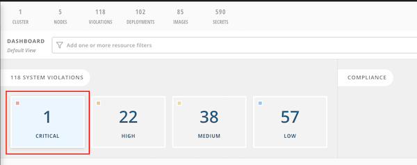

  - Drill down for more information


    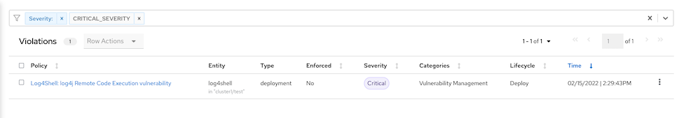


    CVE Information
    

    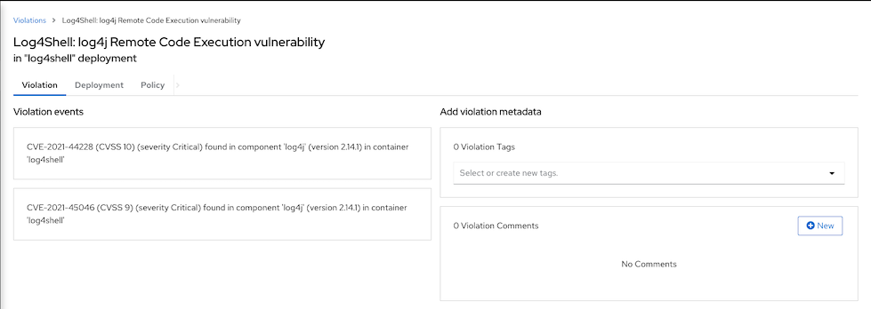


    CVSS score: https://nvd.nist.gov/vuln-metrics/cvss

- Search by CVE. Vulnerability Management -> Dashboard -> IMAGES -> Search for *CVE-2021-44228*


  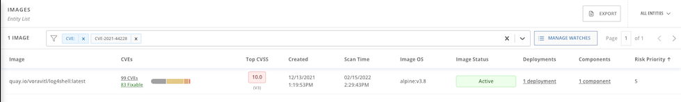


  Details information


  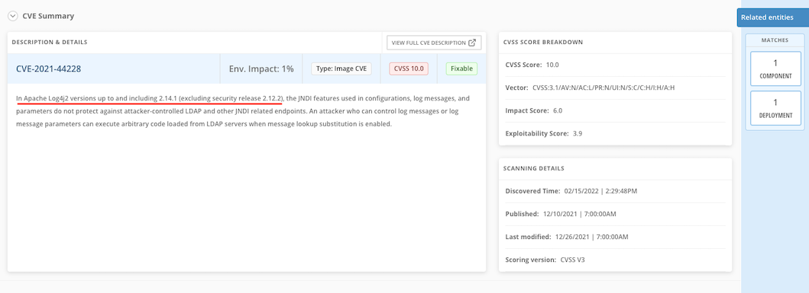

### Detecting suspect behaviors

- Deploy sample application

    ```bash
    oc run backend --labels=app=backend --image=quay.io/voravitl/backend:v1 -n test 
    ```
- Run curl inside backend's pod
  
    ```bash
    oc exec backend -- curl http://localhost:8080/q/health
    ```
- Check Console
  
  - Navigate toDashboard -> Violation

    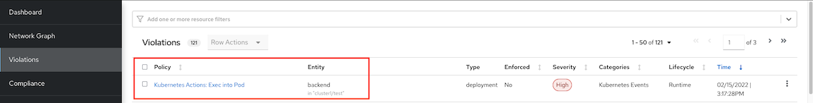

  - Details information

    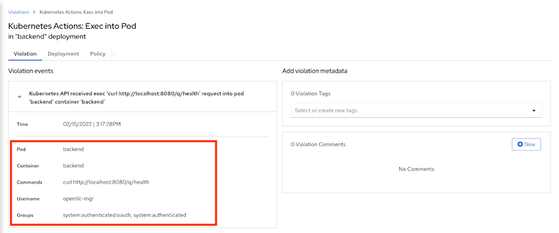

### Shift Left Security
#### kube-linter
- Try kube-linter with deployment YAML
  
  ```bash
  kube-linter lint manifests/backend-bad-example.yaml
  ```

- Sample recommendation
  
  ```
  manifests/backend-bad-example.yaml: (object: <no namespace>/backend-v2 apps/v1, Kind=Deployment) container "backend" is not set to runAsNonRoot (check: run-as-non-root, remediation: Set runAsUser to a non-zero number and runAsNonRoot to true in your pod or container securityContext. Refer to https://kubernetes.io/docs/tasks/configure-pod-container/security-context/ for details.)

  manifests/backend-bad-example.yaml: (object: <no namespace>/backend-v2 apps/v1, Kind=Deployment) container "backend" has cpu request 0 (check: unset-cpu-requirements, remediation: Set CPU requests and limits for your container based on its requirements. Refer to https://kubernetes.io/docs/concepts/configuration/manage-resources-containers/#requests-and-limits for details.)
  ```

#### Scan container images with roxctl


- Create token for DevOps tools
    
   - Navigate to Platform Configuration -> Integrations -> Authentication Token -> API Token
   - Click Generate Token
   - Input token name and select role Continuous Integration
   - Copy and save token.

- Set API token to environment variable 

  ```bash
  export ROX_API_TOKEN=<token>
  ```

- Scan image
  
  ```bash
  roxctl --insecure-skip-tls-verify -e "$ROX_CENTRAL_ADDRESS" image scan --image quay.io/voravitl/log4shell:latest --output=table
  roxctl --insecure-skip-tls-verify -e "$ROX_CENTRAL_ADDRESS" image scan --image quay.io/voravitl/log4shell:latest --output=json| jq '.result.summary.CRITICAL'
  ```

## Integration with Container Registry (WIP)
- Setup Nexus
- Configure ACS to integrate with Nexus