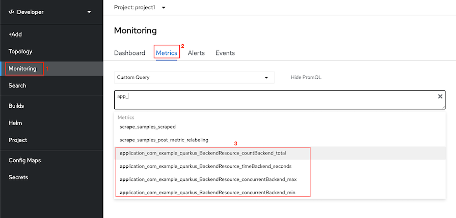
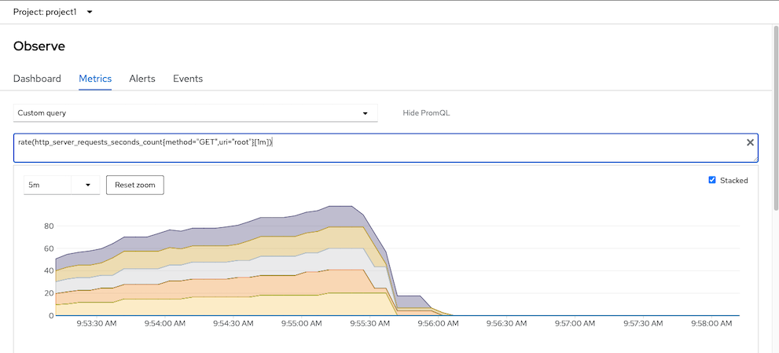
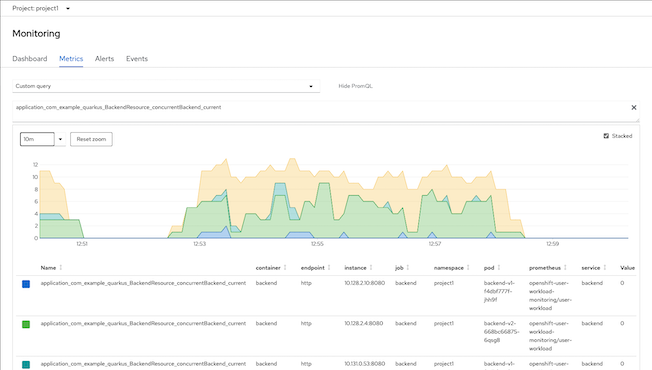
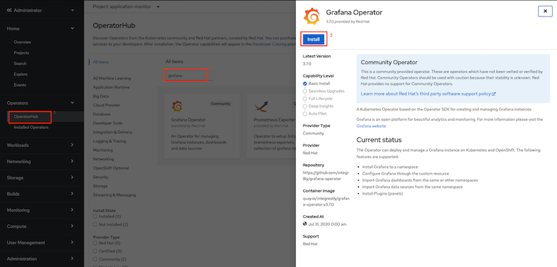
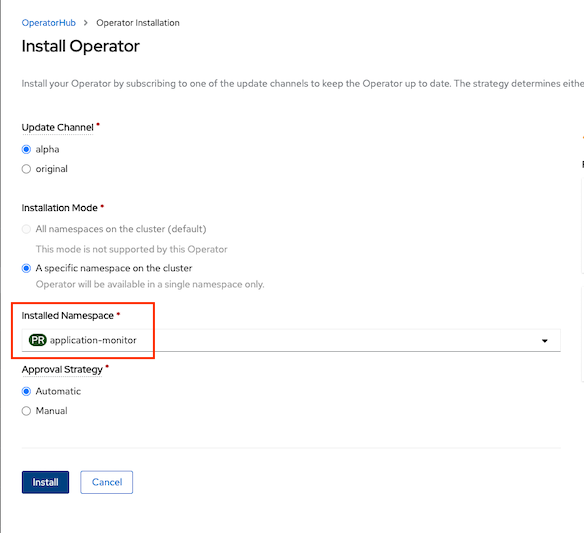
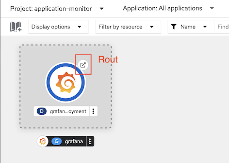
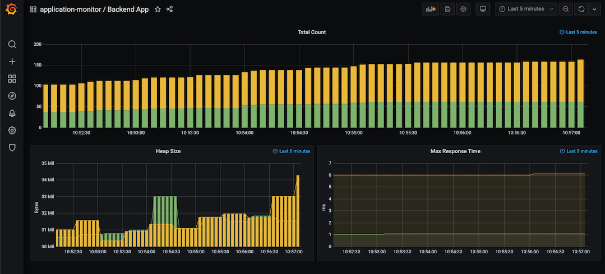

# User Workload Metrics
<!-- TOC -->

- [User Workload Metrics](#user-workload-metrics)
  - [Prerequisites](#prerequisites)
  - [Service Monitoring](#service-monitoring)
  - [Custom Grafana Dashboard](#custom-grafana-dashboard)

<!-- /TOC -->
## Prerequisites
- Setup [User Workload Monitoring](manifests/user-workload-monitoring.yaml)
  
  ```bash
  oc apply -f  manifests/user-workload-monitoring.yaml
  ```

  Remark: You also need to setup and configure [cluster monitoring](infrastructure-monitoring-alerts.md) or use following [simple configuration](manifests/cluster-monitoring-config.yaml). You may need to change storageClassName based on your cluster configuration

  ```bash
  oc apply -f  manifests/cluster-monitoring-config.yaml
  ```
- Verify monitoring stack
  
  ```bash
  oc  get pod -n openshift-user-workload-monitoring
  ```

  Sample output
  
  ```bash
  NAME                                   READY   STATUS    RESTARTS   AGE
  prometheus-operator-5fc7d894dc-9nlhc   2/2     Running   0          9m3s
  prometheus-user-workload-0             4/4     Running   1          5m45s
  prometheus-user-workload-1             4/4     Running   1          6m1s
  thanos-ruler-user-workload-0           3/3     Running   5          8m55s
  thanos-ruler-user-workload-1           3/3     Running   0          11s
  ```
  
## Service Monitoring
- Deploy application with custom metrics
  - Backend application provides metrics by /metrics and /metrics/applications
  
    ```bash
    oc apply -f manifests/frontend.yaml -n project1
    oc apply -f manifests/backend.yaml -n project1
    oc set env deployment/frontend-v1 BACKEND_URL=http://backend:8080/ -n project1
    oc set env deployment/frontend-v2 BACKEND_URL=http://backend:8080/ -n project1
    ```

  - Test backend application metrics
  
    ```bash
    oc exec -n project1 $(oc get pods -n project1 | grep backend | head -n 1 | awk '{print $1}') -- curl http://localhost:8080/metrics
    oc exec -n project1 $(oc get pods -n project1 | grep backend | head -n 1 | awk '{print $1}') -- curl http://localhost:8080/metrics/application
    ```
    
  - Sample output
  
    ```bash
    # TYPE vendor_memory_committedNonHeap_bytes gauge
    vendor_memory_committedNonHeap_bytes 3.1780976E7
    # HELP vendor_memory_maxNonHeap_bytes Displays the maximum amount of used non-heap memory in bytes.
    # TYPE vendor_memory_maxNonHeap_bytes gauge
    vendor_memory_maxNonHeap_bytes -1.0
    # HELP vendor_memory_usedNonHeap_bytes Displays the amount of used non-heap memory in bytes.
    # TYPE vendor_memory_usedNonHeap_bytes gauge
    vendor_memory_usedNonHeap_bytes 3.1780976E7
    ```
    
- Create [Service Monitoring](manifests/backend-service-monitor.yaml) to monitor backend service
    
    ```bash
    oc apply -f manifests/backend-service-monitor.yaml -n project1
    ```
    
    Remark: Role **monitor-edit** is required for create **ServiceMonitor** and **PodMonitor** resources. Following example is granting role montior-edit to user1 for project1

    ```bash
    oc adm policy add-role-to-user  monitoring-edit user1 -n project1
    ```
    
- Developer Console monitoring metrics  
  - Select application metrics

    

  - Application metrics 
    
    - Request counted

      

    - Concurrent requests
    
      

## Custom Grafana Dashboard
<!-- https://access.redhat.com/solutions/5335491 -->
Use Grafana Operator (Community Edition) to deploy Grafana and configure datasource to Thanos Querier
- Create project
  
  ```bash
  oc new-project application-monitor --display-name="Custom Grafana" --description="Custom Grafana"
  ```
  
- Install Grafana Operator to project application-monitor
  - Install Grafana Operator from OperatorHub

  

  - Install to application-monitor project
  
  
  
- Create [Grafana instance](manifests/grafana.yaml)
  
  ```bash
  oc create -f manifests/grafana.yaml -n application-monitor
  oc get pods -n application-monitor
  #Sample Output
  NAME                                 READY   STATUS    RESTARTS   AGE
  grafana-deployment-cd4764497-jcwtx   1/1     Running   0          52s
  grafana-operator-7d585d8fb4-nks8s    1/1     Running   0          4m55s
  ```
  
- Add role cluster-monitoring-view to Grafana ServiceAccount

  ```bash
  oc adm policy add-cluster-role-to-user cluster-monitoring-view \
  -z grafana-serviceaccount -n application-monitor
  ```

- Create [Grafana DataSource](manifests/grafana-datasource.yaml) with serviceaccount grafana-serviceaccount's token and connect to thanos-querier

  ```bash
  TOKEN=$(oc serviceaccounts get-token grafana-serviceaccount -n application-monitor)
  cat manifests/grafana-datasource.yaml|sed 's/Bearer .*/Bearer '"$TOKEN""'"'/'|oc apply -n application-monitor -f -
  ```  

- Create [Grafana Dashboard](manifests/grafana-dashboard.yaml)

  ```bash
  oc apply -f manifests/grafana-dashboard.yaml -n application-monitor 
  ```

- Login to Grafana Dashboard with following URL
  
  ```bash
  echo "Grafana URL => https://$(oc get route grafana-route -o jsonpath='{.spec.host}' -n application-monitor)"
  ```
  
  or use link provided by Developer Console

  

  Login with user `admin` and password `openshift`

  
  
- Generate workload
  
  ```bash
  FRONTEND_URL=https://$(oc get route frontend -n project1 -o jsonpath='{.spec.host}')
  while [ 1 ];
  do
    curl $FRONTEND_URL
    printf "\n"
    sleep .2
  done
  ```
  Remark: You need to configure frontend app to connect to backend app

  ```bash
  oc set env deployment/frontend-v1 BACKEND_URL=http://backend:8080/ -n project1
  oc set env deployment/frontend-v2 BACKEND_URL=http://backend:8080/ -n project1
  ```
  
- Grafana Dashboard
  
  
