# User Workload Monitoring
<!-- TOC -->

- [User Workload Monitoring](#user-workload-monitoring)
  - [Prerequisites](#prerequisites)
  - [Service Monitoring](#service-monitoring)
  - [K6](#k6)
  - [Custom Grafana Dashboard](#custom-grafana-dashboard)
  - [Custom Alert](#custom-alert)


<!-- /TOC -->
## Prerequisites
- Setup [User Workload Monitoring](manifests/cluster-monitoring-config.yaml)
  
  <!-- ```bash
  oc apply -f  manifests/user-workload-monitoring.yaml
  ``` -->

  <!-- Remark: You also need to setup and configure [cluster monitoring](infrastructure-monitoring-alerts.md) or use following [simple configuration](manifests/cluster-monitoring-config.yaml). You may need to change *storageClassName* based on your cluster configuration -->

  
  
  ```bash
  DEFAULT_STORAGE_CLASS=$(oc get sc -A -o jsonpath='{.items[?(@.metadata.annotations.storageclass\.kubernetes\.io/is-default-class=="true")].metadata.name}')
  cat manifests/cluster-monitoring-config.yaml | sed 's/storageClassName:.*/storageClassName: '$DEFAULT_STORAGE_CLASS'/' | oc apply -f  -
  sleep 10
  oc -n openshift-user-workload-monitoring wait --for condition=ready \
   --timeout=180s pod -l app.kubernetes.io/name=prometheus
  oc -n openshift-user-workload-monitoring wait --for condition=ready \
   --timeout=180s pod -l app.kubernetes.io/name=thanos-ruler
  oc get pvc -n openshift-monitoring
  ```

  Output

  ```bash
  configmap/cluster-monitoring-config created
  pod/prometheus-user-workload-0 condition met
  pod/prometheus-user-workload-1 condition met
  pod/thanos-ruler-user-workload-0 condition met
  pod/thanos-ruler-user-workload-1 condition met
  NAME                                 STATUS   VOLUME                                     CAPACITY   ACCESS MODES   STORAGECLASS                           AGE
  prometheus-k8s-db-prometheus-k8s-0   Bound    pvc-c1513ebb-6fcf-4136-b3a2-41a7a3afd83b   50Gi       RWO            ocs-external-storagecluster-ceph-rbd   21s
  prometheus-k8s-db-prometheus-k8s-1   Bound    pvc-f9f9d7b1-3303-41ed-9549-43fab596cebe   50Gi       RWO            ocs-external-storagecluster-ceph-rbd   21s
  ```

- Verify monitoring stack
  
  ```bash
  oc  get pod -n openshift-user-workload-monitoring
  ```

  Sample output
  
  ```bash
  NAME                                   READY   STATUS    RESTARTS   AGE
  prometheus-operator-787b6f6d75-lrgjg   2/2     Running   0          70s
  prometheus-user-workload-0             6/6     Running   0          63s
  prometheus-user-workload-1             6/6     Running   0          63s
  thanos-ruler-user-workload-0           4/4     Running   0          62s
  thanos-ruler-user-workload-1           4/4     Running   0          62s
  ```

- CPU and Memory used by User Workload Monitoring
  
  Overall resouces consumed by user workload monitoring

  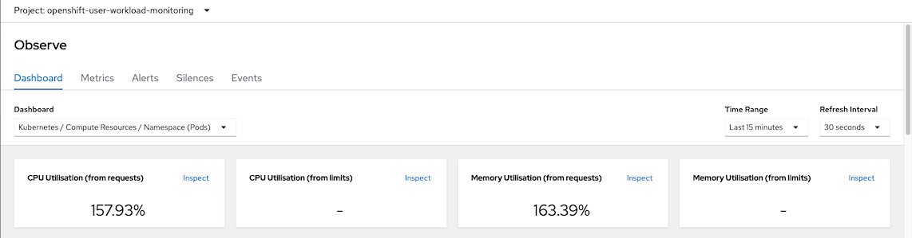

  CPU Usage
  
  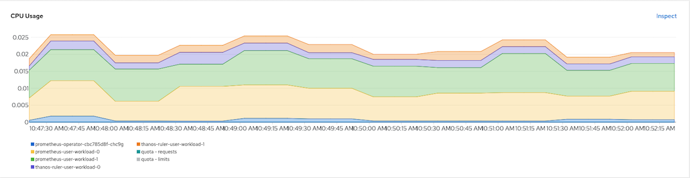

  Memory Usage

  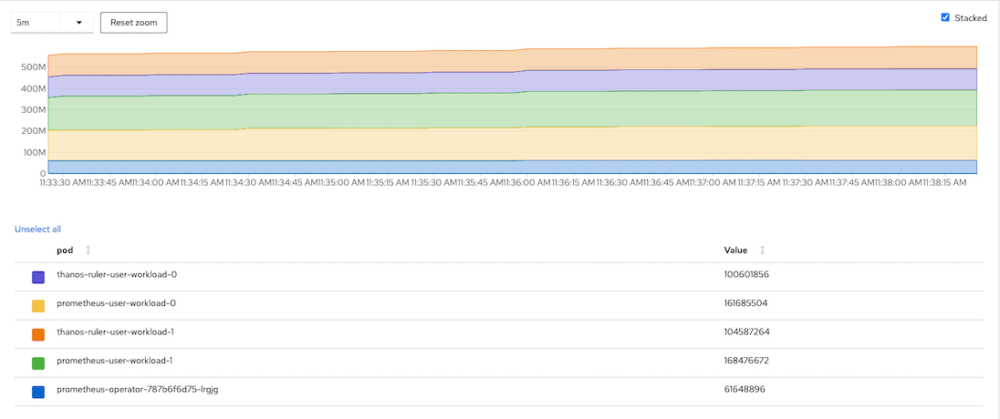

  CPU Quota
  
  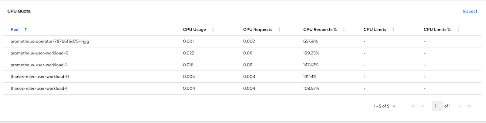

  Memory Quota

  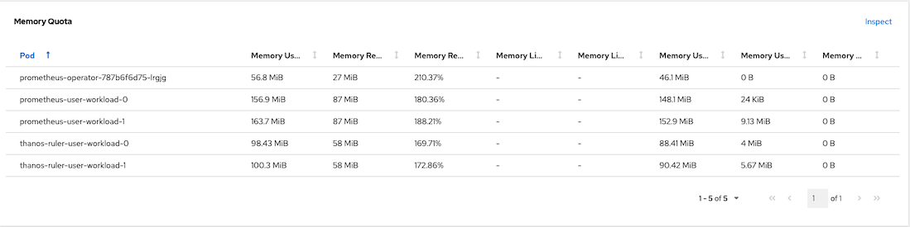
  
## Service Monitoring

- Deploy [frontend/backend app](manifests/frontend-v1-and-backend-v1-JVM.yaml) with custom metrics

  ```bash
  oc create -f manifests/frontend-v1-and-backend-v1-JVM.yaml -n project1
  ```

  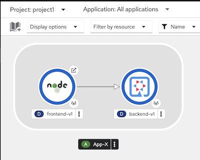

- Call frontend app with curl

  ```bash
  curl https://$(oc get route frontend -o jsonpath='{.spec.host}' -n project1)
  ``` 

  Output

  ```bash
  Frontend version: v1 => [Backend: http://backend:8080, Response: 200, Body: Backend version:v1, Response:200, Host:backend-v1-5587465b8d-9kvsc, Status:200, Message: Hello, World]
  ``` 
  - Check for backend's metrics
    
    - Check JVM heap size

      ```bash
      oc exec -n project1 $(oc get pods -l app=backend \
      --no-headers  -o custom-columns='Name:.metadata.name' \
      -n project1 | head -n 1 ) \
      -- curl -s  http://localhost:8080/q/metrics | grep heap
      ```

      Sample output

      ```bash
      jvm_memory_used_bytes{area="heap",id="Tenured Gen"} 1.1301808E7
      jvm_memory_used_bytes{area="nonheap",id="CodeHeap 'profiled nmethods'"} 5261952.0
      jvm_memory_used_bytes{area="heap",id="Eden Space"} 2506768.0
      jvm_memory_used_bytes{area="nonheap",id="Metaspace"} 3.3255E7
      jvm_memory_used_bytes{area="nonheap",id="CodeHeap 'non-nmethods'"} 1389824.0
      jvm_memory_used_bytes{area="heap",id="Survivor Space"} 524288.0
      jvm_memory_used_bytes{area="nonheap",id="Compressed Class Space"} 4096808.0
      jvm_memory_used_bytes{area="nonheap",id="CodeHeap 'non-profiled nmethods'"} 1120640.0
      ...
      ```

    - Check for backend application related metrics
    
      ```bash
      curl https://$(oc get route frontend -n project1 -o jsonpath='{.spec.host}')
      oc exec -n project1 $(oc get pods -l app=backend \
      --no-headers  -o custom-columns='Name:.metadata.name' \
      -n project1 | head -n 1 ) \
      -- curl -s  http://localhost:8080/q/metrics | grep http_server_requests_seconds
      ```
    
    Check that http_server_requests_seconds_count with method GET and root URI value is 1 with return status 200
  
    ```bash
    # HELP http_server_requests_seconds
    http_server_requests_seconds_count{method="GET",outcome="SUCCESS",status="200",uri="root"} 2.0
    http_server_requests_seconds_sum{method="GET",outcome="SUCCESS",status="200",uri="root"} 3.769968656
    # TYPE http_server_requests_seconds_max gauge
    # HELP http_server_requests_seconds_max
    http_server_requests_seconds_max{method="GET",outcome="SUCCESS",status="200",uri="root"} 3.486753482
    ```

    
- Create [Service Monitoring](manifests/backend-monitor.yaml) to monitor backend service
    
    ```yaml
    apiVersion: monitoring.coreos.com/v1
    kind: ServiceMonitor
    metadata:
      name: backend-monitor
    spec:
      endpoints:
      - interval: 30s
        port: http
        path: /q/metrics # Get metrics from URI /q/metrics
        scheme: http
      selector:
        matchLabels:
          app: backend # select only label app = backend
    ```

    Create service monitor

    ```bash
    oc apply -f manifests/backend-service-monitor.yaml -n project1
    ```
    
    Remark: Role **monitor-edit** is required for create **ServiceMonitor** and **PodMonitor** resources. Following example is granting role montior-edit to user1 for project1

    ```bash
    oc adm policy add-role-to-user  monitoring-edit user1 -n project1
    ```
    
- Developer Console monitoring metrics  
  - Select application metrics

    

  - Application metrics 
  
    - Scale backend-v1 and frontend-v1 to 5 pod and run load test tool

      ```bash
      oc scale deployment backend-v1 --replicas=5 -n project1
      oc scale deployment frontend-v1 --replicas=5 -n project1
      ```

      - Use K6
  
      ```bash
       oc run load-test-frontend -n project1 \
      -i --image=loadimpact/k6  \
      --rm=true --restart=Never --  run -< manifests/load-test-k6.js \
      -e URL=http://frontend:8080 \
      -e THREADS=10 \
      -e RAMPUP=30s \
      -e DURATION=3m \
      -e RAMPDOWN=30s \
      -e K6_NO_CONNECTION_REUSE=true
      ```

      - Use Siege 

      ```bash
      oc create -f manifests/tools.yaml -n project1
      TOOL=$(oc get po -n project1 -l app=network-tools --no-headers  -o custom-columns='Name:.metadata.name')
      ```

      Run siege command

      ```bash
      oc exec -n project1 $TOOL -- siege -c 20 -t 4m http://frontend:8080
      ```
    
    - PromQL for query request/sec for GET method to root URI of backend service
    
      ```
      rate(http_server_requests_seconds_count{method="GET",uri="root"}[1m])
      ```

      Sample stacked graph

      

## K6

This is optional steps. If you have k6 on your manchine

```bash
k6 run manifests/load-test-k6.js \
--out json=output.json \
--summary-export=summary-export.json \
-e URL=https://$(oc get route frontend -o jsonpath='{.spec.host}' -n project1) \
-e THREADS=10 \
-e RAMPUP=30s \
-e DURATION=3m \
-e RAMPDOWN=30s \
-e K6_NO_CONNECTION_REUSE=true
```
*Remark:* output are stored in output.json and summary-export.json


Run K6 with dashboard (You need to install K6 dashbaord first)

```bash
k6 run manifests/load-test-k6.js \
--out dashboard \
-e URL=https://$(oc get route frontend -o jsonpath='{.spec.host}' -n project1) \
-e THREADS=10 \
-e RAMPUP=30s \
-e DURATION=3m \
-e RAMPDOWN=30s \
-e K6_NO_CONNECTION_REUSE=true
```

View [Dashboard](http://127.0.0.1:5665/)

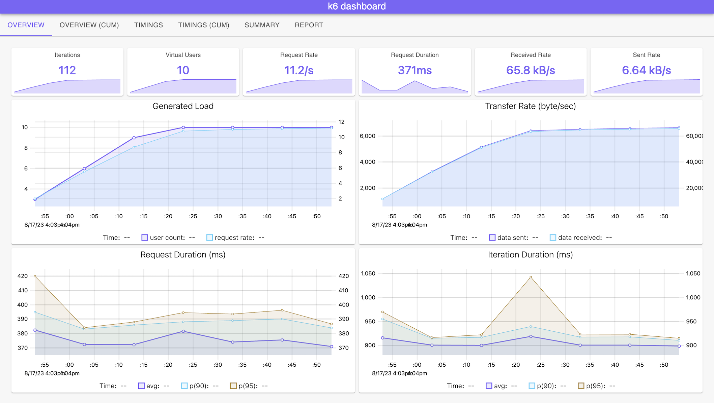

## Custom Grafana Dashboard
- Install Grafana Operator to project application-monitor
  
  

  or using CLI

  ```bash
  oc create -f manifests/grafana-sub.yaml
  ```

  Verify

  ```bash
  oc get csv -n openshift-operators
  ```

  Output

  ```bash
  NAME                      DISPLAY            VERSION   REPLACES                  PHASE
  grafana-operator.v5.6.2   Grafana Operator   5.6.2     grafana-operator.v5.6.1   Succeeded
  ```
<!-- https://access.redhat.com/solutions/5335491 -->
  Use **Grafana Operator by Red Hat** to deploy Grafana and configure datasource to Thanos Querier
  Remark: **Grafana Operator is Community Edition - not supported by Red Hat**


- Create project
  
  ```bash
  oc new-project application-monitor --display-name="App Dashboard" --description="Grafana Dashboard for Application Monitoring"
  ```
  

  
- Create [Grafana instance](manifests/grafana.yaml)
  
  ```bash
  oc create -f manifests/grafana.yaml -n application-monitor
  oc create route edge grafana --service=grafana-service --port=3000 -n application-monitor
  watch -d oc get pods -n application-monitor
  ```
  
  Sample Output
  
  ```bash
  NAME                                 READY   STATUS    RESTARTS   AGE
  grafana-deployment-96d5f5954-5hml7   1/1     Running   0          14s
  ```
  
- Add cluster role `cluster-monitoring-view` to Grafana ServiceAccount

  ```bash
  oc adm policy add-cluster-role-to-user cluster-monitoring-view \
  -z grafana-sa -n application-monitor
  ```

- Create [Grafana DataSource](manifests/grafana-datasource.yaml) with serviceaccount grafana-serviceaccount's token and connect to thanos-querier
  
  ```bash
  TOKEN=$(oc create token grafana-sa --duration=4294967296s -n application-monitor)
  cat manifests/grafana-datasource.yaml|sed 's/Bearer .*/Bearer '"$TOKEN""'"'/'|oc apply -n application-monitor -f -
  ```  

- Create [Grafana Dashboard](manifests/grafana-dashboard.yaml)

  ```bash
  oc apply -f manifests/grafana-dashboard.yaml -n application-monitor 
  ```

- Login to Grafana Dashboard with following URL
  
  ```bash
  echo "Grafana URL => https://$(oc get route grafana -o jsonpath='{.spec.host}' -n application-monitor)"
  ```
  
  or use link provided by Developer Console

  

  Login with user `admin` and password `openshift`
  
- Generate workload
  - bash script to loop request to frontend application.
  
    ```bash
    FRONTEND_URL=https://$(oc get route frontend -n project1 -o jsonpath='{.spec.host}')
    while [ 1 ];
    do
      curl $FRONTEND_URL
      printf "\n"
      sleep .2
    done
    ```

  - k6 load test tool with 10 threads for 5 minutes

    ```bash
    oc run load-test-frontend -n project1 \
    -i --image=loadimpact/k6  \
    --rm=true --restart=Never --  run -< manifests/load-test-k6.js \
    -e URL=http://frontend:8080 \
    -e THREADS=15 \
    -e RAMPUP=30s \
    -e DURATION=5m \
    -e RAMPDOWN=30s
    ```    
  
- Grafana Dashboard
  
  

## Custom Alert

- Check [PrometheusRule](manifests/backend-custom-alert.yaml)

  [backend-app-alert](manifests/backend-custom-alert.yaml) is consists with 2 following alerts:
  
  - ConcurrentBackend
    severity warning when total concurrent reqeusts is greater than 40 requests/sec
  
  - HighLatency
    servierity critical when percentile 90th of response time is greater than 5 sec  


- Create [backend-app-alert](manifests/backend-custom-alert.yaml) 

  ```bash
  oc apply -f manifests/backend-custom-alert.yaml
  ```

  Remark: Role `monitoring-rules-view` is required for view `PrometheusRule` resource and role `monitoring-rules-edit` is required to  create, modify, and deleting `PrometheusRule` 
  
  Following example is granting role monitoring-rules-view and monitoring-rules-edit to user1 for project1

  ```bash
  oc adm policy add-role-to-user  monitoring-rules-view user1 -n project1
  oc adm policy add-role-to-user  monitoring-rules-edit user1 -n project1

  ``` 
  
<!-- - For simplified our test, set backend app to 2 pod
  
  ```bash
  oc delete deployment backend-v2 -n project1
  oc scale deployment backend-v1 --replicas=2 -n project1
  ``` -->
  
- Test `ConcurrentBackend` alert with 25 concurrent requests

  ```bash
     oc run load-test-frontend -n project1 \
    -i --image=loadimpact/k6  \
    --rm=true --restart=Never --  run -< manifests/load-test-k6.js \
    -e URL=http://frontend:8080 \
    -e THREADS=15 \
    -e RAMPUP=30s \
    -e DURATION=5m \
    -e RAMPDOWN=30s 
  ```

  Check for alert in Developer Console by select Menu `Monitoring` then select `Alerts`

  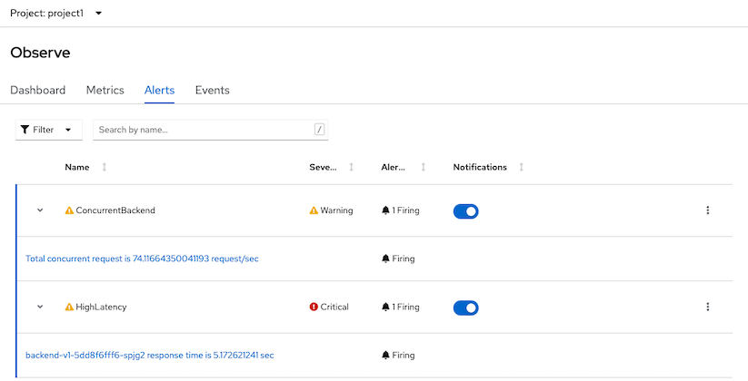

<!-- - Test `HighLatency` alert
  - Set backend with 6 sec response time
    - By CLI
      ```bash
      oc set env deployment/backend-v1 APP_BACKEND=https://httpbin.org/delay/6 -n project1
      ```
    - By Developer Console
      - Select `Topology` then select backend-v1 and select dropdown menu `Edit Deployment`
        
        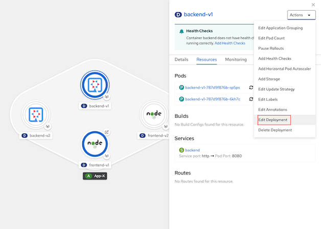
        
      - Select `Environment` and set APP_BACKEND to https://httpbin.org/delay/6

        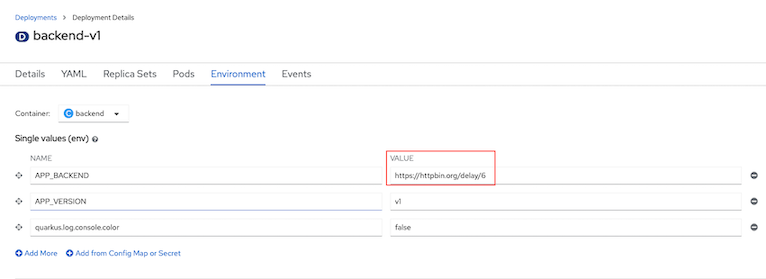 -->
  <!-- - Request to frontend app
    
    ```bash
    curl $FRONTEND_URL
    ``` -->
  - Check for alert in Developer Console 
    
    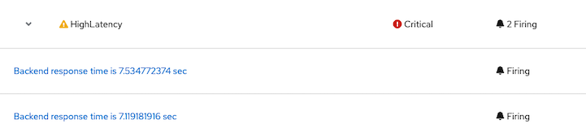

  - Console overview status

    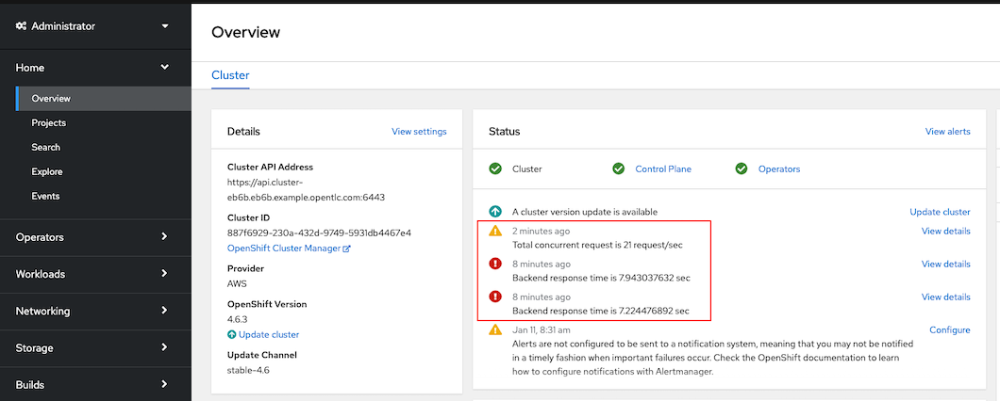


    sum(increase(http_server_requests_seconds_count{outcome="SUCCESS"}[5m]))/sum(increase(http_server_requests_seconds_count[5m]))*100