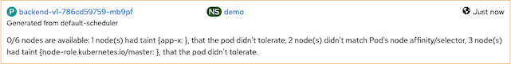

# Assign Pod to Node
- [Assign Pod to Node](#assign-pod-to-node)
  - [Node Selector](#node-selector)
  - [Taints and Tolerations](#taints-and-tolerations)
  - [Remove node label and toleration](#remove-node-label-and-toleration)

## Node Selector

You can configure pod to run on particular node by using node label along with nodeSelector 

- Deploy [backend application](manifests/backend-v1.yaml) and scale to 5 pods
  
  ```bash
  oc new-project demo
  oc apply -f manifests/backend-v1.yaml -n demo
  oc scale deployment backend-v1 --replicas=5 -n demo
  ```
- Check that 5 pods is running on which worker nodes
  
  ```bash
  watch oc get pods -o 'custom-columns=Name:.metadata.name,PHASE:.status.phase,NODE:.spec.nodeName' -n demo
  ```
  
  Sample output

  ```bash
    Name                        PHASE     NODE
    backend-v1-b564ff66-6spph   Running   ip-10-0-XXX-179.us-east-2.compute.internal
    backend-v1-b564ff66-dh77c   Running   ip-10-0-XXX-101.us-east-2.compute.internal
    backend-v1-b564ff66-dtkjn   Running   ip-10-0-XXX-179.us-east-2.compute.internal
    backend-v1-b564ff66-n7kr4   Running   ip-10-0-XXX-121.us-east-2.compute.internal
    backend-v1-b564ff66-thhqv   Running   ip-10-0-XXX-121.us-east-2.compute.internal
  ```

- Let's say we want to run backend app is belong to project app-x and project app-x need to run on node 179 only then we'll label node 179 with label app-x

  ```bash
  oc label node ip-10-0-XXX-179.us-east-2.compute.internal app-x=''
  ```

- Add nodeSelector to [backend-v1 deployment](manifests/backend-v1-with-node-selector.yaml)
  Remark:
  - You can use another shell/terminal to check status of backend-v1's pods with previously watch command
  - sed is use for set replicas to 5.

    ```bash
    cat manifests/backend-v1-with-node-selector.yaml | sed s/replicas:\ 1/replicas:\ 5/g | oc apply -n demo -f -
    ```

    Sample output from watch command

    ```bash
    Name                          PHASE     NODE
    backend-v1-786cd59759-bcmpx   Running   ip-10-0-XXX-179.us-east-2.compute.internal
    backend-v1-786cd59759-dkgxp   Pending   ip-10-0-XXX-179.us-east-2.compute.internal
    backend-v1-786cd59759-lpnwq   Pending   ip-10-0-XXX-179.us-east-2.compute.internal
    backend-v1-786cd59759-vlqp2   Running   ip-10-0-XXX-179.us-east-2.compute.internal
    backend-v1-786cd59759-x4nlb   Running   ip-10-0-XXX-179.us-east-2.compute.internal
    backend-v1-b564ff66-dh77c     Running   ip-10-0-XXX-101.us-east-2.compute.internal
    backend-v1-b564ff66-thhqv     Running   ip-10-0-XXX-121.us-east-2.compute.internal
    ```

    When finished all pods will be run on node 179

    ```bash
    Name                          PHASE     NODE
    backend-v1-786cd59759-bcmpx   Running   ip-10-0-XXX-179.us-east-2.compute.internal
    backend-v1-786cd59759-dkgxp   Running   ip-10-0-XXX-179.us-east-2.compute.internal
    backend-v1-786cd59759-lpnwq   Running   ip-10-0-XXX-179.us-east-2.compute.internal
    backend-v1-786cd59759-vlqp2   Running   ip-10-0-XXX-179.us-east-2.compute.internal
    backend-v1-786cd59759-x4nlb   Running   ip-10-0-XXX-179.us-east-2.compute.internal
    ```

- Check [backend-v1 deployment](manifests/backend-v1-with-node-selector.yaml) with nodeAffinity under template

    ```yaml
    spec:
      affinity:
        nodeAffinity:
          requiredDuringSchedulingIgnoredDuringExecution:
            nodeSelectorTerms:
            - matchExpressions:
              - key: app-x
                operator: Exists
    ```

## Taints and Tolerations

Taint is proporty of nodes that allow only pod with toleration can be scheduled to run on that particular node.

- Let's say we want to allow only project app-x to run on node 179 then we will taint node 179

  ```bash
  oc adm taint node ip-10-0-248-179.us-east-2.compute.internal app-x='':NoSchedule
  ```

- Taint is not effect pods those already scheduled then we will force backend-v1 to create all pods again
  
  ```bash
  oc delete pods --all -n demo
  ```

  Pods cannot schedule because there is no toleration in deployment
 
  ```bash
  Name                          PHASE     NODE
  backend-v1-786cd59759-79jmh   Pending   <none>
  backend-v1-786cd59759-gnwg7   Pending   <none>
  backend-v1-786cd59759-lc4jr   Pending   <none>
  backend-v1-786cd59759-lgk8r   Pending   <none>
  backend-v1-786cd59759-vcd22   Pending   <none>
  ```

  Check Events in OpenShift Console

  
 
- Add toleration to [backend-v1 deployment](manifests/backend-v1-with-node-selector-and-toleration.yaml)

  ```bash
  cat manifests/backend-v1-with-node-selector-and-toleration.yaml|sed s/replicas:\ 1/replicas:\ 5/g | oc apply -n demo -f -
  ```

  When finished all pods will be run on node 179

  ```bash
  Name                          PHASE     NODE
  backend-v1-647db46bfc-868w6   Running   ip-10-0-XXX-179.us-east-2.compute.internal
  backend-v1-647db46bfc-krzvs   Running   ip-10-0-XXX-179.us-east-2.compute.internal
  backend-v1-647db46bfc-nssqz   Running   ip-10-0-XXX-179.us-east-2.compute.internal
  backend-v1-647db46bfc-qhvws   Running   ip-10-0-XXX-179.us-east-2.compute.internal
  backend-v1-647db46bfc-vnl5l   Running   ip-10-0-XXX-179.us-east-2.compute.internal
  ```

- Check [backend-v1 deployment](manifests/backend-v1-with-node-selector-and-toleration.yaml) with nodeAffinity under template

    ```yaml
      tolerations:
      - effect: NoSchedule
        key: app-x
        operator: Exists
    ```

## Remove node label and toleration

- Following commands show how to remove node label and toleration

  ```bash
  oc label node ip-10-0-XXX-179.us-east-2.compute.internal app-x-
  oc adm taint nodes ip-10-0-XXX-179.us-east-2.compute.internal app-x='':NoSchedule-
  ```
