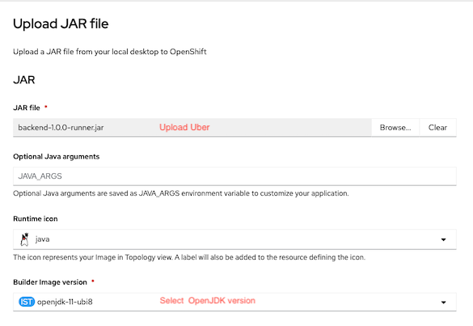
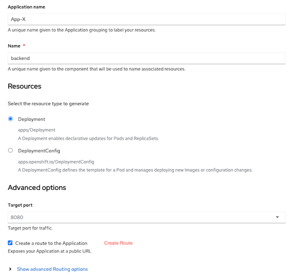
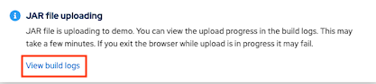
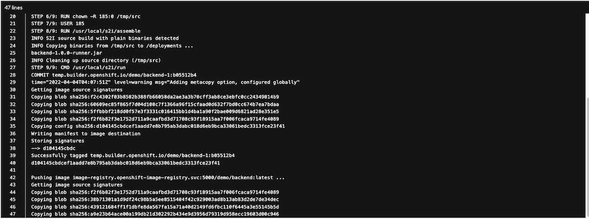
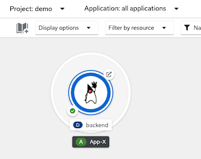

# Developer Console
- [Developer Console](#developer-console)
  - [Upload Uber JAR](#upload-uber-jar)
## Upload Uber JAR
- Select upload JAR
  
  

- Upload your Uber JAR and select Builder Image
  
  

- Name your application and select parameters e.g. Ingress (Route), request/limit

  

- View build logs

  

  Build log

   

- Check for build config by select menu Builds->backend->YAML
  - Base image is from *sourceStrategy*
  - Source type is *binary*

  ```yaml
  strategy:
    type: Source
    sourceStrategy:
      from:
        kind: ImageStreamTag
        namespace: openshift
        name: 'java:openjdk-11-ubi8'
  postCommit: {}
  source:
    type: Binary
    binary: {}
  ```

- Check your deployed application

   