# CI/CD with Jenkins
<!-- TOC -->

- [CI/CD with Jenkins](#cicd-with-jenkins)
  - [Overall Solution](#overall-solution)
    - [Build and Deploy to Development Environment](#build-and-deploy-to-development-environment)
    - [Deploy Staging Environment](#deploy-staging-environment)
    - [Deploy UAT Environment](#deploy-uat-environment)
    - [Deploy Production Environment](#deploy-production-environment)
  - [Setup](#setup)
    - [Projects](#projects)
    - [Jenkins, SonarQube and Nexus](#jenkins-sonarqube-and-nexus)

<!-- /TOC -->
## Overall Solution

Jenkins pipelines to demonstrate CI/CD process to build Quarkus application from source code to container image with version control by tag name and deploy application to Development, Staging, UAT and blue/green deployment to Production environment.

Remark:

[*Source code of Quarkus and Jenkins*](https://gitlab.com/ocp-demo/backend_quarkus)


### Build and Deploy to Development Environment
- Build fast-jar Quarkus application
- Pull dependencies from Nexus
- Run unit test with JUnit and code quality with SonarQube
- Push container image to Nexus or internal registry
- Create service, route and deploymentconfig in dev project

  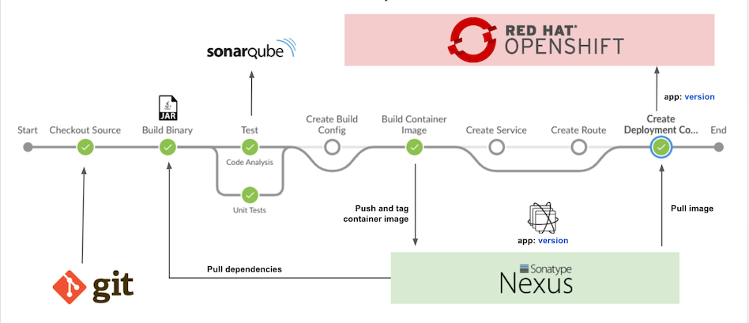

### Deploy Staging Environment

- Select version to deploy to stage project
- Tag container image with *version-DDMMYYYY-round*
- Tear down and deploy application to stage project

  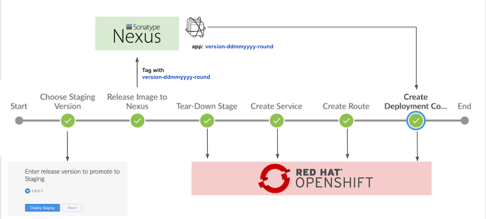

### Deploy UAT Environment

- Select version to deploy to uat project. Only images with tag *version-DDMMYYYY-round* will be avaiable in list to deploy
- Tear down and deploy application to uat project

### Deploy Production Environment

- Select version to deploy to prod project. Only images with tag *version-DDMMYYYY-round* will be avaiable in list to deploy
- Create deploymentconfig and service for blue and green version
- Create route
- Select version to deploy and scale down previous version

  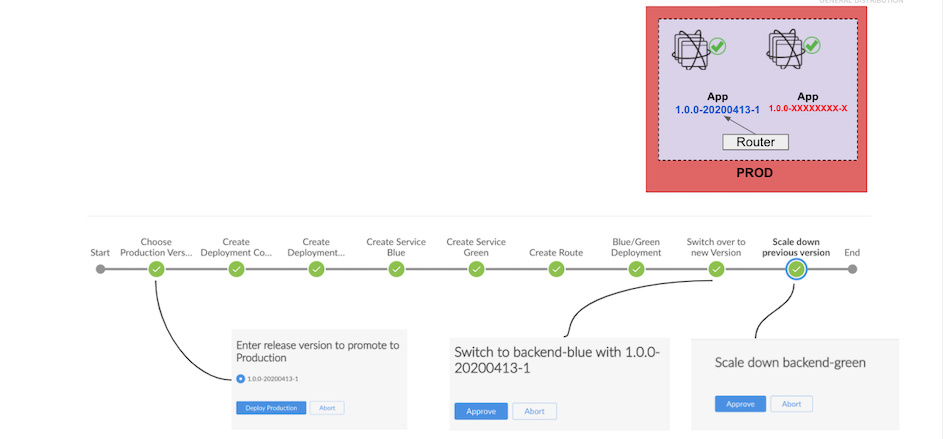

## Setup
### Projects
- Create 4 projects ci-cd, dev, stage, uat and prod

  ```bash
  CI_CD=ci-cd
  DEV=dev
  STAGE=stage
  UAT=uat
  PROD=prod
  oc new-project $DEV  --display-name="Development Environment"
  oc new-project $STAGE  --display-name="Staging Environment"
  oc new-project $UAT --display-name="User Acceptance Test Environment"
  oc new-project $PROD --display-name="Production Environment"
  oc new-project $CI_CD  --display-name="CI/CD Tools"
  ```

- Allow jenkins service account to managed dev, stage, uat and prod
  
  ```bash
  oc policy add-role-to-user edit system:serviceaccount:${CI_CD}:jenkins -n ${DEV}
  oc policy add-role-to-user edit system:serviceaccount:${CI_CD}:jenkins -n ${STAGE}
  oc policy add-role-to-user edit system:serviceaccount:${CI_CD}:jenkins -n ${UAT}
  oc policy add-role-to-user edit system:serviceaccount:${CI_CD}:jenkins -n ${PROD}
  ```

- Allow dev, stage, uat and prod to pull image from ci-cd project (in case use internal image registry instead of Nexus)

  ```bash
  oc policy add-role-to-group system:image-puller system:serviceaccounts:${DEV} -n ${CI_CD}
  oc policy add-role-to-group system:image-puller system:serviceaccounts:${STAGE} -n ${CI_CD}
  oc policy add-role-to-group system:image-puller system:serviceaccounts:${UAT} -n ${CI_CD}
  oc policy add-role-to-group system:image-puller system:serviceaccounts:${PROD} -n ${CI_CD}
  ```

  Remark: You can use bash script [setup_projects.sh](bin/setup_projects.sh) for all above steps.

### Jenkins, SonarQube and Nexus
- Setup
  - Run *bash scripts* to setup Jenkins, SonarQube and Nexus
  
    ```bash
    cd bin
    ./setup_nexus.sh
    ./setup_jenkins.sh
    ./setup_sonar.sh
    ```
    Sample output

    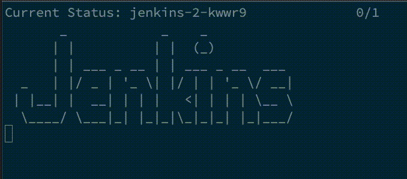

    Check Developer Console

    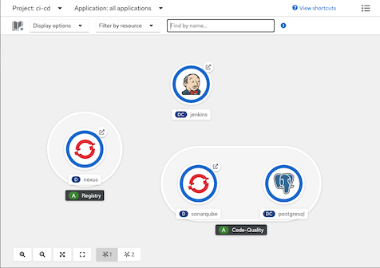

  - Login to Nexus with user *admin* with password from the 1st line *nexus_password.txt*. You can change password to whatever you want
  - Check for Nexus's repositories
    
    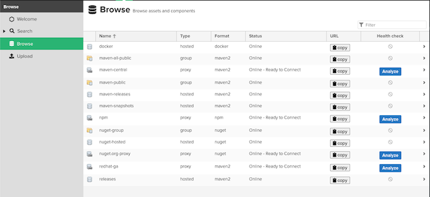

  - Jenkins will use user and password stored in secret *nexus-credential*
    - Check for nexus-credential
      
      ```bash
      oc describe secret/nexus-credential -n ci-cd
      ```

      Sample output

      ```bash
      Name:         nexus-credential
      Namespace:    ci-cd
      Labels:       <none>
      Annotations:  <none>

      Type:  Opaque

      Data
      ====
      password:  48 bytes
      username:  8 bytes
      ```

<!-- ### Jenkins Slave
- Create custom jenkins slave which contains maven 3.6, skopeo and nexus-cli by run [setup_maven36_slave.sh](bin/setup_maven36_slave.sh)
  
  ```bash
  oc project ci-cd
  ./setup_maven36_slave.sh
  ```
- Check imagestream in project ci-cd
    
  ```bash
  oc get is/maven36-with-tools
  ``` -->

### Jenkins Pipelines
- Create pipelines
  
  ```bash
  oc apply -f manifests/backend-build-pipeline.yaml -n ci-cd
  oc apply -f manifests/backend-release-pipeline.yaml -n ci-cd
  oc apply -f manifests/backend-release-uat-pipeline.yaml -n ci-cd
  oc apply -f manifests/backend-release-prod-pipeline.yaml -n ci-cd
  ```

- Control pipeline to use internal registry or Nexus by pipeline's parameter **USE_INTERNAL_REGISTRY**

  ```yaml
  env:
    - name: DEV_PROJECT
      value: dev
    - name: CICD_PROJECT
      value: ci-cd
    - name: BACKEND_URL
      value: https://httpbin.org/status/200
    - name: NEXUS_SVC
      value: http://nexus.ci-cd.svc.cluster.local:8081
    - name: NEXUS_REGISTRY_SVC
      value: nexus-registry.ci-cd.svc.cluster.local:5000
    - name: NEXUS_REGISTRY
      value: nexus-registry-ci-cd.apps.cluster-a987.a987.example.opentlc.com
    - name: SONARQUBE_SVC
      value: http://sonarqube:9000
    - name: NEXUS_SECRET
      value: nexus-credential
    - name: USE_INTERNAL_REGISTRY
      value: "false"
  ```
### Jenkins Remote API
- Create token
  
  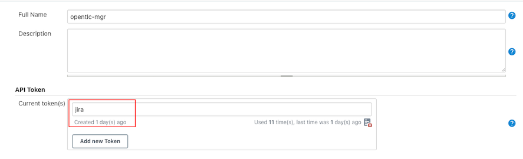

  Check for jenkins's user ID

  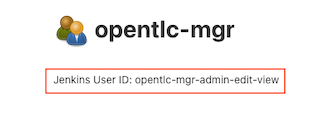

- Configure pipeline Trigger builds
  
  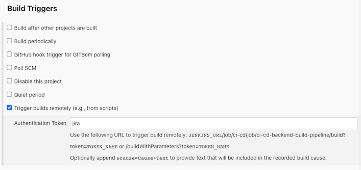

- Test 
  
```bash
USERID=opentlc-mgr-admin-edit-view
TOKEN=117d9459d809be344f1823cbc1248fba09
JENKINS_URL=https://jenkins-ci-cd.apps.cluster-1516.1516.example.opentlc.com
curl -X POST -L -v --user $USERID:$TOKEN "$JENKINS_URL/job/ci-cd/job/ci-cd-backend-build-pipeline/buildWithParameters?token=jira&NEXUS_REGISTRY_SVC=nexus-registry.ci-cd.svc.cluster.local:5000&NEXUS_REGISTRY=nexus-registry-ci-cd.apps.cluster-a987.a987.example.opentlc.com"
```
## Checkpoints
- Maven build in pipeline pull dependencies from nexus
  - Code snippets 

    ```javascript
    environment {
      mvnCmd = "mvn -s ./nexus_settings.xml "
      ...
      ...
    }
    ...
    script {
      sh "${mvnCmd} -Dquarkus.package.type=fast-jar -Dinternal.repo.username=${nexusUser} -Dinternal.repo.password=${nexusPassword} -DskipTests=true clean package"
    }
    ```
  - Nexus's repository
    
    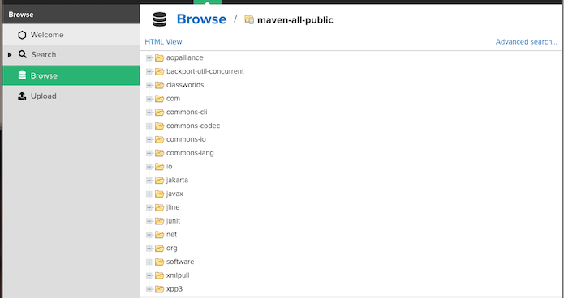

- SonarQube code quality checking
  - Code snippets 

    ```javascript
    script {
      sh "${mvnCmd} sonar:sonar -Dinternal.repo.username=${nexusUser} -Dinternal.repo.password=${nexusPassword} -Dsonar.host.url=${env.SONARQUBE_SVC} -Dsonar.projectName=${imageName}-${devTag} -Dsonar.projectVersion=${devTag}"
    }
    ```
  - Scan result
    
    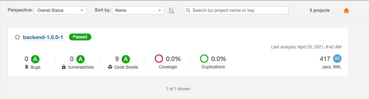

- Container images is built and pushed to Nexus
  - Code snippets 

    ```javascript
    openshift.withCluster() {
      openshift.withProject(env.CICD_PROJECT) {
         openshift.newBuild(
               "--name=${imageName}",
               "--to=${nexus_url}/${imageName}:latest",
               "--to-docker=true",
               "--push-secret=nexus-registry",
               "--strategy=docker",
               "--binary=true"
             )
      }
    }
    ```
  - Nexus image registry

    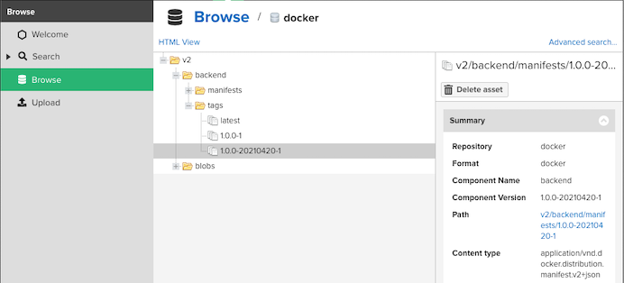

- Application is deployed with label *version* and  *tag*
  
    

<!-- ## Possible improvement
- Change from deploymentconfig to deployment
- Change from OpenShift's template to kustomize
- Validate SonarQube result -->
