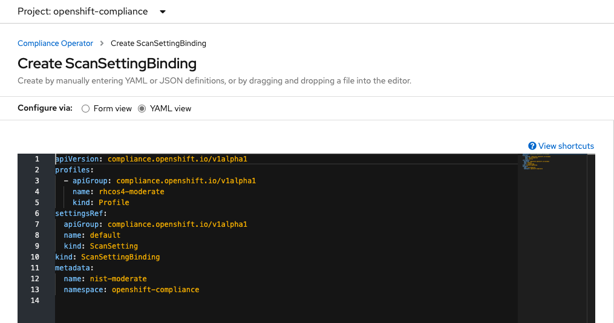
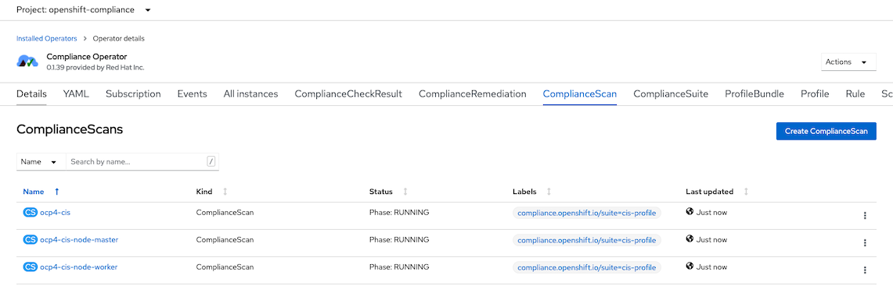
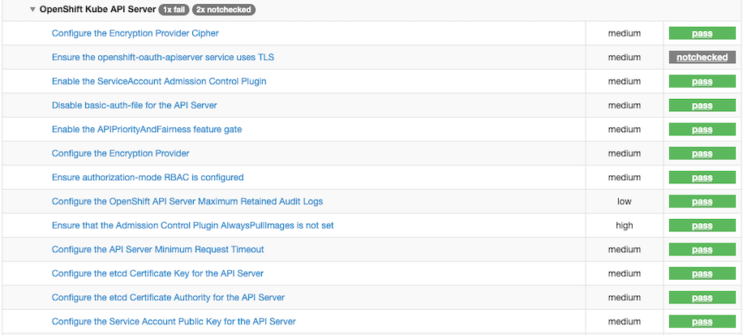

# OpenShift Compliance with Compliance Operator

- [OpenShift Compliance with Compliance Operator](#openshift-compliance-with-compliance-operator)
  - [Prerequisites](#prerequisites)
  - [Compliance Operator](#compliance-operator)
  - [CIS Profile](#cis-profile)
  - [Openscap Report](#openscap-report)

## Prerequisites
- OpenShift 4.6 or 4.7
- Cluster-admin user access


## Compliance Operator

- Install Compliance Operator from OperatorHub
- **[Optional]** Verify Compliance Operator
  - Check compliance profile
    
    ```bash
    oc get profiles.compliance -n openshift-compliance
    ```

    Output example

    ```bash
    NAME              AGE
    ocp4-cis          4h52m
    ocp4-cis-node     4h52m
    ocp4-e8           4h52m
    ocp4-moderate     4h52m
    rhcos4-e8         4h52m
    rhcos4-moderate   4h52m
    ```

  - Check detail of profile
    
    ```bash
    oc get -o yaml profiles.compliance ocp4-cis  -n openshift-compliance
    ```

   Output example

   ```yaml
   ...
   rules:
    - ocp4-accounts-restrict-service-account-tokens
    - ocp4-accounts-unique-service-account
    - ocp4-api-server-admission-control-plugin-alwaysadmit
    - ocp4-api-server-admission-control-plugin-alwayspullimages
    - ocp4-api-server-admission-control-plugin-namespacelifecycle
    - ocp4-api-server-admission-control-plugin-noderestriction
   ...
   ```
  - Check details of rule
    
    ```bash
    oc get -o yaml rules.compliance ocp4-accounts-unique-service-account  -n openshift-compliance
    ```
- Check for default ScanSetting
  
  - List all ScanSetting
    
    ```bash
    oc get scansettings -n openshift-compliance
    ```

    Result

    ```bash
    NAME                 AGE
    default              35m
    default-auto-apply   35m
    ```

  - Check for *default* ScanSetting
  
    ```bash
    oc describe scansettings default -n openshift-compliance 
    ```

    Output example, scheduled at 1AM everyday and apply to both master and worker node and use block storage (RWO) for stored result

    ```bash
    Raw Result Storage:
      Pv Access Modes:
        ReadWriteOnce
      Rotation:  3
      Size:      1Gi
    Roles:
      worker
      master
    Scan Tolerations:
      Effect:    NoSchedule
      Key:       node-role.kubernetes.io/master
      Operator:  Exists
      Schedule:    0 1 * * *
      Events:      <none>
    ```
## CIS Profile

- To start scan, create ScanSettingBinding. Scan will be started immediately after save
  - Use Admin Console to create ScanSettingBinding, default is *rhcos4-moderate* and use default *ScanSetting*

    

  - Add *opc4-cis* profile to profiles list
  
    ```yaml
    apiVersion: compliance.openshift.io/v1alpha1
    profiles:
      - apiGroup: compliance.openshift.io/v1alpha1
        name: rhcos4-moderate
        kind: Profile
      - apiGroup: compliance.openshift.io/v1alpha1
        name: ocp4-cis
        kind: Profile 
    settingsRef:
      apiGroup: compliance.openshift.io/v1alpha1
      name: default
      kind: ScanSetting
    kind: ScanSettingBinding
    metadata:
      name: cis-and-moderate-profile
      namespace: openshift-compliance
    ```

    or use CLI

    ```bash
    oc apply -f manifests/cis-and-moderate-profile.yaml
    oc describe scansettingbinding/cis-and-moderate-profile -n openshift-compliance
    ```

    Check for status

    ```bash
    Status:
      Conditions:
        Last Transition Time:  2021-05-12T08:02:50Z
        Message:               The scan setting binding was successfully processed
        Reason:                Processed
        Status:                True
        Type:                  Ready
      Output Ref:
        API Group:  compliance.openshift.io
        Kind:       ComplianceSuite
        Name:       cis-and-moderate-profile
    Events:
      Type    Reason        Age   From                    Message
      ----    ------        ----  ----                    -------
      Normal  SuiteCreated  10s   scansettingbindingctrl  ComplianceSuite openshift-compliance/cis-and-moderate-profile created    
    ```
  
  - Check ComplianceScan tab
    
    

  - or use CLI
    
    ```bash
    oc get compliancescan -n openshift-compliance
    ```
    
    Output

    ```bash
    NAME                     PHASE     RESULT
    ocp4-cis                 DONE      NON-COMPLIANT
    rhcos4-moderate-master   RUNNING   NOT-AVAILABLE
    rhcos4-moderate-worker   RUNNING   NOT-AVAILABLE
    ```

- Check result
  - Count for FAIL 
  
    ```bash
    oc get compliancecheckresult -n openshift-compliance | grep FAIL | wc -l
    ```

  - Script for summary result [bin/check-compliance-result.sh](bin/check-compliance-result.sh) 
    
    ```bash
    ================== RESULT ==================
    TYPE          	NUMBER
    PASS          	148
    FAIL          	395
    MANUAL        	34
    INFO          	2
    NOT_APPLICABLE	0
    
    ================ SEVERITY =================
    high          	29
    low           	27
    medium        	515
    unknown       	14
    ```

  - Check for result description for *ocp4-cis-api-server-encryption-provider-config*
    
    ```bash
    oc describe compliancecheckresult/ocp4-cis-api-server-encryption-provider-config -n openshift-compliance
    ```
    
    Output
    
    ```bash
    ...
    Description:  Configure the Encryption Provider
    etcd is a highly available key-value store used by OpenShift deployments
    for persistent storage of all REST API objects. These objects are
    sensitive in nature and should be encrypted at rest to avoid any
    disclosures.
    Id:            xccdf_org.ssgproject.content_rule_api_server_encryption_provider_config
    Instructions:  Run the following command:
    $ oc get apiserver cluster -ojson | jq -r '.spec.encryption.type'
    The output should return aescdc as the encryption type.
    ...
    Severity:                  medium
    Status:                    FAILED
    Events:                    <none> 
    ```

- Fix failed policies with *ComplianceRemediation*
  - List *ComplianceRemediation*
  
    ```bash
    oc get ComplianceRemediation -n openshift-compliance
    ```

    Output

    ```bash
    NAME                                                                                                STATE
    ocp4-cis-api-server-encryption-provider-cipher                                                      NotApplied
    ocp4-cis-api-server-encryption-provider-config                                                      NotApplied
    rhcos4-moderate-master-audit-rules-dac-modification-chmod                                           NotApplied
    rhcos4-moderate-master-audit-rules-dac-modification-chown                                           NotApplied
    ...
    ```

  - Fix failed *ocp4-cis-api-server-encryption-provider-config* policy with *ComplianceRemidiation*
  
    ```bash
    oc patch -n openshift-compliance complianceremediation \
    ocp4-cis-api-server-encryption-provider-config -p '{"spec":{"apply":true}}' --type='merge'
    ```

    Check result
    
    ```bash
    oc get ComplianceRemediation/ocp4-cis-api-server-encryption-provider-config -n openshift-compliance
    ```

    Output

    ```bash
    NAME                                             STATE
    ocp4-cis-api-server-encryption-provider-config   Applied
    ```
  
- Re-run scan
  -  Annotate *ComplianceScans* to rescan or use [script](bin/rerun-compliance-scan.sh)
    
    ```bash
    for scan in $(oc get compliancescans -n openshift-compliance -o custom-columns=NAME:.metadata.name --no-headers)
    do
    oc annotate compliancescans $scan compliance.openshift.io/rescan= -n openshift-compliance
    done
    watch -d oc get compliancescans -n openshift-compliance
    ```

    Result

    ```bash
    compliancescan.compliance.openshift.io/ocp4-cis annotated
    compliancescan.compliance.openshift.io/rhcos4-moderate-master annotated
    compliancescan.compliance.openshift.io/rhcos4-moderate-worker annotated
    NAME                     PHASE     RESULT
    ocp4-cis                 RUNNING   NOT-AVAILABLE
    rhcos4-moderate-master   RUNNING   NOT-AVAILABLE
    rhcos4-moderate-worker   RUNNING   NOT-AVAILABLE
    ```

  - Recheck policy *ocp4-cis-api-server-encryption-provider-config*
    
    ```bash
    oc describe compliancecheckresult/ocp4-cis-api-server-encryption-provider-config -n openshift-compliance
    ```
    
    Output
    
    ```bash
    ...
    Severity:                  medium
    Status:                    PASS
    Events:                    <none>
    ```
- Change *ScanSettingBinding* cis-and-moderate-profile to use ScanSetting *default-auto-apply*
  
  ```bash
  oc patch -n openshift-compliance ScanSettingBinding cis-and-moderate-profile -p '{"settingsRef":{"name":"default-auto-apply"}}' --type='merge'
  ```

  Output

  ```bash
  scansettingbinding.compliance.openshift.io/cis-and-moderate-profile patched
  ```

- [Re-run scan](bin/rerun-compliance-scan.sh)
- Check compliance scan status
  
  ```bash
  watch oc get compliancescans -n openshift-compliance
  ```
  
  Output

  ```bash
  NAME                     PHASE     RESULT
  ocp4-cis                 DONE      NON-COMPLIANT
  rhcos4-moderate-master   RUNNING   NOT-AVAILABLE
  rhcos4-moderate-worker   RUNNING   NOT-AVAILABLE
  ```
- [Recheck result](bin/check-compliance-result.sh)
  
  ```bash
  ================== RESULT ==================
  TYPE          	NUMBER
  PASS          	150
  FAIL          	89
  MANUAL        	34
  INFO          	2
  NOT_APPLICABLE	0
  INCONSISTENT  	304

  ================ SEVERITY =================
  high          	29
  low           	27
  medium        	515
  unknown       	14
  ```
 ## Openscap Report
 - Create pod to mount to cis pv
   ```bash
   oc create -f manifests/cis-extract.yaml
   oc apply -f manifests/ocp4-worker-extract.yaml
   ```
 - Copy report file from pod
   ```bash
   oc cp cis-extract:/cis-scan-results .
   
   ```
   Reports 
   ```bash
   ├── 0
   │   └── ocp4-cis-api-checks-pod.xml.bzip2
   └── 1
       └── ocp4-cis-api-checks-pod.xml.bzip2
   ```
 - Install openscap on RHEL
   ```bash
   yum install openscap-scanner openscap-utils scap-security-guide
   ```
 - Use openscap utils in RHEL to generate HTML report
   ```bash
   oscap xccdf generate report ocp4-cis-api-checks-pod.xml.bzip2 > ocp4-cis.html
   ``` 
 - Sample reports [cis](images/ocp4-cis.pdf) and [ocp4-worker-moderate](images/ocp4-worker-moderate.pdf)
  
   

   HTML version here [cis](images/ocp4-cis.html) and [ocp4-worker-moderate](images/ocp4-worker-moderate.html)

