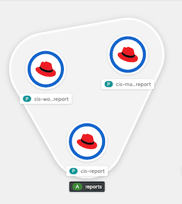

# OpenShift Compliance with Compliance Operator

- [OpenShift Compliance with Compliance Operator](#openshift-compliance-with-compliance-operator)
  - [Prerequisites](#prerequisites)
  - [Compliance Operator](#compliance-operator)
  - [CIS Profile](#cis-profile)
  - [Openscap Report](#openscap-report)
    - [CIS](#cis)
    - [PCI-DSS](#pci-dss)
    - [Reports](#reports)

## Prerequisites
- OpenShift 4.6+
- Cluster-admin user access


## Compliance Operator

- Install Compliance Operator from OperatorHub
- **[Optional]** Verify Compliance Operator
  - Check compliance profile
    
    ```bash
    oc get profiles.compliance -n openshift-compliance
    ```

    Output example

    ```bash
    NAME                 AGE
    ocp4-cis             8m8s
    ocp4-cis-node        8m8s
    ocp4-e8              8m8s
    ocp4-moderate        8m7s
    ocp4-moderate-node   8m7s
    ocp4-nerc-cip        8m7s
    ocp4-nerc-cip-node   8m7s
    ocp4-pci-dss         8m7s
    ocp4-pci-dss-node    8m7s
    rhcos4-e8            8m2s
    rhcos4-moderate      8m2s
    rhcos4-nerc-cip      8m1s
    ```

  - Check detail of profile
    
    ```bash
    oc get -o yaml profiles.compliance ocp4-cis  -n openshift-compliance
    ```

   Output example

   ```yaml
   ...
   rules:
    - ocp4-accounts-restrict-service-account-tokens
    - ocp4-accounts-unique-service-account
    - ocp4-api-server-admission-control-plugin-alwaysadmit
    - ocp4-api-server-admission-control-plugin-alwayspullimages
    - ocp4-api-server-admission-control-plugin-namespacelifecycle
    - ocp4-api-server-admission-control-plugin-noderestriction
   ...
   ```
  - Check details of rule
    
    ```bash
    oc get -o yaml rules.compliance ocp4-accounts-unique-service-account  -n openshift-compliance
    ```

- Check for default ScanSetting
  
  - List all ScanSetting
    
    ```bash
    oc get scansettings -n openshift-compliance
    ```

    Result

    ```bash
    NAME                 AGE
    default              35m
    default-auto-apply   35m
    ```

  - Check for *default* ScanSetting
  
    ```bash
    oc describe scansettings default -n openshift-compliance 
    ```

    Output example, scheduled at 1AM everyday and apply to both master and worker node and use block storage (RWO) for stored result

    ```bash
    Raw Result Storage:
      Pv Access Modes:
        ReadWriteOnce
      Rotation:  3
      Size:      1Gi
    Roles:
      worker
      master
    Scan Tolerations:
      Effect:    NoSchedule
      Key:       node-role.kubernetes.io/master
      Operator:  Exists
      Schedule:    0 1 * * *
      Events:      <none>
    ```
## CIS Profile

- To start scan, create ScanSettingBinding. Scan will be started immediately after save
  - Use Admin Console to create ScanSettingBinding, default is *rhcos4-moderate* and use default *ScanSetting*

    

  - Add *opc4-cis* and *ocp4-cis-node* profiles for CIS compliance to [ScanSettingBinding](manifests/cis-profile.yaml) or add  *ocp4-pci-dss* and  *ocp4-pci-dss-node* for PCI-DSS compliance
  
    ```yaml
    apiVersion: compliance.openshift.io/v1alpha1
    profiles:
      - apiGroup: compliance.openshift.io/v1alpha1
        name: ocp4-cis-node
        kind: Profile
      - apiGroup: compliance.openshift.io/v1alpha1
        name: ocp4-cis
        kind: Profile 
    settingsRef:
      apiGroup: compliance.openshift.io/v1alpha1
      name: default
      kind: ScanSetting
    kind: ScanSettingBinding
    metadata:
      name: cis-profile
      namespace: openshift-compliance
    ```

    or use CLI

    ```bash
    oc apply -f manifests/cis-profile.yaml
    oc apply -f manifests/pci-dss-profile.yaml
    oc describe scansettingbinding/cis-profile -n openshift-compliance|grep -A14  "Status:" 
    oc describe scansettingbinding/pci-dss-profile -n openshift-compliance|grep -A14  "Status:"
    ```

    Check for status
    
    ```bash
    Status:
      Conditions:
        Last Transition Time:  2022-04-12T08:00:27Z
        Message:               The scan setting binding was successfully processed
        Reason:                Processed
        Status:                True
        Type:                  Ready
      Output Ref:
        API Group:  compliance.openshift.io
        Kind:       ComplianceSuite
        Name:       cis-profile
    Events:
      Type    Reason        Age   From                    Message
      ----    ------        ----  ----                    -------
      Normal  SuiteCreated  10s   scansettingbindingctrl  ComplianceSuite openshift-compliance/cis-profile created
    ```
  
  - Check ComplianceScan tab
    
    

  - or use CLI
    
    ```bash
    watch -d oc get compliancescan -n openshift-compliance
    ```
    
    Output

    ```bash
    NAME                       PHASE       RESULT
    ocp4-cis                   RUNNING     NOT-AVAILABLE
    ocp4-cis-node-master       RUNNING     NOT-AVAILABLE
    ocp4-cis-node-worker       RUNNING     NOT-AVAILABLE
    ocp4-pci-dss               RUNNING     NOT-AVAILABLE
    ocp4-pci-dss-node-master   LAUNCHING   NOT-AVAILABLE
    ocp4-pci-dss-node-worker   LAUNCHING   NOT-AVAILABLE
    ```

    When compliance scan is completed

    ```bash
    NAME                       PHASE   RESULT
    ocp4-cis                   DONE    NON-COMPLIANT
    ocp4-cis-node-master       DONE    NON-COMPLIANT
    ocp4-cis-node-worker       DONE    NON-COMPLIANT
    ocp4-pci-dss               DONE    NON-COMPLIANT
    ocp4-pci-dss-node-master   DONE    NON-COMPLIANT
    ocp4-pci-dss-node-worker   DONE    NON-COMPLIANT
    ```

- Check result
  - Count for FAIL 
  
    ```bash
    oc get compliancecheckresult -n openshift-compliance | grep FAIL
    NUM_OF_CIS_FAILED_BEFORE_REMIDIATE=$(oc get compliancecheckresult -n openshift-compliance | grep FAIL|grep cis|wc -l)
    NUM_OF_PCI_DSS_FAILED_BEFORE_REMIDIATE=$(oc get compliancecheckresult -n openshift-compliance | grep FAIL|grep pci-dss|wc -l)
    ```

    Output

    ```bash
    ocp4-pci-dss-node-worker-kubelet-eviction-thresholds-set-soft-imagefs-available    FAIL     medium
    ocp4-pci-dss-node-worker-kubelet-eviction-thresholds-set-soft-imagefs-inodesfree   FAIL     medium
    ocp4-pci-dss-node-worker-kubelet-eviction-thresholds-set-soft-memory-available     FAIL     medium
    ocp4-pci-dss-node-worker-kubelet-eviction-thresholds-set-soft-nodefs-available     FAIL     medium
    ocp4-pci-dss-node-worker-kubelet-eviction-thresholds-set-soft-nodefs-inodesfree    FAIL     medium
    ```

  - Check for result description for *ocp4-cis-api-server-encryption-provider-config*
    
    ```bash
    oc describe compliancecheckresult/ocp4-cis-api-server-encryption-provider-config -n openshift-compliance
    ```
    
    Output
    
    ```bash
    ...
    Description:  Configure the Encryption Provider
    etcd is a highly available key-value store used by OpenShift deployments
    for persistent storage of all REST API objects. These objects are
    sensitive in nature and should be encrypted at rest to avoid any
    disclosures.
    Id:            xccdf_org.ssgproject.content_rule_api_server_encryption_provider_config
    Instructions:  Run the following command:
    $ oc get apiserver cluster -ojson | jq -r '.spec.encryption.type'
    The output should return aescdc as the encryption type.
    ...
    Severity:                  medium
    Status:                    FAILED
    Events:                    <none> 
    ```

- Fix failed policies with *ComplianceRemediation*
  - List *ComplianceRemediation*
  
    ```bash
    oc get ComplianceRemediation -n openshift-compliance
    ```

    Output

    ```bash
    NAME                                                                                 STATE
    ocp4-cis-api-server-encryption-provider-cipher                                       NotApplied
    ocp4-cis-api-server-encryption-provider-config                                       NotApplied
    ocp4-cis-node-master-kubelet-configure-event-creation                                NotApplied
    ocp4-cis-node-master-kubelet-configure-tls-cipher-suites                             NotApplied
    ocp4-cis-node-master-kubelet-enable-iptables-util-chains                             NotApplied
    ocp4-cis-node-master-kubelet-enable-protect-kernel-defaults                          NotApplied
    ocp4-cis-node-master-kubelet-enable-protect-kernel-sysctl                            NotApplied
    ocp4-cis-node-master-kubelet-eviction-thresholds-set-hard-imagefs-available          NotApplied
    ocp4-cis-node-master-kubelet-eviction-thresholds-set-hard-imagefs-available-1        NotApplied
    ...
    ```

  - Fix failed *ocp4-cis-api-server-encryption-provider-config* and *ocp4-cis-api-server-encryption-provider-cipher* policy with *ComplianceRemidiation*
  
    ```bash
    oc patch -n openshift-compliance complianceremediation \
    ocp4-cis-api-server-encryption-provider-config -p '{"spec":{"apply":true}}' --type='merge'
    oc patch -n openshift-compliance complianceremediation \
    ocp4-cis-api-server-encryption-provider-cipher -p '{"spec":{"apply":true}}' --type='merge'
    ```

    Check result
    
    ```bash
    oc get ComplianceRemediation/ocp4-cis-api-server-encryption-provider-config -n openshift-compliance
    ```

    Output

    ```bash
    NAME                                             STATE
    ocp4-cis-api-server-encryption-provider-config   Applied
    ```
  
- Re-run scan
  -  Annotate *ComplianceScans* to rescan or use [script](bin/rerun-compliance-scan.sh)
    
    ```bash
    for scan in $(oc get compliancescans -n openshift-compliance -o custom-columns=NAME:.metadata.name --no-headers)
    do
    oc annotate compliancescans $scan compliance.openshift.io/rescan= -n openshift-compliance
    done
    watch -d oc get compliancescans -n openshift-compliance
    ```

    Result

    ```bash
    NAME                       PHASE         RESULT
    ocp4-cis                   DONE          NON-COMPLIANT
    ocp4-cis-node-master       DONE          NON-COMPLIANT
    ocp4-cis-node-worker       DONE          NON-COMPLIANT
    ocp4-pci-dss               DONE          NON-COMPLIANT
    ocp4-pci-dss-node-master   AGGREGATING   NOT-AVAILABLE
    ocp4-pci-dss-node-worker   AGGREGATING   NOT-AVAILABLE
    ```

  - Recheck policy *ocp4-cis-api-server-encryption-provider-config*
    
    ```bash
    oc describe compliancecheckresult/ocp4-cis-api-server-encryption-provider-config -n openshift-compliance | grep -A3 Severity
    ```
    
    Output
    
    ```bash
    Severity:                  medium
    Status:                    PASS
    Events:                    <none>
    ```

- Change *ScanSettingBinding* cis-and-moderate-profile to use ScanSetting *default-auto-apply*
  
  ```bash
  oc patch -n openshift-compliance ScanSettingBinding cis-profile -p '{"settingsRef":{"name":"default-auto-apply"}}' --type='merge'
  oc patch -n openshift-compliance ScanSettingBinding pci-dss-profile -p '{"settingsRef":{"name":"default-auto-apply"}}' --type='merge'
  ```

  Output

  ```bash
  scansettingbinding.compliance.openshift.io/cis-profile patched
  scansettingbinding.compliance.openshift.io/pci-dss-profile patched
  ```


  Compare number of failed compliance before and after remidiate
  
  ```bash
  NUM_OF_CIS_FAILED_AFTER_REMIDIATE=$(oc get compliancecheckresult -n openshift-compliance | grep FAIL|grep cis|wc -l)
  NUM_OF_PCI_DSS_FAILED_AFTER_REMIDIATE=$(oc get compliancecheckresult -n openshift-compliance | grep FAIL|grep pci-dss|wc -l)
  echo "Number of failed CIS compliance reduce from $NUM_OF_CIS_FAILED_BEFORE_REMIDIATE to $NUM_OF_CIS_FAILED_AFTER_REMIDIATE"
  ```

 ## Openscap Report

 Generate HTML reports for latest scan results by using oscap tools. Container image with oscap tools already build with this [Dockerfile](manifests/Dockerfile.oscap)

 ### CIS
   
    - Create [pods](manifests/cis-report.yaml) to mount to CIS reports PVC
     
      ```bash
      oc create -f manifests/cis-report.yaml -n openshift-compliance
      watch oc get pods -l app=report-generator -n openshift-compliance
      ```

      Output

      ```bash
      NAME                READY   STATUS    RESTARTS   AGE
      cis-master-report   1/1     Running   0          54s
      cis-report          1/1     Running   0          55s
      cis-worker-report   1/1     Running   0          55s
      ```

      

    - Generate CIS reports with *oscap*
    
      ```bash
      REPORTS_DIR=compliance-operator-reports
      mkdir -p $REPORTS_DIR
      reports=(cis-report cis-worker-report cis-master-report)
      for report in ${reports[@]}
      do
        DIR=$(oc exec -n openshift-compliance $report -- ls -1t /reports|grep -v "lost+found"|head -n 1)

        for file in $(oc exec -n openshift-compliance $report -- ls -1t /reports/$DIR)
        do
          echo "Generate report for $report from $file"
          oc exec -n openshift-compliance $report -- oscap xccdf generate report /reports/$DIR/$file > $REPORTS_DIR/$report-$file.html
        done
      done 
      oc delete pods -l app=report-generator -n openshift-compliance
      ```
     
      Sample output

      ```bash
        Generate report for cis-report from ocp4-cis-api-checks-pod.xml.bzip2
        Generate report for cis-worker-report from openscap-pod-f73cef8b1e6a98fa8233b84163f62300c60df10e.xml.bzip2
        Generate report for cis-worker-report from openscap-pod-ac5e7838c12d9bea905d474069522b5b502ad724.xml.bzip2
        Generate report for cis-master-report from openscap-pod-47877a9e79536f85e552662526e0cd247278bf47.xml.bzip2
        Generate report for cis-master-report from openscap-pod-3c5d5e72bf73ebbdbc4ff5cf27f6c3443534e9d6.xml.bzip2
        Generate report for cis-master-report from openscap-pod-cd506d793bc03ad62909572b95df1d2d94d13a3e.xml.bzip2
      ```
### PCI-DSS
   
    - Create [pods](manifests/cis-report.yaml) to mount to PCI-DSS reports PVC
     
      ```bash
      oc create -f manifests/pci-dss-report.yaml -n openshift-compliance
      watch oc get pods -l app=report-generator -n openshift-compliance
      ```

      Output

      ```bash
      NAME                    READY   STATUS    RESTARTS   AGE
      pci-dss-master-report   1/1     Running   0          11s
      pci-dss-report          1/1     Running   0          12s
      pci-dss-worker-report   1/1     Running   0          12
      ```


    - Generate PCI-DSS reports with *oscap*
    
      ```bash
      REPORTS_DIR=compliance-operator-reports
      mkdir -p $REPORTS_DIR
      reports=(pci-dss-report pci-dss-worker-report pci-dss-master-report)
      for report in ${reports[@]}
      do
        DIR=$(oc exec -n openshift-compliance $report -- ls -1t /reports|grep -v "lost+found"|head -n 1)

        for file in $(oc exec -n openshift-compliance $report -- ls -1t /reports/$DIR)
        do
          echo "Generate report for $report from $file"
          oc exec -n openshift-compliance $report -- oscap xccdf generate report /reports/$DIR/$file > $REPORTS_DIR/$report-$file.html
        done
      done 
      oc delete pods -l app=report-generator -n openshift-compliance
      ```
     
      Sample output

      ```bash
        Generate report for cis-report from ocp4-cis-api-checks-pod.xml.bzip2
        Generate report for cis-worker-report from openscap-pod-f73cef8b1e6a98fa8233b84163f62300c60df10e.xml.bzip2
        Generate report for cis-worker-report from openscap-pod-ac5e7838c12d9bea905d474069522b5b502ad724.xml.bzip2
        Generate report for cis-master-report from openscap-pod-47877a9e79536f85e552662526e0cd247278bf47.xml.bzip2
        Generate report for cis-master-report from openscap-pod-3c5d5e72bf73ebbdbc4ff5cf27f6c3443534e9d6.xml.bzip2
        Generate report for cis-master-report from openscap-pod-cd506d793bc03ad62909572b95df1d2d94d13a3e.xml.bzip2
      ```

### Reports

Sample reports of OpenShift clusters with auto-remidiation  

- [CIS](compliance-operator-reports/cis/../fix-with-auto-remidiation/cis-report-ocp4-cis-api-checks.pdf) 
- [PCI-DSS](compliance-operator-reports/pci-dss/pci-dss-report-ocp4-pci-dss-api-checks-pod.pdf)
- HTML version [here](compliance-operator-reports/) 

Sample [reports](compliance-operator-reports/fix-kubelet/) of OpenShift clusters with secure [kubelet config](manifests/cis-secure-kubelet.yaml) for machine config master and worker.

- kubelet config
  
  ```yaml
      kubeletConfig:
        eventRecordQPS: 5
        tlsCipherSuites:
        - TLS_ECDHE_RSA_WITH_AES_256_GCM_SHA384
        - TLS_ECDHE_ECDSA_WITH_AES_256_GCM_SHA384
        - TLS_ECDHE_RSA_WITH_AES_128_GCM_SHA256
        - TLS_ECDHE_ECDSA_WITH_AES_128_GCM_SHA256
  ```

- Secure /etc/sysctl.d/90-kubelet.conf for 
  
  ```properties
  vm.overcommit_memory=1
  vm.panic_on_oom=0
  kernel.panic=10
  kernel.panic_on_oops=1
  kernel.keys.root_maxkeys=1000000
  kernel.keys.root_maxbytes=25000000
  ```


