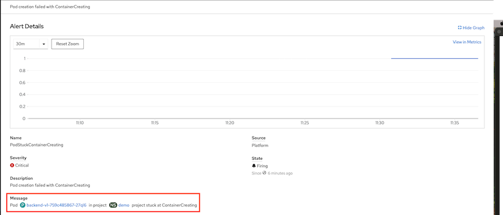

# Custom Monitoring

- [Custom Monitoring](#custom-monitoring)
  - [Monitor for Pod Creation](#monitor-for-pod-creation)
    - [Cluster Level](#cluster-level)
    - [User Workload Monitoring](#user-workload-monitoring)
  - [Test Alert](#test-alert)

## Monitor for Pod Creation
  - Create custom alerts to monitor for pod creating status with PrometheusRule [pod-stuck-alerts.yaml](manifests/pod-stuck-alerts.yaml)
   
  - This *PrometheusRule* will sending alerts if pod status 
    - PodStuckContainerCreating for 2 minutes
    - PodStuckImagePullBackOff for 30 seconds
    - PodStuckErrImagePull for 2 minuts
    - PodStuckCrashLoopBackOff for 2 minutes
    - PodStuckCreateContainerError for 2 minutes

    ```yaml
    apiVersion: monitoring.coreos.com/v1
    kind: PrometheusRule
    metadata:
    name: pod-stuck
    spec:
    groups:
    - name: PodStuck
        rules:
        - alert: PodStuckContainerCreating
        annotations:
            description: Pod creation failed with ContainerCreating
            message: Pod  {{ $labels.pod }}  in project {{ $labels.namespace }} project stuck at ContainerCreating
        expr: kube_pod_container_status_waiting_reason{reason="ContainerCreating"}  == 1
        for: 2m
        labels:
            severity: critical
        - alert: PodStuckImagePullBackOff
        annotations:
            description: Pod creation failed with ImagePullBackOff
            message: Pod  {{ $labels.pod }}  in project {{ $labels.namespace }} project stuck at ImagePullBackOff
        expr: kube_pod_container_status_waiting_reason{reason="ImagePullBackOff"} == 1 
        for: 2m
        labels:
            severity: critical
        - alert: PodStuckErrImagePull
        annotations:
            description: Pod creation failed with ErrImagePull
            message: Pod  {{ $labels.pod }}  in project {{ $labels.namespace }} project stuck at ErrImagePull
        expr: kube_pod_container_status_waiting_reason{reason="ErrImagePull"} == 1 
        for: 30s
        labels:
            severity: critical
        - alert: PodStuckCrashLoopBackOff
        annotations:
            description: Pod creation failed with ImagePullBackOff
            message: Pod  {{ $labels.pod }}  in project {{ $labels.namespace }} project stuck at CrashLoopBackOff
        expr: kube_pod_container_status_waiting_reason{reason="CrashLoopBackOff"} == 1 
        for: 2m
        labels:
            severity: critical
        - alert: PodStuckCreateContainerError
        annotations:
            description: Pod creation failed with ErrImagePull
            message: Pod  {{ $labels.pod }}  in project {{ $labels.namespace }} project stuck at CreateContainerError
        expr: kube_pod_container_status_waiting_reason{reason="CreateContainerError"} == 1 
        for: 2m
        labels:
            severity: critical
    ```
    
### Cluster Level
  - Create *PrometheusRule* in namespace *openshift-monitoring*
  
  ```bash
  oc create -f manifests/pod-stuck-alerts.yaml -n openshift-monitoring
  ```
  - Check alert rules

    

### User Workload Monitoring
  - If [user workload monitoring](application-metrics.md) is enabled. Prometheus Rule can be created at project level.
    
    ```bash
    oc new-project demo
    oc create -f manifests/pod-stuck-alerts.yaml -n demo
    ```

  - Add following label to deploy rules to Thanos Ruler
  
    ```yaml
    metadata:
      name: pod-stuck
      labels:
       openshift.io/prometheus-rule-evaluation-scope: leaf-prometheus
    ```

  - Check for alert rules in Developer Console

      

## Test Alert
  - Create following deployments. These deployments intentionally put pods into error state.
  
  ```bash
  oc create -f manifests/pod-stuck/backend-v1.yaml -n demo
  oc create -f manifests/pod-stuck/backend-v2.yaml -n demo
  oc create -f manifests/pod-stuck/backend-v3.yaml -n demo
  ```
  
  - Check for result
  
  ```bash
  oc get pods -n demo
  ```
  
  - Sample result
  
  ```bash
  NAME                          READY   STATUS                 RESTARTS   AGE
  backend-v1-759c485867-27ql6   0/1     ContainerCreating      0          2m42s
  backend-v2-5c866fb9bf-2fzj4   0/1     CreateContainerError   0          2m40s
  backend-v3-cbcd9cddb-pjbvl    0/1     ImagePullBackOff       0          2m39s
  ```
  
- Check for alerts on Notifications menu
    
    

- Overview
        
    

- For User Workload Monitoring
    
    

- Check for details of an alert
        
    


