# Custom Monitoring

- [Custom Monitoring](#custom-monitoring)
  - [Monitor for Pod Creation](#monitor-for-pod-creation)
    - [Cluster Level](#cluster-level)
  - [Test Alert](#test-alert)
  - [Alert with LINE](#alert-with-line)

## Monitor for Pod Creation
  - Create custom alerts to monitor for pod creating status with PrometheusRule [pod-stuck-alerts.yaml](manifests/pod-stuck-alerts.yaml)
   
  - This *PrometheusRule* will sending alerts if pod status 
    - PodStuckContainerCreating for 2 minutes
    - PodStuckImagePullBackOff for 30 seconds
    - PodStuckErrImagePull for 2 minuts
    - PodStuckCrashLoopBackOff for 2 minutes
    - PodStuckCreateContainerError for 2 minutes

    
    
### Cluster Level
  - Create *[PrometheusRule](manifests/pod-stuck-alerts.yaml)* in namespace *openshift-monitoring*
  
  ```bash
  oc create -f manifests/pod-stuck-alerts.yaml -n openshift-monitoring
  ```

  - Check alert rules

    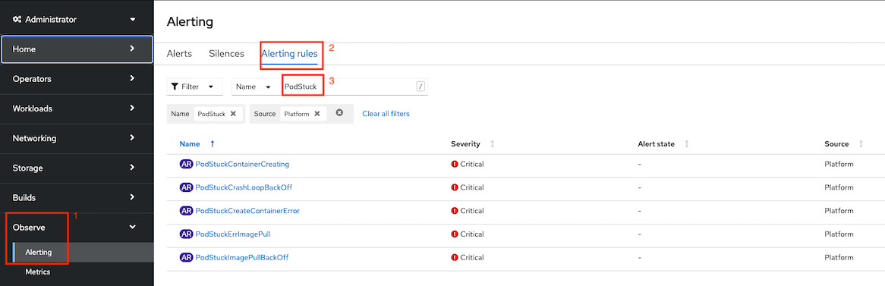

<!-- ### User Workload Monitoring
  - If [user workload monitoring](application-metrics.md) is enabled. Prometheus Rule can be created at project level.
    
    ```bash
    oc create -f manifests/pod-stuck-alerts.yaml -n demo
    ```

  - Add following label to deploy rules to Thanos Ruler
  
    ```yaml
    metadata:
      name: pod-stuck
      labels:
       openshift.io/prometheus-rule-evaluation-scope: leaf-prometheus
    ```

  - Check for alert rules in Developer Console

      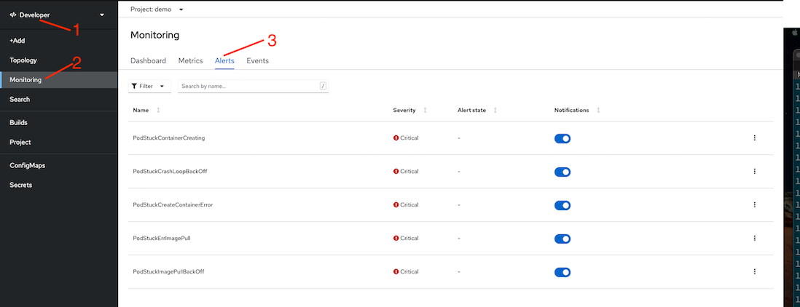 -->

## Test Alert
  - Create following [pod-stuck](manifests/pod-stuck.yaml) deployments. These deployments intentionally put pods into error state.
  
  ```bash
  oc create -f manifests/pod-stuck.yaml -n demo
  ```
  
  - Check for result
  
  ```bash
  oc get pods -n demo
  ```
  
  - Sample result
  
  ```bash
  NAME                          READY   STATUS             RESTARTS     AGE
  backend-v5-65569d96b9-ht5zl   0/1     CrashLoopBackOff   1 (8s ago)   13s
  backend-v6-794c9fc748-hgpl2   0/1     ImagePullBackOff   0            13s
  ```
  
- Check for alerts on Notifications menu
    
    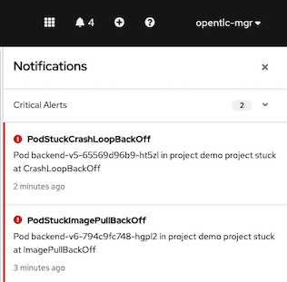

- Administrator -> Overview
        
    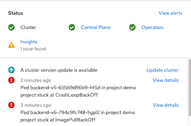

<!-- - For User Workload Monitoring
    
    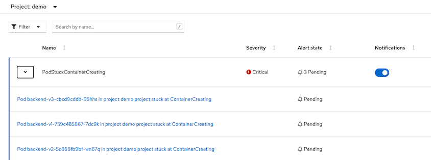 -->

- Check for details of an alert
        
    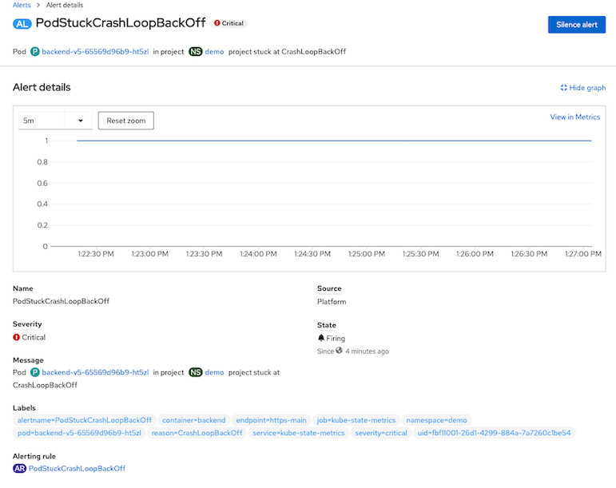


## Alert with LINE

- Login to [LINE Developer](https://developers.line.biz/) and create Channel
- Deploy LINE BOT app
  
  ```bash
  oc new-project line-alert
  oc create -f manifests/line-bot.yaml -n line-alert
  ```

  Verify deployment

    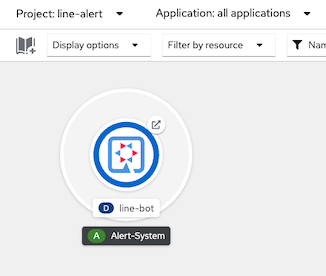

- Update line-bot deployment environment variable *API_LINE_TOKEN* with your channel access token

  Channel access token

  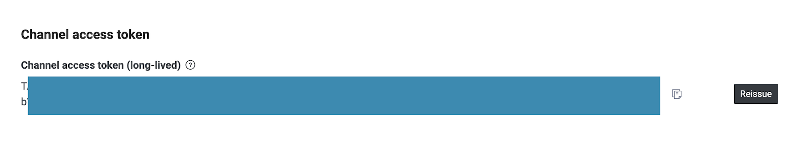
    
  Update Environment variable 
  
  - Developer Console

    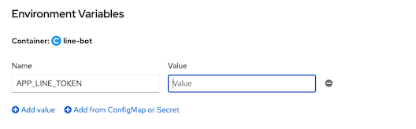

  - CLI

    ```bash
    oc set env -n line-alert deployment/line-bot API_LINE_TOKEN-
    oc set env -n line-alert deployment/line-bot API_LINE_TOKEN=$API_LINE_TOKEN
    ```

- Update your Channel's Webhook with line-bot route
  
  Webhook URL 

  ```bash
  LINE_WEBHOOK=https://$(oc get route line-bot -n line-alert -o jsonpath='{.spec.host}')/webhook
  echo $LINE_WEBHOOK
  ```
  
  Configure Line BOT Webhook to your channel

    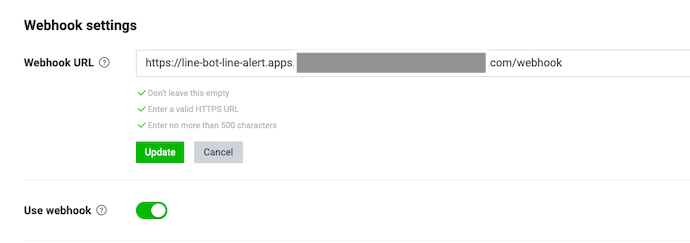

 
  Send some message to your LINE BOT and check line-bot pod's log

    ```bash
    2022-09-06 06:47:14,766 INFO  [com.vor.LineBotResource] (executor-thread-0) Message Type: text
    2022-09-06 06:47:14,766 INFO  [com.vor.LineBotResource] (executor-thread-0) Message: Hi
    2022-09-06 06:47:14,766 INFO  [com.vor.LineBotResource] (executor-thread-0) userId: U*************, userType: user
    2022-09-06 06:47:14,767 INFO  [com.vor.LineBotResource] (executor-thread-0) replyToken: 0a5b7*********
    ```

- Register your LINE account to receiving alert by send message **register** to LINE BOT

    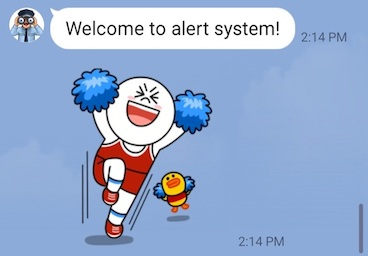

    line-bot pod's log
    
    ```log
    2022-09-06 07:14:04,915 INFO [com.vor.LineBotResource] (executor-thread-0) destination: Uef7db62e42ed955b58d9810f64955806
    2022-09-06 07:14:04,916 INFO [com.vor.LineBotResource] (executor-thread-0) Message Type: text
    2022-09-06 07:14:04,916 INFO [com.vor.LineBotResource] (executor-thread-0) Message: Register
    2022-09-06 07:14:07,142 INFO [com.vor.LineBotResource] (executor-thread-0) Register user: U*************
    2022-09-06 07:14:07,143 INFO [com.vor.LineBotResource] (executor-thread-0) userId: U*************, userType: user
    2022-09-06 07:14:07,143 INFO [com.vor.LineBotResource] (executor-thread-0) replyToken: 741b1*********
    ```

- Configure Alert Manger Webhook
  
  - Administrator Console, Administration->Cluster Settings->Configuration and select *Alertmanager*

      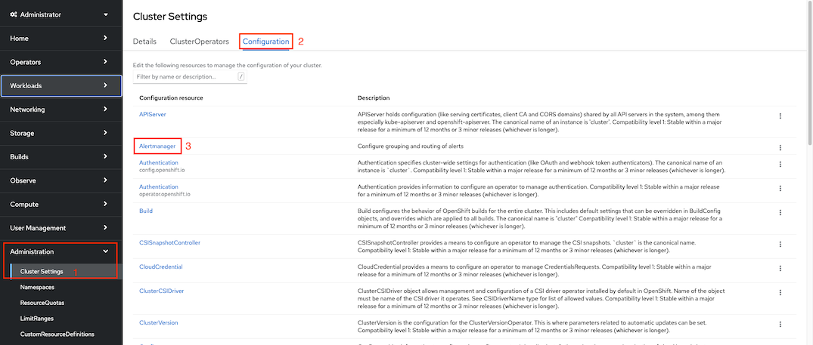
  
  - Create Receiver

      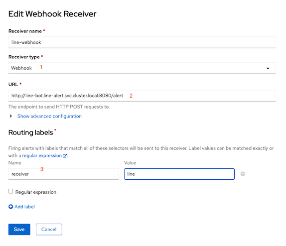

  - Check that PrometheusRule [pod-stuck](manifests/pod-stuck-alerts.yaml) contains label receiver with value equals to line for each alert

    ```yaml
    - alert: PodStuckErrImagePull
      annotations:
        message: Pod  {{ $labels.pod }}  in project {{ $labels.namespace }} project stuck at ErrImagePull
        description: Pod  {{ $labels.pod }}  in project {{ $labels.namespace }} project stuck at ErrImagePull
      expr: kube_pod_container_status_waiting_reason{reason="ErrImagePull"} == 1 
      for: 30s
      labels:
        severity: critical
        receiver: 'line'
    ```

- Create deployment with CrashLoopBackoff

    ```bash
    oc create -f manifests/pod-stuck -n demo
    watch oc get pods -n demo
    ```

- Check LINE message
  
  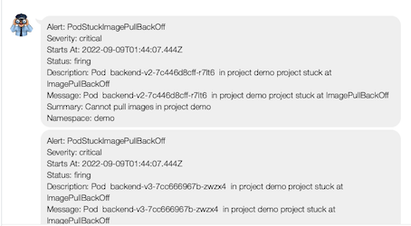