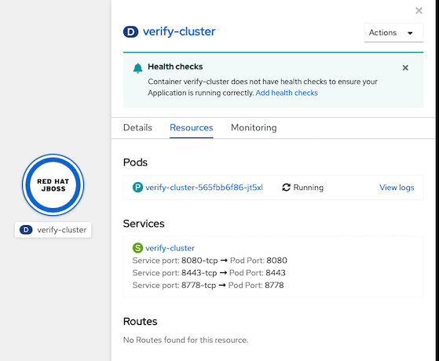
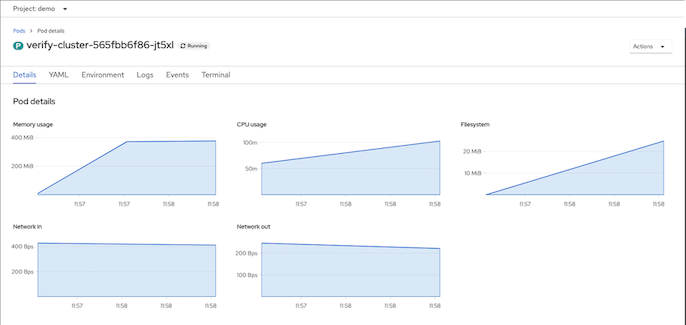
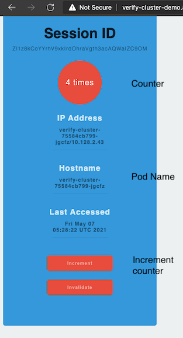

# JBoss EAP on OpenShift
- [JBoss EAP on OpenShift](#jboss-eap-on-openshift)
  - [Binary Build and Deployment](#binary-build-and-deployment)
  - [Configure Standalone Cluster](#configure-standalone-cluster)

## Binary Build and Deployment
- Clone [verify cluster app](https://gitlab.com/ocp-demo/verify-cluster.git)
- Pacakge application (WAR) and copy at your local directory
  
  ```bash
  mvn clean package
  mkdir -p deployments
  cp target/verify-cluster.war deployments
  ```

- Create build config with EAP image stream and use local WAR file
  - Initial environment variables
    
    ```bash
    APP_NAME=verify-cluster
    PROJECT=$(oc project -q)
    IMAGE_STREAM=jboss-eap73-openshift:7.3
    REPLICAS=2
    VERSION=1.0.0
    BINARY_PATH=deployments/verify-cluster.war
    ```

  - Build EAP container image with deployed application
    - Create build config
    
      ```bash
      oc new-build --binary=true \
      --name=${APP_NAME} -l app=${APP_NAME} --image-stream=${IMAGE_STREAM}
      ```
    
    - Start build
    
      ```bash
      oc start-build ${APP_NAME} \
      --from-file=${BINARY_PATH} \
      --follow
      ```

    - Tag image with version

      ```bash
      oc tag ${APP_NAME}:latest ${APP_NAME}:${VERSION}
      ```

    - Check build config
      
      ```bash
      oc get buildconfig/verify-cluster
      ```

      output

      ```bash
      NAME             TYPE     FROM     LATEST
      verify-cluster   Source   Binary   1
      ```

- Create Deoloyment
  -  Start build and deploy with *oc new-app*
    
    ```bash
    oc new-app ${APP_NAME}:${VERSION} \
    --labels=app=${APP_NAME},deploymentconfig=${APP_NAME},version=${VERSION},app.kubernetes.io/name=jboss
    ```

  - Check pods
    
    ```bash
    oc get pods -l app=$APP_NAME
    ```
    
    Output
    
    ```bash
    NAME                              READY   STATUS    RESTARTS   AGE
    verify-cluster-565fbb6f86-jt5xl   1/1     Running   0          4m42s
    ```
  
  - Check on Development Console

    Pods

    

    Resources

    

- Create route
  
  ```bash
  oc expose svc/${APP_NAME}
  echo "URL: http://$(oc get route ${APP_NAME} -n ${PROJECT} -o jsonpath='{.spec.host}')/verify-cluster"
  ```
- Test access verify-cluster and press *Increment*. Notice pod name and number of hits will be increased

  

## Configure Standalone Cluster

- Service Account default needs view role to run KUBE_PING

  ```bash
  oc adm policy add-cluster-role-to-user \
  view system:serviceaccount:$PROJECT:default -n $PROJECT
  ```

- Pause rollout

  ```bash
  oc rollout pause deployment  ${APP_NAME}
  ```

-  Configure JGROUP
  
  ```bash
  oc set env deployment ${APP_NAME} \
  JGROUPS_PING_PROTOCOL=kubernetes.KUBE_PING \
  KUBERNETES_NAMESPACE=${PROJECT} \
  KUBERNETES_LABELS=app=${APP_NAME},version=${VERSION}
  oc set env deployment ${APP_NAME} DISABLE_EMBEDDED_JMS_BROKER=true
  ```

- Scale replicas
  
  ```bash
  oc scale deployment ${APP_NAME} --replicas=${REPLICAS}
  ```

- Resume rollout and check pods
  
  ```bash
  oc rollout resume deployment  ${APP_NAME}
  oc get pods -l app=$APP_NAME,version=$VERSION
  ```

  Output

  ```bash
  NAME                              READY   STATUS        RESTARTS   AGE
  verify-cluster-75584cb799-rcf5t   1/1     Terminating   0          52s
  verify-cluster-789f5dd9d-qmg9s    1/1     Running       0          34s
  verify-cluster-789f5dd9d-s4q8z    1/1     Running       0          38s
  ```
  
  Check log

  ```bash
  oc logs  $(oc get pods -l app=$APP_NAME,version=$VERSION | tail -n 1 | awk '{print $1}')
  ```


- Test that sessions is replicated
  - Access verify-cluster app
  - Increment counter
  - Delete pod that response your request
    
    ```bash
    oc delete pods <pod name>
    ```
  - Refresh page again and check that counter still continue.

- [binary_build.sh](binary_build.sh) can be used to automated all steps.
  
<!-- - Add eap73 image streams. Image Stream here [Link](https://github.com/jboss-container-images/jboss-eap-7-openshift-image/tree/7.3.x/templates)

```bash
for resource in \
  eap73-amq-persistent-s2i.json \
  eap73-amq-s2i.json \
  eap73-basic-s2i.json \
  eap73-https-s2i.json \
  eap73-image-stream.json \
  eap73-sso-s2i.json \
  eap73-starter-s2i.json \
  eap73-third-party-db-s2i.json \
  eap73-tx-recovery-s2i.json
do
  oc replace --force -f \
https://raw.githubusercontent.com/jboss-container-images/jboss-eap-7-openshift-image/eap73/templates/${resource} -n openshift
done
```


```
- Sample S2I from Git
```bash
oc new-app --name=verify-cluster \
--template=eap73-openjdk11-basic-s2i \
--param APPLICATION_NAME=verify-cluster \
--param IMAGE_STREAM_NAMESPACE=openshift  \
--param SOURCE_REPOSITORY_REF=master \
--param CONTEXT_DIR=. \
--param SOURCE_REPOSITORY_URL=https://gitlab.com/ocp-demo/verify-cluster
```

```bash
oc new-app --name=verify-cluster \
--template=eap73-openjdk11-basic-s2i \
--param SOURCE_REPOSITORY_URL=https://gitlab.com/ocp-demo/verify-cluster
```
```bash
oc new-app --name=verify-cluster \
--image-stream=verify-cluster \
--labels=app=verify-cluster \
--labels=version=1.0.0
``` -->

<!-- ### JDG on OpenShift
```bash
for resource in datagrid72-image-stream.json \
  datagrid72-basic.json \
  datagrid72-https.json \
  datagrid72-mysql-persistent.json \
  datagrid72-mysql.json \
  datagrid72-partition.json \
  datagrid72-postgresql.json \
  datagrid72-postgresql-persistent.json
do
  oc apply -n openshift -f \
  https://raw.githubusercontent.com/jboss-container-images/jboss-datagrid-7-openshift-image/1.3/templates/${resource}
done
oc -n openshift import-image jboss-datagrid72-openshift:1.3
oc import-image jboss-datagrid-7/datagrid73-openshift --from=registry.access.redhat.com/jboss-datagrid-7/datagrid73-openshift --confirm

oc create -f https://raw.githubusercontent.com/jboss-openshift/application-templates/master/secrets/datagrid-app-secret.json

oc new-app --template=datagrid72-basic --name=rhdg -e USERNAME=developer \
-e PASSWORD=openshift -e CACHE_NAMES=mycache \
-e MYCACHE_CACHE_START=EAGER
oc exec datagrid-app-2-ngxd7 -- env | grep MYCACHE_CACHE_START
oc env pods/datagrid-app-1-<id> --list
oc set env dc/datagrid-app MYCACHE_CACHE_START=LAZY
```

## EAP 7.3
- Update Imagestreams
    - boss-eap73-openshift
    - jboss-eap73-runtime-openshift
    - jboss-eap73-openjdk11-openshift
    - jboss-eap73-openjdk11-runtime-openshift
```bash
for resource in \
  eap73-amq-persistent-s2i.json \
  eap73-amq-s2i.json \
  eap73-basic-s2i.json \
  eap73-https-s2i.json \
  eap73-image-stream.json \
  eap73-sso-s2i.json \
  eap73-starter-s2i.json \
  eap73-third-party-db-s2i.json \
  eap73-tx-recovery-s2i.json \
  eap73-openjdk11-amq-persistent-s2i.json \
  eap73-openjdk11-amq-s2i.json \
  eap73-openjdk11-basic-s2i.json \
  eap73-openjdk11-https-s2i.json \
  eap73-openjdk11-image-stream.json \
  eap73-openjdk11-sso-s2i.json \
  eap73-openjdk11-starter-s2i.json \
  eap73-openjdk11-third-party-db-s2i.json \
  eap73-openjdk11-tx-recovery-s2i.json
do
  oc replace -n openshift --force -f \
https://raw.githubusercontent.com/jboss-container-images/jboss-eap-7-openshift-image/eap73/templates/${resource}
done
```

## EAP 7.2
```bash
for resource in \
  eap72-amq-persistent-s2i.json \
  eap72-amq-s2i.json \
  eap72-basic-s2i.json \
  eap72-https-s2i.json \
  eap72-image-stream.json \
  eap72-sso-s2i.json \
  eap72-starter-s2i.json \
  eap72-third-party-db-s2i.json \
  eap72-tx-recovery-s2i.json
do
  oc replace --force -f \
https://raw.githubusercontent.com/jboss-container-images/jboss-eap-7-openshift-image/eap72/templates/${resource} -n openshift
```

## Setup JDG on EAP

You need to start EAP with **stanalone-ha.xml**

- JBOSS CLI
```bash
./jboss-cli.sh --user=admin --password=admin  \
--controller=http-remoting://127.0.0.1:9990 --connect
```
- Add Socket Binding to RHDG server
```bash
/socket-binding-group=standard-sockets/remote-destination-outbound-socket-binding=remote-rhdg-server1:add(host=127.0.0.1,port=11222)
```
- Add remote cache
```bash
batch
/subsystem=infinispan/remote-cache-container=rhdg:add(default-remote-cluster=data-grid-cluster)
/subsystem=infinispan/remote-cache-container=rhdg/remote-cluster=data-grid-cluster:add(socket-bindings=[remote-rhdg-server1])
run-batch
```
- Enable remote cache statistics 
```bash
/subsystem=infinispan/remote-cache-container=rhdg:write-attribute(name=statistics-enabled, value=true)
/subsystem=infinispan/remote-cache-container=rhdg:read-attribute(name=active-connections)
```
- Check for statistics
```bash
/subsystem=infinispan/remote-cache-container=rhdg/remote-cache=verify-cluster.war:read-resource(include-runtime=true, recursive=true)
/subsystem=infinispan/remote-cache-container=rhdg/remote-cache=verify-cluster.war:reset-statistics()
```
- Create cache container name **demo** for externalized HTTP to for web
```bash
batch
/subsystem=infinispan/cache-container=web/invalidation-cache=demo:add()
/subsystem=infinispan/cache-container=web/invalidation-cache=demo/store=hotrod:add(remote-cache-container=rhdg,fetch-state=false,purge=false,passivation=false,shared=true)
/subsystem=infinispan/cache-container=web/invalidation-cache=demo/component=transaction:add(mode=BATCH)
/subsystem=infinispan/cache-container=web/invalidation-cache=demo/component=locking:add(isolation=REPEATABLE_READ)
/subsystem=infinispan/cache-container=web:write-attribute(name=default-cache,value=demo)
run-batch
```
- edit label
```properties
app.openshift.io/runtime=jboss
``` -->