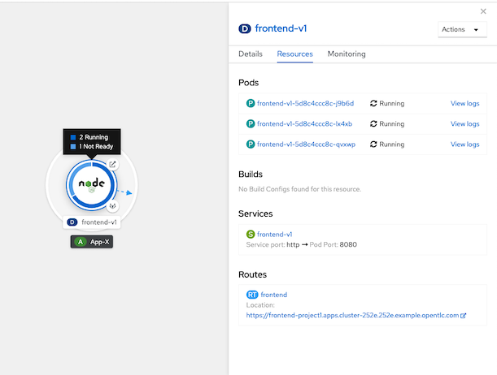
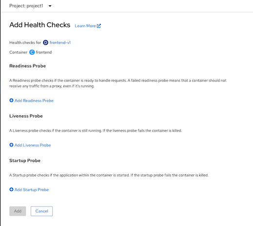

# Pod Health Check
<!-- TOC -->

- [Pod Health Check](#pod-health-check)
  - [Prerequisite](#prerequisite)
  - [Readiness, Livenss and Startup Probe](#readiness-livenss-and-startup-probe)
  - [Configure and Test Probes](#configure-and-test-probes)
    - [Command Line](#command-line)
    - [Developer Console](#developer-console)

<!-- /TOC -->
## Prerequisite

Deploy frontend app (if you still not deploy it yet)

  ```bash
  oc apply -f manifests/frontend.yaml -n project1
  oc delete deployment frontend-v2 -n project1
  ```

## Readiness, Livenss and Startup Probe

Kubernetes provide 3 types of probe to check pod's health
- Readiness, check that pod is ready for process request or not. If success, service will allow traffic to this pod.
- Liveness, check that pod is dead or alive. Pod will be restarted if liveness probe is failed.
- Startup, for dealing with long startup time pod. Set probe with same as liveness with a duration to failureThreshold * periodSecond. Liveness probe will takeover Startup probe after startup is success.
  
Frontend application provides health check with following URI


| URI        | Description  |
| ------------- |:-------------|
|/health/live|Livenness probe URL|
|/health/ready|Readiness probe URL|
|/version|Return application version|


For demo purpose we can set readiness and liveness by following URI


| URI        | Description  |
| ------------- |:-------------|
|/stop|Set liveness to false|
|/start|Set liveness to true|
|/not_ready|Set readiness to false|
|/ready|Set readiness to true|


- Test frontend app readiness
  - Connect to pod
  ```bash
  POD=$(oc get pods --no-headers -n project1 | grep frontend |head -n 1| awk '{print $1}')
  oc -n project1 rsh $POD
  ```
  - Test frontend app
  ```bash
  curl http://localhost:8080/
  ```
  - Test readiness probe
  ```bash
  curl http://localhost:8080/health/ready
  ```
  - Set pod to not ready state 
  ```bash
  curl http://localhost:8080/not_ready
  ```
  - Test frontend readiness probe and test app again. You will get 503 Service Unavailable response code.
  ```bash
  curl -v http://localhost:8080/health/ready
  curl -v http://localhost:8080/ 
  ```
  - Set pod  to ready state
  ```bash
  curl http://localhost:8080/ready
  ```
## Configure and Test Probes
### Command Line
- Test frontend app liveness
  - Connect to pod
  ```bash
  POD=$(oc get pods --no-headers -n project1 | grep frontend |head -n 1| awk '{print $1}')
  oc -n project1 rsh $POD
  ```
  - Test frontend app
  ```bash
  curl http://localhost:8080/
  ```
  - Test readiness probe
  ```bash
  curl http://localhost:8080/health/live
  ```
  - Set pod to not ready state 
  ```bash
  curl http://localhost:8080/stop
  ```
  - Test frontend readiness probe and test app again. You will get 503 Service Unavailable response code.
  ```bash
  curl -v http://localhost:8080/health/live
  curl -v http://localhost:8080/ 
  ```
  - Set pod  to ready state
  ```bash
  curl http://localhost:8080/start
  ```

- Configure Readiness, Liveness and Startup probe
    ```bash
    oc rollout  pause deployment/frontend-v1 -n project1
    oc set probe deployment/frontend-v1 --readiness --get-url=http://:8080/health/ready --initial-delay-seconds=8 --failure-threshold=1 --period-seconds=3 --timeout-seconds=5 -n project1
    oc set probe deployment/frontend-v1 --liveness --get-url=http://:8080/health/live --initial-delay-seconds=5 --failure-threshold=1 --period-seconds=10 --timeout-seconds=5  -n project1
    oc set probe deployment/frontend-v1 --startup --get-url=http://:8080/health/live --initial-delay-seconds=5  --period-seconds=10 -n project1
    oc rollout resume deployment/frontend-v1 -n project1
    watch oc get pods -n project1
    ```
- Check pod status. New pod is created and previous pod is terminated.
    ```bash
    NAME                           READY   STATUS              RESTARTS   AGE
    frontend-v1-5d8c4ccc8c-rhzwt   0/1     ContainerCreating   0          3s
    frontend-v1-c5d4648f9-fkc84    1/1     Running             0          49s
    ```
- Scale frontend-v1 to 3 pods
    ```bash
    oc scale deployment/frontend-v1 --replicas=3
    ```
- Test Liveness Probe
  - Test live probe by set one frontend pod to return 503 for liveness probe
      ```bash
      POD=$(oc get pods --no-headers -n project1 | grep frontend |head -n 1| awk '{print $1}')
      oc exec -n project1 $POD -- curl -s http://localhost:8080/stop
      printf "\n%s is dead\n" $POD
      ```
  - Check pod's events
      ```bash
      oc describe pod $POD -n project1
      # Sample output
      Events:
      Type     Reason          Age    From               Message
      ----     ------          ----   ----               -------
      Normal   Scheduled       3m57s  default-scheduler  Successfully assigned project1/frontend-v1-5d8c4ccc8c-j9b6d to ip-10-0-148-247.ap-southeast-1.compute.internal
      Normal   AddedInterface  3m55s  multus             Add eth0 [10.131.0.112/23]
      Normal   Pulling         3m54s  kubelet            Pulling image "quay.io/voravitl/frontend-js:v1"
      Normal   Pulled          3m51s  kubelet            Successfully pulled image "quay.io/voravitl/frontend-js:v1" in 2.988138314s
      Normal   Created         3m51s  kubelet            Created container frontend
      Normal   Started         3m51s  kubelet            Started container frontend
      Warning  Unhealthy       24s    kubelet            Liveness probe failed: HTTP probe failed with statuscode: 503
      Normal   Killing         24s    kubelet            Container frontend failed liveness probe, will be restarted
      ```
  - Check that pod is restarted 
      ```bash
      oc get pods -n project1
      ## Sample output
      NAME                           READY   STATUS    RESTARTS   AGE
      frontend-v1-5d8c4ccc8c-j9b6d   1/1     Running   1          5m28s
      frontend-v1-5d8c4ccc8c-lx4xb   1/1     Running   0          4m3s
      frontend-v1-5d8c4ccc8c-qvxwp   1/1     Running   0          4m3s
      ```
- Test Readiness Probe
  - Test live probe by set one frontend pod to return 503 for liveness probe
      ```bash
      POD=$(oc get pods --no-headers -n project1 | grep frontend |head -n 1| awk '{print $1}')
      oc exec -n project1 $POD -- curl -s http://localhost:8080/not_ready
      printf "\n%s is not ready\n" $POD
      ```
  - Check pod's events
    ```bash
    oc describe pod/$POD -n project1
    # Sample Output
    Events:
    Type     Reason          Age    From               Message
    ----     ------          ----   ----               -------
    Normal   Scheduled       3m57s  default-scheduler  Successfully assigned project1/frontend-v1-5d8c4ccc8c-j9b6d to ip-10-0-148-247.ap-southeast-1.compute.internal
    Normal   AddedInterface  3m55s  multus             Add eth0 [10.131.0.112/23]
    Normal   Pulling         3m54s  kubelet            Pulling image "quay.io/voravitl/frontend-js:v1"
    Normal   Pulled          3m51s  kubelet            Successfully pulled image "quay.io/voravitl/frontend-js:v1" in 2.988138314s
    Normal   Created         3m51s  kubelet            Created container frontend
    Normal   Started         3m51s  kubelet            Started container frontend
    Warning  Unhealthy       24s    kubelet            Liveness probe failed: HTTP probe failed with statuscode: 503
    Normal   Killing         24s    kubelet            Container frontend failed liveness probe, will be restarted
    ```
- Check that pod is removed from service
    ```bash
    oc describe svc/frontend-v1 -n project1
    ```
- Check developer console
  
    
    
### Developer Console
- Remove  probes from previous steps
```bash
oc set probe deployment/frontend-v1 --remove --readiness --liveness --startup -n project1
watch oc get pods -n project1
```
- Login to OpenShift Web Admin Console and change to Developer Console
- Select topology then select frontend-v1 deployment, then select "Add Health Checks"
  
  
  
- Add health checks
  
  