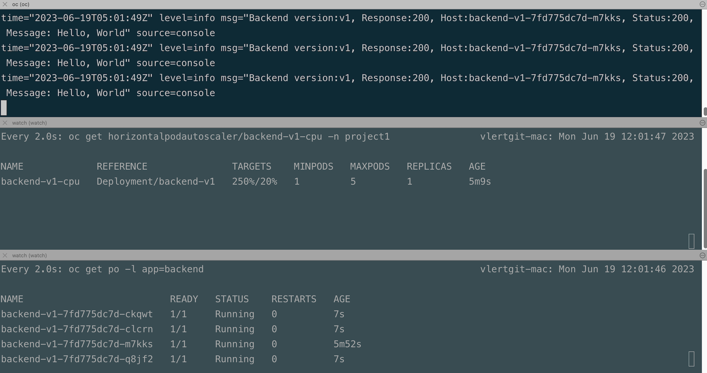
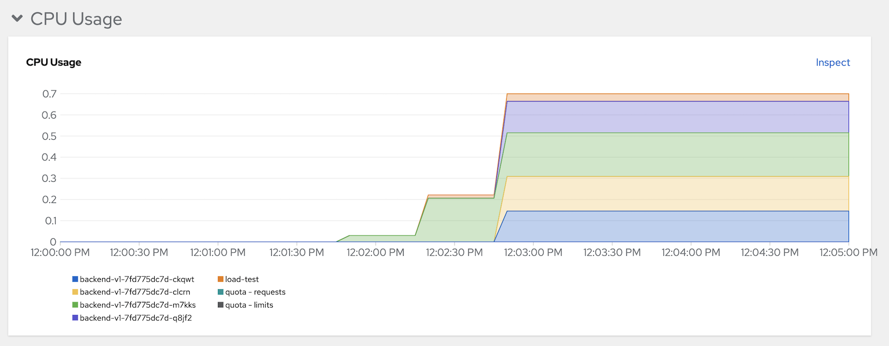
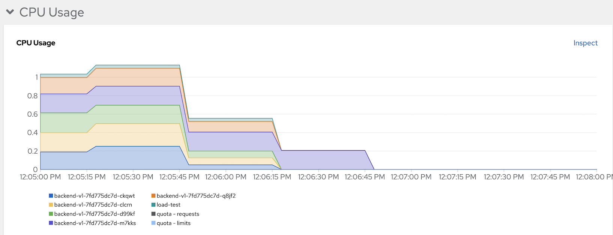
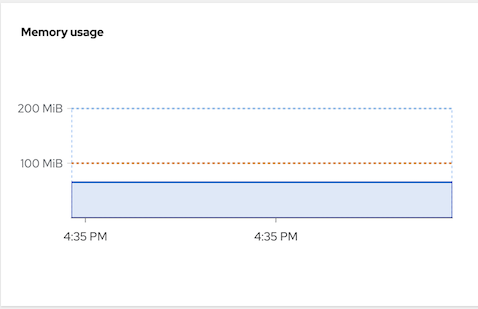
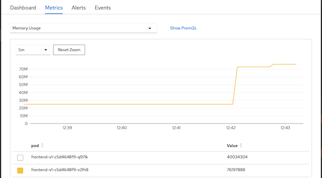
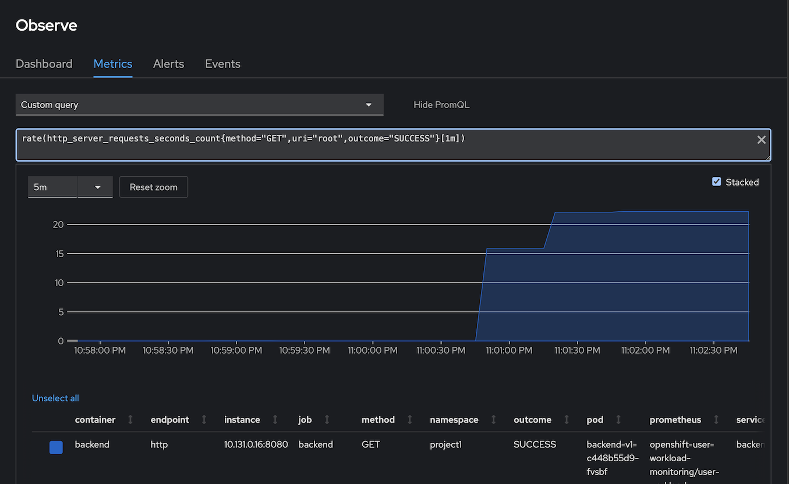
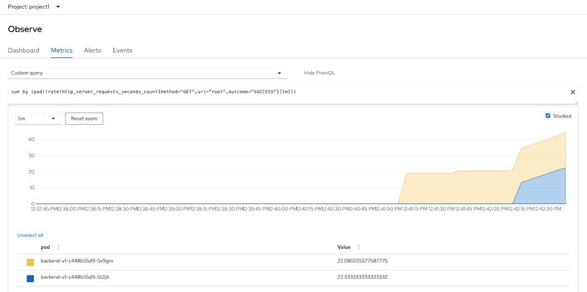

# Horizontal Pod Autoscaler (HPA)
<!-- TOC -->

- [Horizontal Pod Autoscaler (HPA)](#horizontal-pod-autoscaler-hpa)
  - [CPU](#cpu)
  - [Memory](#memory)
  - [Custom Metrics Autoscaler](#custom-metrics-autoscaler)
    - [Configure User Workload Monitoring](#configure-user-workload-monitoring)
    - [Install Operator](#install-operator)
    - [Create SacledObject](#create-sacledobject)
    - [Test](#test)

<!-- /TOC -->
## CPU
- Deploy frontend app (if you still not deploy it yet)
  
  ```bash
  oc new-project project1
  oc apply -f manifests/backend-v1.yaml -n project1
  oc apply -f manifests/backend-service.yaml -n project1
  oc apply -f manifests/backend-route.yaml -n project1
  oc set env deployment backend-v1 -n project1 APP_BACKEND=https://httpbin.org/status/200
  oc wait --for=condition=ready --timeout=60s pod -l app=backend
  BACKEND_URL=http://$(oc get route backend -n project1 -o jsonpath='{.spec.host}')
  curl -v -k $BACKEND_URL
  ```


- Review [CPU HPA for deployment backend](manifests/backend-cpu-hpa.yaml)
    - Scale out when average CPU utilization is greater than 20% of CPU limit
    - Maximum pods is 5
    - Scale down to min replicas if utilization is lower than threshold for 60 sec
  
      ```yaml
        minReplicas: 1
        maxReplicas: 5
        targetCPUUtilizationPercentage: 20
        behavior:
          scaleDown: 
            policies: 
            - type: Pods 
              value: 1
              periodSeconds: 60 
            selectPolicy: Min 
            stabilizationWindowSeconds: 70 
          scaleUp: 
            policies:
            - type: Pods
              value: 5
              periodSeconds: 70
            selectPolicy: Max
            stabilizationWindowSeconds: 0
      ```
    
- Create [CPU HPA for deployment backend](manifests/backend-cpu-hpa.yaml)
  
```bash
oc apply -f manifests/backend-cpu-hpa.yaml -n project1
```

- Check HPA status
```bash
watch oc get horizontalpodautoscaler/backend-cpu -n project1
```

Output

```bash
NAME          REFERENCE            TARGETS         MINPODS   MAXPODS   REPLICAS   AGE
backend-cpu   Deployment/backend   <unknown>/20%   1         5         0          2m4s
```

<!-- - Generate load with load test tool (siege)
```bash
FRONTEND_URL=https://$(oc get route frontend -n project1 -o jsonpath='{.spec.host}')
siege -c 40 $FRONTEND_URL
```

If you don't have siege, run k6 as pod on OpenShift -->

  
- Load test with K6
  - 50 threads
  - Duration 3 minutes
  - Ramp up 30 sec
  - Ramp down 30 sec
    
    ```bash
    URL=http://backend.project1:8080
    oc run load-test -n project1 -i \
    --image=loadimpact/k6 --rm=true --restart=Never \
    --  run -  < manifests/load-test-k6.js \
    -e URL=$URL -e THREADS=50 -e DURATION=3m -e RAMPUP=30s -e RAMPDOWN=30s
    ```

    Output

    

    Check pods CPU in developer console

    


- Stop load test and wait  1 minutes to scale down to 1 replica.

   
  
  Remark: k6 will run as pod name `load-test` for 4 minutes if you want to force stop before 4 minutes just delete `load-test` pod

    ```bash
    oc delete pod load-test -n project1
    ```
## Memory

- Deploy [Memory Leak App](manifests/leak.yaml)

  ```yaml
        resources:
          requests:
            cpu: "0.1"
            memory: 100Mi
          limits:
            cpu: "0.2"
            memory: 200Mi
        env:
          - name: APP_DISHSIZE
            value: "10485760"
  ```
  
  Deploy Leak App

  ```bash
  oc apply -f manifests/leak.yaml -n project1
  oc expose deployment leak -n project1
  oc expose svc leak -n project1
  ```
  
  Check for leak app memory limit

  


- Review [Memory HPA for deployment leak app](manifests/leak-memory-hpa.yaml)
    - Scale out when average memory utilization is greater than 100Mi
    - Maximum pods is 3
    - Scale down to min replicas if utilization is lower than threshold for 60 sec
      
      ```yaml
    
      ```
- Create [Memory HPA for deployment frontend v1](manifests/leak-memory-hpa.yaml)
  
  ```bash
  oc apply -f manifests/leak-memory-hpa.yaml -n project1
  ```
- Check HPA status
  
  ```bash
  watch oc get horizontalpodautoscaler/leak-memory -n project1
  ```

  Output

  ```bash
  NAME          REFERENCE         TARGETS          MINPODS   MAXPODS   REPLICAS   AGE
  leak-memory   Deployment/leak   81829888/100Mi   1         3         1          5h37m
  ```

- Test Leak App to consume another 30 MB
  
  ```bash
  curl -v http://$(oc get route leak -n project1 -o jsonpath='{.spec.host}')/eat/3
  watch oc get po -l app=leak -n project1
  ```

  Output
  ```bash
  < HTTP/1.1 200 OK
  < content-type: text/plain;charset=UTF-8
  < content-length: 20
  < set-cookie: 5ba5938c43542864828d859a0c1ca92a=00adce54797d4ef2002e330336942b56; path=/; HttpOnly
  < cache-control: private
  <
  * Connection #0 to host leak-project1.apps.cluster-27h8w.27h8w.sandbox74.opentlc.com left intact
  Added 31457280 bytes
  ```

- Check that another leak pod is created
  
  ```bash
  NAME                    READY   STATUS    RESTARTS   AGE
  leak-74d885844d-s4vjz   1/1     Running   0          26s
  leak-74d885844d-vrx6s   1/1     Running   0          2m45s
  ```
  
- Check HPA status again

  ```bash
  NAME          REFERENCE         TARGETS           MINPODS   MAXPODS   REPLICAS   AGE
  leak-memory   Deployment/leak   127311872/100Mi   1         3         2          97s
  ```

- Check memory utilization from Developer console
  
  

## Custom Metrics Autoscaler

### Configure User Workload Monitoring
- Enable [user workload monitoring](application-metrics.md)
- Create [Service Monitoring](manifests/backend-monitor.yaml) to monitor backend service
  
  ```bash
  oc apply -f manifests/backend-service-monitor.yaml -n project1
  ```

- Remove HPA by CPU and run K6 with 10 threads
  
  ```bash
    oc delete hpa/backend-cpu -n project1
    URL=http://backend.project1:8080
    oc run load-test -n project1 -i \
    --image=loadimpact/k6 --rm=true --restart=Never \
    --  run -  < manifests/load-test-k6.js \
    -e URL=$URL -e THREADS=10 -e DURATION=3m -e RAMPUP=30s -e RAMPDOWN=30s
  ```
- Check for backends's concurrent requests/sec metric
  - Open Developer Console -> Observe -> Metrics -> Custom metrics
  - Input following PromQL to check for number of requests/min
    
    ```bash
    rate(http_server_requests_seconds_count{method="GET",uri="root",outcome="SUCCESS"}[1m])
    ```

    Output

    

### Install Operator
- Install *Custom Metrics Autoscaler* Operator

  Verify 
  ```bash
  oc get csv -n openshift-keda
  oc get po -n openshift-keda
  ```

  Output

  ```bash
  NAME                                    DISPLAY                     VERSION      REPLACES   PHASE
  custom-metrics-autoscaler.v2.10.1-253   Custom Metrics Autoscaler   2.10.1-253              Succeeded
  NAME                                                 READY   STATUS    RESTARTS   AGE
  custom-metrics-autoscaler-operator-9c9c7c4cb-26l28   1/1     Running   0          10m
  ```

### Create SacledObject
- Create Service Account 
  
  ```bash
  oc create serviceaccount thanos -n project1
  ```
  
- Create [TriggerAuthentication](manifests/cma-trigger-authentication.yaml) and assign cluster role to query thanos
  
  ```bash
  TOKEN=$(oc describe serviceaccount thanos -n project1|grep Token|awk -F':' '{print $2}'|awk '$1=$1')
  cat manifests/cma-trigger-authentication.yaml|sed 's/TOKEN/'$TOKEN'/'|sed 's/PROJECT/project1/' | oc create -f -
  oc adm policy add-cluster-role-to-user cluster-monitoring-view -z thanos -n project1
  ```

- Create [ScaledObject](manifests/backend-scaled-object.yaml ) to scale backend pod by conncurrent request.
  
  ```bash
  oc apply -f manifests/backend-scaled-object.yaml -n project1
  oc get scaledobject/backend -o yaml -n project1 | grep -A4 " conditions:"
  ```

  Number of replicas and triggers configuration
  
  ```yaml
  triggers:
      - authenticationRef:
          kind: TriggerAuthentication
          name: keda-trigger-auth-prometheus
        metadata:
          metricName: http_server_requests_seconds_count
          namespace: project1
          query: sum(rate(http_server_requests_seconds_count{method="GET", uri="root", outcome="SUCCESS"}[1m])) by (pod)
          serverAddress: https://thanos-querier.openshift-monitoring.svc.cluster.local:9092
          threshold: "15"
          authModes: "bearer"
  ```

  Output

   ```yaml
   scaledobject.keda.sh/backend created
   conditions:
   - message: ScaledObject is defined correctly and is ready for scaling
     reason: ScaledObjectReady
     status: "True"
     type: Ready
   ```

### Test
- Run Load Test with K6
  
  ```bash
    URL=http://$(oc get route backend -n project1 -o jsonpath='{.spec.host}')
    oc run load-test -n project1 -i \
    --image=loadimpact/k6 --rm=true --restart=Never \
    --  run -  < manifests/load-test-k6.js \
    -e URL=$URL -e THREADS=20 -e DURATION=3m -e RAMPUP=30s -e RAMPDOWN=30s
  ```
- Check that ScaledObject is active
  
  ```bash
  NAME      SCALETARGETKIND      SCALETARGETNAME   MIN   MAX   TRIGGERS     AUTHENTICATION                 READY   ACTIVE   FALLBACK   AGE
  backend   apps/v1.Deployment   backend-v1        1     5     prometheus   keda-trigger-auth-prometheus   True    True     False      77m
  ```

- Check that backend is scaled out
  
  ```bash
  NAME                         READY   STATUS    RESTARTS   AGE
  backend-v1-c448b55d9-5t2j6   1/1     Running   0          13s
  backend-v1-c448b55d9-5v9gm   1/1     Running   0          129m
  ```

- Check concurent request. Open Developer Console and use custom query
  
  ```bash
  sum by (pod)(rate(http_server_requests_seconds_count{method="GET",uri="root",outcome="SUCCESS"}[1m]))
  ```

  

