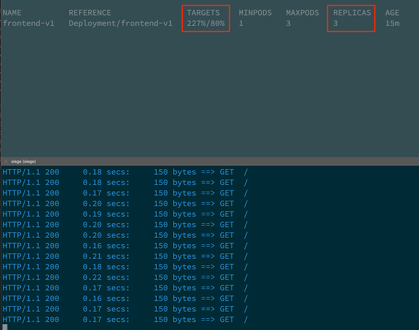
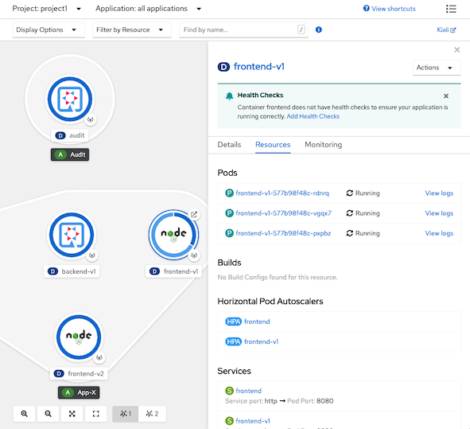

# Horizontal Pod Autoscaler (HPA)
<!-- TOC -->

- [Horizontal Pod Autoscaler (HPA)](#horizontal-pod-autoscaler-hpa)
  - [CPU](#cpu)
  - [Custom Metrics](#custom-metrics)

<!-- /TOC -->
## CPU
- Review [CPU HPA for deployment frontend v1](manifests/frontend-v1-cpu-hpa.yaml)
    - Scale out when average CPU greater than 80% of CPU limit
    - Maximum pods is 3
    ```yaml
    apiVersion: autoscaling/v2beta2
    kind: HorizontalPodAutoscaler
    metadata:
      name: frontend-v1
      namespace: project1
    spec:
      scaleTargetRef:
        apiVersion: apps/v1
        kind: Deployment
        name: frontend-v1
      minReplicas: 1
      maxReplicas: 3
      metrics:
        - type: Resource
          resource:
            name: cpu
            target:
              averageUtilization: 80
              type: Utilization
    ```
- Create [CPU HPA for deployment frontend v1](manifests/frontend-v1-cpu-hpa.yaml)
```bash
oc create -f manifests/frontend-v1-cpu-hpa.yaml -n project1
```
- Check HPA status
```bash
watch oc get horizontalpodautoscaler/frontend-v1-cpu -n project1
```
- Generate load with load test tool (siege)
```bash
FRONTEND_URL=https://$(oc get route frontend -n project1 -jsonpath='{.spec.host}')
siege -c 40 $FRONTEND_URL
```
- Wait for HPA to trigger
  
  

- Check Developer Console
  
  

<!-- ## Memory -->

## Custom Metrics

