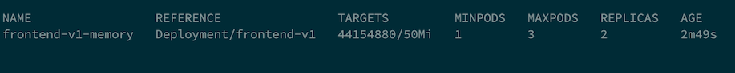

# Horizontal Pod Autoscaler (HPA)
<!-- TOC -->

- [Horizontal Pod Autoscaler (HPA)](#horizontal-pod-autoscaler-hpa)
  - [CPU](#cpu)
  - [Memory](#memory)
  - [Custom Metrics](#custom-metrics)

<!-- /TOC -->
## CPU
- Deploy frontend app (if you still not deploy it yet)
  ```bash
  oc new-project project1
  oc apply -f manifests/frontend.yaml -n project1
  oc delete deployment frontend-v2 -n project1
  FRONTEND_URL=https://$(oc get route frontend -n project1 -o jsonpath='{.spec.host}')
  curl -k $FRONTEND_URL
  ```
- Review [CPU HPA for deployment frontend v1](manifests/frontend-v1-cpu-hpa.yaml)
    - Scale out when average CPU utilization is greater than 80% of CPU limit
    - Maximum pods is 3
    - Scale down to min replicas if utilization is lower than threshold for 60 sec
  
      ```yaml
      apiVersion: autoscaling/v2beta2
      kind: HorizontalPodAutoscaler
      metadata:
        name: frontend-v1-cpu
        namespace: project1
      spec:
        scaleTargetRef:
          apiVersion: apps/v1
          kind: Deployment
          name: frontend-v1
        minReplicas: 1
        maxReplicas: 3
        metrics:
          - type: Resource
            resource:
              name: cpu
              target:
                averageUtilization: 80
                type: Utilization
        behavior:
          scaleDown:
            stabilizationWindowSeconds: 60
            policies:
            - type: Percent
              value: 100
              periodSeconds: 15
      ```
    
- Create [CPU HPA for deployment frontend v1](manifests/frontend-v1-cpu-hpa.yaml)
  
```bash
oc create -f manifests/frontend-v1-cpu-hpa.yaml -n project1
```

- Check HPA status
```bash
watch oc get horizontalpodautoscaler/frontend-v1-cpu -n project1
```

- Generate load with load test tool (siege)
```bash
FRONTEND_URL=https://$(oc get route frontend -n project1 -o jsonpath='{.spec.host}')
siege -c 40 $FRONTEND_URL
```

If you don't have siege, run k6 as pod on OpenShift
  - 40 threads
  - Duration 3 minutes
  - Ramp up 30 sec
  - Ramp down 30 sec
  
```bash
FRONTEND_URL=https://$(oc get route frontend -n project1 -o jsonpath='{.spec.host}')
oc run load-test -n project1 -i \
--image=loadimpact/k6 --rm=true --restart=Never \
--  run -  < manifests/load-test-k6.js \
-e URL=$FRONTEND_URL -e THREADS=40 -e DURATION=3m -e RAMPUP=30s -e RAMPDOWN=30s
```
Remark: k6 will run as pod name `load-test` for 4 minutes if you want to force stop before 4 minutes just delete `load-test` pod

```bash
oc delete pod load-test -n project1
```

- Wait for HPA to trigger
  
  

- Check Developer Console
  
  

- Stop load test and wait  1 minutes to scale down to 1 replica.

## Memory
- Review [Memory HPA for deployment frontend v1](manifests/frontend-v1-memory-hpa.yaml)
    - Scale out when average memory utilization is greater than 60M of memory limit
    - Maximum pods is 3
    - Scale down to min replicas if utilization is lower than threshold for 60 sec
      ```yaml
      apiVersion: autoscaling/v2beta2
      kind: HorizontalPodAutoscaler
      metadata:
        name: frontend-v1-memory
      spec:
        scaleTargetRef:
          apiVersion: apps/v1
          kind: Deployment
          name: frontend-v1
        minReplicas: 1
        maxReplicas: 3
        metrics:
        - type: Resource
          resource:
            name: memory
            target:
              type: Utilization
              averageValue: 50Mi
        behavior:
          scaleDown:
            stabilizationWindowSeconds: 60
            policies:
            - type: Percent
              value: 100
              periodSeconds: 15
      ```
- Create [Memory HPA for deployment frontend v1](manifests/frontend-v1-memory-hpa.yaml)
```bash
oc delete -f manifests/frontend-v1-cpu-hpa.yaml -n project1
oc create -f manifests/frontend-v1-memory-hpa.yaml -n project1
```
- Check HPA status
```bash
watch oc get horizontalpodautoscaler/frontend-v1-memory -n project1
```
- Generate load with load test tool (siege)
```bash
FRONTEND_URL=https://$(oc get route frontend -n project1 -jsonpath='{.spec.host}')
siege -c 40 $FRONTEND_URL
```
- Wait for HPA to trigger
  
  

- Check memory utilization from Developer console
  
  

- Stop load test and wait  1 minutes to scale down to 1 replica.

## Custom Metrics
WIP
