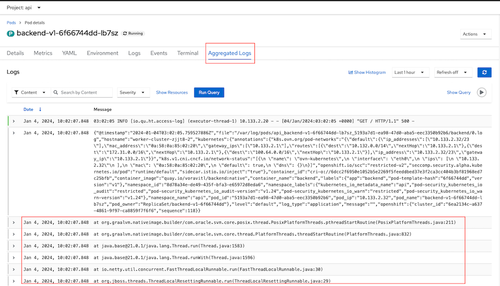
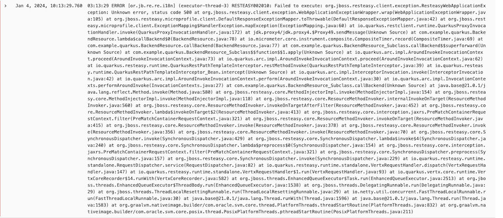
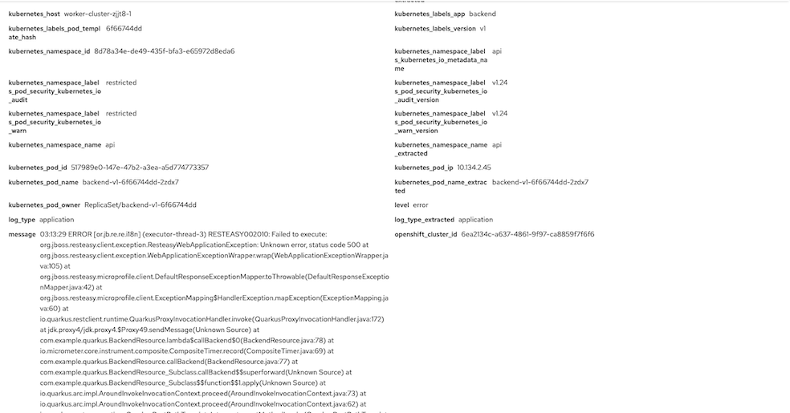
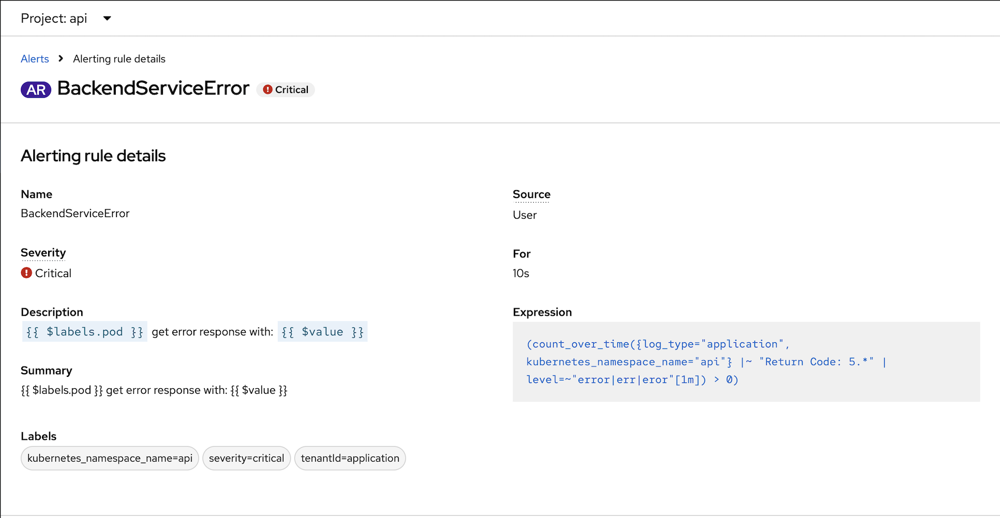

# Logging with Loki
- [Logging with Loki](#logging-with-loki)
  - [Install and Config](#install-and-config)
  - [Test with Sample Applications](#test-with-sample-applications)
  - [Support for multi-lines error log](#support-for-multi-lines-error-log)
  - [LogQL](#logql)
  - [Alert](#alert)

## Install and Config
- Install [Logging Operator](manifests/logging-operator.yaml) and [Loki Operator](manifests/loki-operator.yaml)
  
  ```bash
  oc create -f manifests/logging-operator.yaml
  oc create -f manifests/loki-operator.yaml
  sleep 60
  oc wait --for condition=established --timeout=180s \
  crd/lokistacks.loki.grafana.com \
  crd/clusterloggings.logging.openshift.io
  oc get csv -n openshift-logging
  ```

  Output

  ```bash
  NAME                            DISPLAY                     VERSION   REPLACES                             PHASE
  cluster-logging.v5.9.0          Red Hat OpenShift Logging   5.9.0                                          Succeeded
  loki-operator.v5.9.0            Loki Operator               5.9.0                                          Succeeded
  ```

- Create Logging Instance
  - Prepare Object Storage configuration including S3 access Key ID, access Key Secret, Bucket Name, endpoint and Region
    - In case of using ODF
        - Create Bucket
          
          - Admin Console
            - Navigate to Storage -> Object Storage -> Object Bucket Claims
            - Create ObjectBucketClaim
              - Claim Name: *loki*
              - StorageClass: *openshift-storage.nooba.io*
              - BucketClass: *nooba-default-bucket-class*
          
          - CLI with [YAML](manifests/loki-odf-bucket.yaml)
            
            ```bash
            oc create -f manifests/loki-odf-bucket.yaml
            ```
            
        - Retrieve configuration into environment variables

          ```bash
          S3_BUCKET=$(oc get ObjectBucketClaim loki -n openshift-storage -o jsonpath='{.spec.bucketName}')
          REGION="''"
          ACCESS_KEY_ID=$(oc get secret loki -n openshift-storage -o jsonpath='{.data.AWS_ACCESS_KEY_ID}'|base64 -d)
          SECRET_ACCESS_KEY=$(oc get secret loki -n openshift-storage -o jsonpath='{.data.AWS_SECRET_ACCESS_KEY}'|base64 -d)
          ENDPOINT="https://s3.openshift-storage.svc:443"
          DEFAULT_STORAGE_CLASS=$(oc get sc -A -o jsonpath='{.items[?(@.metadata.annotations.storageclass\.kubernetes\.io/is-default-class=="true")].metadata.name}')
          ```
    - If you want to test with existing S3 bucket used by OpenShift Image Registry 
      
      ```bash
      S3_BUCKET=$(oc get configs.imageregistry.operator.openshift.io/cluster -o jsonpath='{.spec.storage.s3.bucket}' -n openshift-image-registry)
      REGION=$(oc get configs.imageregistry.operator.openshift.io/cluster -o jsonpath='{.spec.storage.s3.region}' -n openshift-image-registry)
      ACCESS_KEY_ID=$(oc get secret image-registry-private-configuration -o jsonpath='{.data.credentials}' -n openshift-image-registry|base64 -d|grep aws_access_key_id|awk -F'=' '{print $2}'|sed 's/^[ ]*//')
      SECRET_ACCESS_KEY=$(oc get secret image-registry-private-configuration -o jsonpath='{.data.credentials}' -n openshift-image-registry|base64 -d|grep aws_secret_access_key|awk -F'=' '{print $2}'|sed 's/^[ ]*//')
      ENDPOINT=$(echo "https://s3.$REGION.amazonaws.com")
      DEFAULT_STORAGE_CLASS=$(oc get sc -A -o jsonpath='{.items[?(@.metadata.annotations.storageclass\.kubernetes\.io/is-default-class=="true")].metadata.name}')
       ```

  - Create [Logging and Loki Instances](manifests/logging-loki-instance.yaml)
    
    ```bash
    cat manifests/logging-loki-instance.yaml \
        |sed 's/S3_BUCKET/'$S3_BUCKET'/' \
        |sed 's/REGION/'$REGION'/' \
        |sed 's|ACCESS_KEY_ID|'$ACCESS_KEY_ID'|' \
        |sed 's|SECRET_ACCESS_KEY|'$SECRET_ACCESS_KEY'|' \
        |sed 's|ENDPOINT|'$ENDPOINT'|'\
        |sed 's|DEFAULT_STORAGE_CLASS|'$DEFAULT_STORAGE_CLASS'|' \
        |oc apply -f -
    watch oc get po -n openshift-logging
    ```
    
    Output

    ```bash
    secret/logging-loki-s3 created
    lokistack.loki.grafana.com/logging-loki created
    clusterlogging.logging.openshift.io/instance created
    
    NAME                                           READY   STATUS    RESTARTS   AGE
    cluster-logging-operator-67d4f44f5c-6pn5l      1/1     Running   0          7m18s
    collector-8zfb7                                1/1     Running   0          75s
    collector-gpn8c                                1/1     Running   0          76s
    collector-j5gx7                                1/1     Running   0          74s
    collector-ktssl                                1/1     Running   0          75s
    collector-kw9wv                                1/1     Running   0          74s
    collector-q4lsr                                1/1     Running   0          73s
    logging-loki-compactor-0                       1/1     Running   0          89s
    logging-loki-distributor-75d9b9fc8c-gn8d8      1/1     Running   0          89s
    logging-loki-distributor-75d9b9fc8c-qxttl      1/1     Running   0          89s
    logging-loki-gateway-946cf94d7-ttddj           2/2     Running   0          88s
    logging-loki-gateway-946cf94d7-vbx74           2/2     Running   0          88s
    logging-loki-index-gateway-0                   1/1     Running   0          89s
    logging-loki-index-gateway-1                   1/1     Running   0          61s
    logging-loki-ingester-0                        1/1     Running   0          89s
    logging-loki-ingester-1                        0/1     Pending   0          25s
    logging-loki-querier-5888b4fdf7-cvdst          1/1     Running   0          89s
    logging-loki-querier-5888b4fdf7-wx577          1/1     Running   0          89s
    logging-loki-query-frontend-66c7ffd5d4-4vpgm   1/1     Running   0          89s
    logging-loki-query-frontend-66c7ffd5d4-flbpv   1/1     Running   0          89s
    logging-loki-ruler-0                           1/1     Running   0          88s
    logging-loki-ruler-1                           1/1     Running   0          88s
    logging-view-plugin-65d59cb67b-hmb2b           1/1     Running   0          91s
    ```
- PVC storage (RWO) used by Loki

  ```bash
  NAME                                   STATUS   VOLUME                                     CAPACITY   ACCESS MODES   STORAGECLASS                           AGE
  storage-logging-loki-compactor-0       Bound    pvc-a405a61d-2361-44a6-9b9a-a79a5a3a4d48   10Gi       RWO            ocs-external-storagecluster-ceph-rbd   3m51s
  storage-logging-loki-index-gateway-0   Bound    pvc-688a34a3-562a-4e27-aa09-4d81baca5c5b   50Gi       RWO            ocs-external-storagecluster-ceph-rbd   3m51s
  storage-logging-loki-index-gateway-1   Bound    pvc-5ede4b00-ad62-4505-bd69-1931f79e52b2   50Gi       RWO            ocs-external-storagecluster-ceph-rbd   3m19s
  storage-logging-loki-ingester-0        Bound    pvc-065cc5de-e506-45ca-925f-c1f3ba61803e   10Gi       RWO            ocs-external-storagecluster-ceph-rbd   3m51s
  storage-logging-loki-ingester-1        Bound    pvc-a21adf64-b93c-47fc-a454-20b0e9af220b   10Gi       RWO            ocs-external-storagecluster-ceph-rbd   2m48s
  storage-logging-loki-ruler-0           Bound    pvc-fa925ae5-34dd-4497-90b5-37d5ec99b925   10Gi       RWO            ocs-external-storagecluster-ceph-rbd   3m51s
  storage-logging-loki-ruler-1           Bound    pvc-fb19290d-eaf2-4684-8721-3bc8aa4066f9   10Gi       RWO            ocs-external-storagecluster-ceph-rbd   3m51s
  wal-logging-loki-ingester-0            Bound    pvc-fed10b0d-19a5-49be-ae90-c1b2f5ed6108   150Gi      RWO            ocs-external-storagecluster-ceph-rbd   3m51s
  wal-logging-loki-ingester-1            Bound    pvc-89c5591b-8fb0-4229-84c3-9d0a28c721c5   150Gi      RWO            ocs-external-storagecluster-ceph-rbd   2m48s
  wal-logging-loki-ruler-0               Bound    pvc-b431cae4-de01-4202-9ed3-97710e549722   150Gi      RWO            ocs-external-storagecluster-ceph-rbd   3m51s
  wal-logging-loki-ruler-1               Bound    pvc-50b62352-0e38-4109-98b5-db17df013030   150Gi      RWO            ocs-external-storagecluster-ceph-rbd   3m51s
  ```

- Enable Console Plugin Operator
  
  - Navigate to Administrator->Operators->Installed Opertors->Red Hat OpenShift Logging then Enable Console Plugin on the right menu
  
    


  - Or using CLI
    
    Remark: If you already enable other console plugins then run only the 2nd command

    ```bash
    oc patch console.operator cluster \
    --type json -p '[{"op": "add", "path": "/spec/plugins", "value": []}]'
    oc patch console.operator cluster \
    --type json -p '[{"op": "add", "path": "/spec/plugins/-", "value": "logging-view-plugin"}]'
    ```

<!-- - Restart console pod
         
  ```bash
  for pod in $(oc get po -l component=ui -n openshift-console --no-headers -o custom-columns='Name:.metadata.name,PHASE:.status.phase' |grep Running|awk '{print $1}')
  do
    oc delete po $pod -n openshift-console
  done
  ``` -->

- Verify that Logs menu is avaiable under Observe menu
  
  


## Test with Sample Applications

- Deploy sample applications

  ```bash
  oc new-project ui
  oc new-project api
  oc create -f manifests/frontend.yaml -n ui
  oc create -f manifests/backend-v1.yaml -n api
  oc expose deployment/backend-v1 -n api
  oc set env deployment/frontend-v1 BACKEND_URL=http://backend-v1.api.svc:8080 -n ui
  oc set env deployment/frontend-v2 BACKEND_URL=http://backend-v1.api.svc:8080 -n ui
  oc set env deployment/backend-v1 APP_BACKEND=https://httpbin.org/status/201 -n api
  oc scale deployment/frontend-v1 --replicas=3 -n ui
  oc scale deployment/frontend-v2 --replicas=3 -n ui
  oc scale deployment/backend-v1 --replicas=6 -n api
  ```

  Application Flow

  ```mermaid
  graph TD;
    Client--> Route
    Route-->|Project ui|Frontend;
    Frontend--> |Project api|Backend;
    Backend-->|External App|https://httpbin.org/status/201
   
  ```

- Test sample app
  
  ```bash
  FRONTEND_URL=$(oc get route/frontend -o jsonpath='{.spec.host}' -n ui)
  curl -v https://$FRONTEND_URL
  ```

  Output

  ```bash
  Frontend version: v2 => [Backend: http://backend-v1.api.svc:8080, Response: 201, Body: Backend version:v1, Response:201, Host:backend-v1-b585d794d-pcw9k, Status:201, Message: Hello, World
  ```

- Check log 
  - Switch to Developer Console and choose project api
  - Select menu Observe -> Logs
    
    
  
  - Filter log by Severity
    - Select Severity
      
      


      Output

      
  
## Support for multi-lines error log
- Configure backend app to return 500
  
  ```bash
  oc set env deployment/backend-v1 APP_BACKEND=https://httpbin.org/status/500 -n api
  ```
- Test app
  
  ```bash
  curl -v https://$FRONTEND_URL
  ```

  Output

  ```bash
  < HTTP/1.1 500 Internal Server Error
  < x-correlation-id: 94235c71-c810-4894-b6fd-41517464060a
  < x-powered-by: Express
  < content-type: text/html; charset=utf-8
  < content-length: 88
  < etag: W/"58-ybUg4JCk2x6Hmz6hGWKXkVMOmdQ"
  < date: Thu, 04 Jan 2024 03:02:05 GMT
  < keep-alive: timeout=5
  < set-cookie: edf28febca8ee46e0446d33e418fb5c2=fc80b538e2fb152c86546fc1c0328e01; path=/; HttpOnly; Secure; SameSite=None
  <
  * Connection #0 to host frontend-ui.apps.cluster-xxx.io left intact
  Frontend version: v2 => [Backend: http://backend-v1.api.svc:8080, Response: 500, Body: ]
  ```
- Check log
  
  

- Configure log forward with option [detectMultilineErrors](manifests/ClusterLogForwarder-detectMultilineErrors.yaml)

  ```bash
  oc create -f manifests/ClusterLogForwarder-detectMultilineErrors.yaml
  ```
- Test app again and check log in Loki
  
  

  detail

  


## LogQL
- Open Developer Console then select Observe->Log
- Click *Show Query* and input following LogQL to query
  - Application Log 
  - in namesapce *api*
  - only worker node name *ip-10-0-215-10.us-east-2.compute.internal*
  - and contain string *Return Code*
  
  *Remark: replace your worker node hostname to ip-10-0-215-10.us-east-2.compute.internal*

  ```bash
  { log_type="application", kubernetes_namespace_name="api" } | json | hostname=~"ip-10-0-215-10.us-east-2.compute.internal" |~ "Return Code: .*"
  ```

  Output

  


## Alert

- Label namespace api to match condition for LokiStack to monitor for alert
  
  ```bash
  oc label ns api openshift.io/cluster-monitoring=true
  ```

- [Optional] Add roles to user to manage alert (CRUD)
  
  ```bash
  oc adm policy add-role-to-user alertingrules.loki.grafana.com-v1-admin -n api user1
  ```

- Create [Alert Rule](manifests/loki-backend-alert.yaml)
  
  ```bash
  oc apply -f manifests/loki-backend-alert.yaml
  ```

- Configure backend app to return 500
  
  ```bash
  oc set env deployment/backend-v1 APP_BACKEND=https://httpbin.org/status/500 -n api
  ```
- Call frontend
- Check for alert
  
  


<!-- delete ingester then queier -->