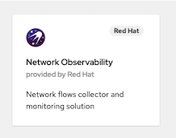
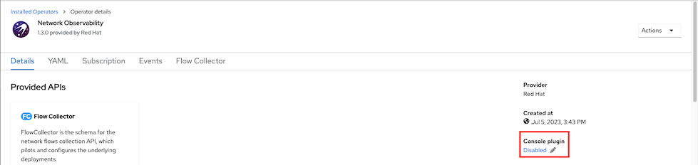
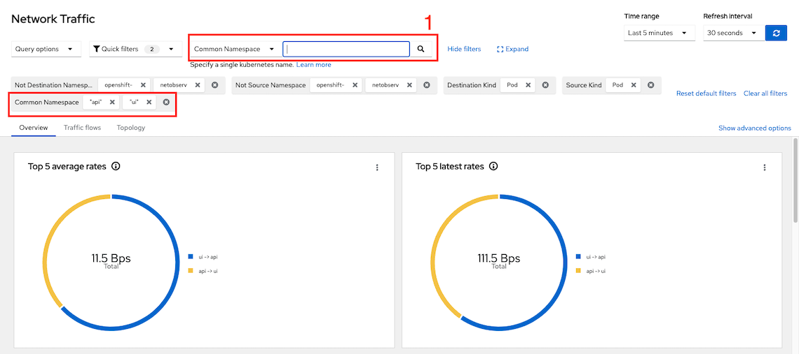
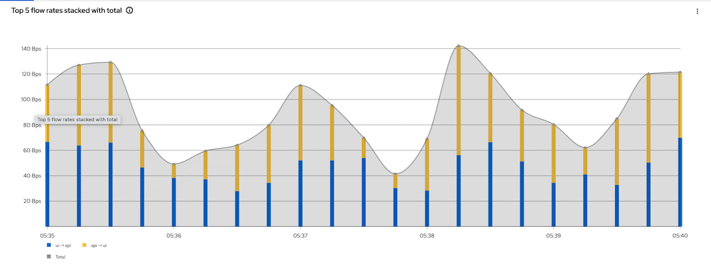
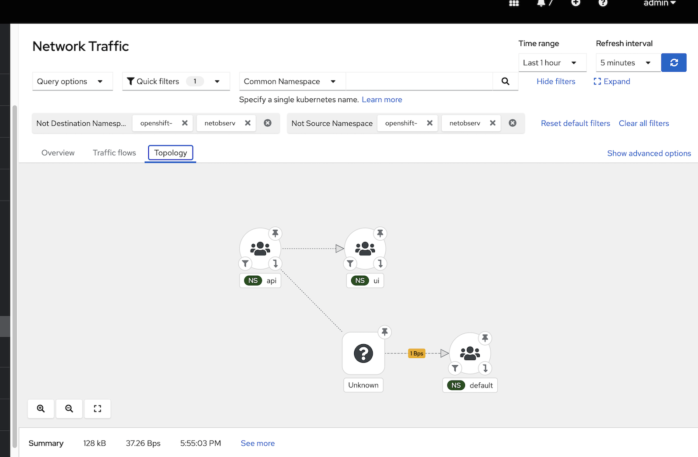

# Network Observability
- [Network Observability](#network-observability)
  - [Install Operators](#install-operators)
    - [Network Observability Operator](#network-observability-operator)
    - [Loki Operator](#loki-operator)
      - [Configure Loki for Network Observability](#configure-loki-for-network-observability)
    - [Create Flow Collector](#create-flow-collector)
  - [Test](#test)

## Install Operators
### Network Observability Operator

- Install Network Observability Operator
   - [Command Line](manifests/netobserv-operator.yaml)

      ```bash
      oc create -f manifests/netobserv-operator.yaml
      oc wait --for condition=established --timeout=180s \
      crd/flowcollectors.flows.netobserv.io
      oc get csv -n openshift-netobserv-operator
      ```

      Output
    
      ```bash
      customresourcedefinition.apiextensions.k8s.io/flowcollectors.flows.netobserv.io condition met
      NAME                                    DISPLAY                 VERSION   REPLACES                                PHASE
      network-observability-operator.v1.3.0   Network Observability   1.3.0     network-observability-operator.v1.2.0   Succeeded
      ```

      Enable console plugin
    
      ```bash
      oc patch console.operator cluster  \
      --type json -p '[{"op": "add", "path": "/spec/plugins/-", "value": "netobserv-plugin"}]'
      ```
      
   - Admin Console
     
     

     Enable console plugin

     

### Loki Operator
- Install [Loki Operator](loki.md) and config Loki instance 
  - Install Loki Operator
    
    ```bash
    oc create -f manifests/loki-operator.yaml
    oc wait --for condition=established --timeout=180s \
    crd/lokistacks.loki.grafana.com
    oc get csv
    ```

    Output
    
    ```bash
    customresourcedefinition.apiextensions.k8s.io/lokistacks.loki.grafana.com condition met
    NAME                                    DISPLAY                 VERSION   REPLACES                                PHASE
    loki-operator.v5.7.2                    Loki Operator           5.7.2     loki-operator.v5.7.1                    Succeeded
    ```

#### Configure Loki for Network Observability
  - Prepare Object Storage configuration including S3 access Key ID, access Key Secret, Bucket Name, endpoint and Region
      - For demo purpose, If you have existing S3 bucket used by OpenShift Image Registry
        
        ```bash
          S3_BUCKET=$(oc get configs.imageregistry.operator.openshift.io/cluster -o jsonpath='{.spec.storage.s3.bucket}' -n openshift-image-registry)
          AWS_REGION=$(oc get configs.imageregistry.operator.openshift.io/cluster -o jsonpath='{.spec.storage.s3.region}' -n openshift-image-registry)
          AWS_ACCESS_KEY_ID=$(oc get secret image-registry-private-configuration -o jsonpath='{.data.credentials}' -n openshift-image-registry|base64 -d|grep aws_access_key_id|awk -F'=' '{print $2}'|sed 's/^[ ]*//')
          AWS_SECRET_ACCESS_KEY=$(oc get secret image-registry-private-configuration -o jsonpath='{.data.credentials}' -n openshift-image-registry|base64 -d|grep aws_secret_access_key|awk -F'=' '{print $2}'|sed 's/^[ ]*//')
         ```
  - Create [Loki Instance](manifests/netobserv-loki-s3.yaml)
  
    ```bash
        cat manifests/netobserv-loki-s3.yaml \
        |sed 's/S3_BUCKET/'$S3_BUCKET'/' \
        |sed 's/AWS_REGION/'$AWS_REGION'/' \
        |sed 's/AWS_ACCESS_KEY_ID/'$AWS_ACCESS_KEY_ID'/' \
        |sed 's|AWS_SECRET_ACCESS_KEY|'$AWS_SECRET_ACCESS_KEY'|' \
        |oc apply -f -
        watch oc get po -n netobserv
    ```

    Output

    ```bash
    NAME                                   READY   STATUS              RESTARTS   AGE
    loki-compactor-0                       0/1     ContainerCreating   0          9s
    loki-distributor-57476f98bf-vhw9q      0/1     Running             0          9s
    loki-gateway-54cf794dcf-5pqgd          0/2     ContainerCreating   0          9s
    loki-gateway-54cf794dcf-6pw4g          0/2     ContainerCreating   0          9s
    loki-index-gateway-0                   0/1     ContainerCreating   0          9s
    loki-ingester-0                        0/1     ContainerCreating   0          9s
    loki-querier-6fdbf9bf5c-gw8c7          0/1     ContainerCreating   0          9s
    loki-query-frontend-66d97f7c68-jsgc8   0/1     Running             0          9s
    ```

### Create Flow Collector
 - Create [FlowCollector](manifests/FlowCollector.yaml)
    
   ```bash
   oc create -f manifests/FlowCollector.yaml
   oc get flowcollector -n netobserv
   ```
   
   Output
   ```bash
    flowcollector.flows.netobserv.io/cluster created
    NAME      AGENT   SAMPLING (EBPF)   DEPLOYMENT MODEL   STATUS
    cluster   EBPF    50                DIRECT             Ready
   ```

## Test
 - Check Network Observability by Open Administrator -> Observe -> Network Traffic
   
   Overview
   - Add filtering by namespace name i.e. monitor for namespace ui and api
     
     

     Flow Rate

     

   Topology

  