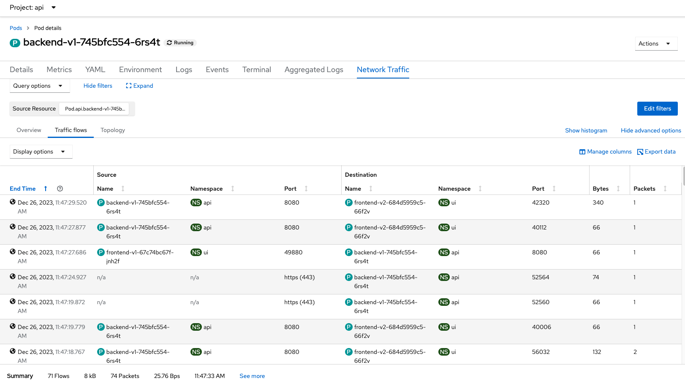

# Network Observability
- [Network Observability](#network-observability)
  - [Install Operators](#install-operators)
    - [Network Observability Operator](#network-observability-operator)
    - [Loki Operator](#loki-operator)
      - [Configure Loki for Network Observability](#configure-loki-for-network-observability)
    - [Create Flow Collector](#create-flow-collector)
  - [Test](#test)

## Install Operators
### Network Observability Operator

- Install Network Observability Operator
   - [Command Line](manifests/netobserv-operator.yaml)

      ```bash
      oc create -f manifests/netobserv-operator.yaml
      sleep 60
      oc wait --for condition=established --timeout=180s \
      crd/flowcollectors.flows.netobserv.io
      oc get csv -n openshift-netobserv-operator
      ```

      Output
    
      ```bash
      customresourcedefinition.apiextensions.k8s.io/flowcollectors.flows.netobserv.io condition met
      NAME                                    DISPLAY                 VERSION   REPLACES                                PHASE
      network-observability-operator.v1.4.2   Network Observability   1.4.2     network-observability-operator.v1.4.1   Succeeded
      ```

      Enable console plugin
    
      ```bash
      oc patch console.operator cluster  \
      --type json -p '[{"op": "add", "path": "/spec/plugins/-", "value": "netobserv-plugin"}]'
      ```
      
   - Admin Console
     
     

     Enable console plugin

     

### Loki Operator
- Install [Loki Operator](loki.md) and config Loki instance 
  - Install Loki Operator
    
    ```bash
    oc create -f manifests/loki-operator.yaml
    oc wait --for condition=established --timeout=180s \
    crd/lokistacks.loki.grafana.com
    oc get csv
    ```

    Output
    
    ```bash
    customresourcedefinition.apiextensions.k8s.io/lokistacks.loki.grafana.com condition met
    NAME                                    DISPLAY                 VERSION   REPLACES                                PHASE
    loki-operator.v5.7.2                    Loki Operator           5.7.2     loki-operator.v5.7.1                    Succeeded
    ```

#### Configure Loki for Network Observability
  - Prepare Object Storage configuration including S3 access Key ID, access Key Secret, Bucket Name, endpoint and Region
        - In case of using ODF
            - Create Bucket
              - Admin Console
                - Navigate to Storage -> Object Storage -> Object Bucket Claims
                - Create ObjectBucketClaim
                  - Claim Name: *netobserv*
                  - StorageClass: *openshift-storage.nooba.io*
                  - BucketClass: *nooba-default-bucket-class*
              - CLI
                
                ```bash
                oc create -f manifests/netobserv-odf-bucket.yaml
                ```
        - Retrieve configuration into environment variables

          ```bash
          S3_BUCKET=$(oc get ObjectBucketClaim netobserv -n openshift-storage -o jsonpath='{.spec.bucketName}')
          REGION="''"
          ACCESS_KEY_ID=$(oc get secret netobserv -n openshift-storage -o jsonpath='{.data.AWS_ACCESS_KEY_ID}'|base64 -d)
          SECRET_ACCESS_KEY=$(oc get secret netobserv -n openshift-storage -o jsonpath='{.data.AWS_SECRET_ACCESS_KEY}'|base64 -d)
          ENDPOINT="https://s3.openshift-storage.svc:443"
          DEFAULT_STORAGE_CLASS=$(oc get sc -A -o jsonpath='{.items[?(@.metadata.annotations.storageclass\.kubernetes\.io/is-default-class=="true")].metadata.name}')
        ``` 
      - If you have existing S3 bucket used by OpenShift Image Registry
        
        ```bash
          S3_BUCKET=$(oc get configs.imageregistry.operator.openshift.io/cluster -o jsonpath='{.spec.storage.s3.bucket}' -n openshift-image-registry)
          REGION=$(oc get configs.imageregistry.operator.openshift.io/cluster -o jsonpath='{.spec.storage.s3.region}' -n openshift-image-registry)
          ACCESS_KEY_ID=$(oc get secret image-registry-private-configuration -o jsonpath='{.data.credentials}' -n openshift-image-registry|base64 -d|grep aws_access_key_id|awk -F'=' '{print $2}'|sed 's/^[ ]*//')
          SECRET_ACCESS_KEY=$(oc get secret image-registry-private-configuration -o jsonpath='{.data.credentials}' -n openshift-image-registry|base64 -d|grep aws_secret_access_key|awk -F'=' '{print $2}'|sed 's/^[ ]*//')
          ENDPOINT=$(echo "https://s3.$REGION.amazonaws.com")
          DEFAULT_STORAGE_CLASS=$(oc get sc -A -o jsonpath='{.items[?(@.metadata.annotations.storageclass\.kubernetes\.io/is-default-class=="true")].metadata.name}')
         ```

  - Create [Loki Instance](manifests/netobserv-loki-s3.yaml)
  
    ```bash
        cat manifests/netobserv-loki-s3.yaml \
        |sed 's/S3_BUCKET/'$S3_BUCKET'/' \
        |sed 's/REGION/'$REGION'/' \
        |sed 's|ACCESS_KEY_ID|'$ACCESS_KEY_ID'|' \
        |sed 's|SECRET_ACCESS_KEY|'$SECRET_ACCESS_KEY'|' \
        |sed 's|ENDPOINT|'$ENDPOINT'|'\
        |sed 's|DEFAULT_STORAGE_CLASS|'$DEFAULT_STORAGE_CLASS'|' \
        |oc apply -f -
        watch oc get po -n netobserv
    ```

    Output

    ```bash
    NAME                                   READY   STATUS              RESTARTS   AGE
    loki-compactor-0                       0/1     ContainerCreating   0          9s
    loki-distributor-57476f98bf-vhw9q      0/1     Running             0          9s
    loki-gateway-54cf794dcf-5pqgd          0/2     ContainerCreating   0          9s
    loki-gateway-54cf794dcf-6pw4g          0/2     ContainerCreating   0          9s
    loki-index-gateway-0                   0/1     ContainerCreating   0          9s
    loki-ingester-0                        0/1     ContainerCreating   0          9s
    loki-querier-6fdbf9bf5c-gw8c7          0/1     ContainerCreating   0          9s
    loki-query-frontend-66d97f7c68-jsgc8   0/1     Running             0          9s
    ```

### Create Flow Collector
 - Create [FlowCollector](manifests/FlowCollector.yaml)
    
   ```bash
   oc create -f manifests/FlowCollector.yaml
   oc get flowcollector -n netobserv
   ```
   
   Output
   ```bash
    flowcollector.flows.netobserv.io/cluster created
    NAME      AGENT   SAMPLING (EBPF)   DEPLOYMENT MODEL   STATUS
    cluster   EBPF    50                DIRECT             Ready
   ```

## Test
 - Check Network Observability by Open Administrator -> Observe -> Network Traffic
 - Overview
     - Add filtering by namespace name i.e. monitor for namespace ui and api
     
       

- Flow Rate

    

- Topology

    
- Network Traffic Pod
     
    
     
- Raw Data from backend pod request to external system i.e. httpbin.org
  
  ```json
  {
      "AgentIP": "192.168.12.2",
      "Bytes": 72,
      "DstAddr": "3.95.102.170",
      "DstMac": "F2:A3:8F:EF:54:0E",
      "DstPort": 443,
      "Duplicate": false,
      "Etype": 2048,
      "Flags": 16,
      "FlowDirection": "0",
      "IfDirection": 0,
      "Interface": "ovn-k8s-mp0",
      "K8S_ClusterName": "bd7d6a47-bfe9-4eec-a381-0239eee1afdc",
      "Packets": 1,
      "Proto": 6,
      "SrcAddr": "10.134.0.30",
      "SrcK8S_HostIP": "10.10.10.21",
      "SrcK8S_HostName": "worker-cluster-r88vr-2",
      "SrcK8S_Name": "backend-v1-867995c57f-jplzw",
      "SrcK8S_Namespace": "api",
      "SrcK8S_OwnerName": "backend-v1",
      "SrcK8S_OwnerType": "Deployment",
      "SrcK8S_Type": "Pod",
      "SrcMac": "0A:58:0A:86:00:01",
      "SrcPort": 51498,
      "TimeFlowEndMs": 1703561169348,
      "TimeFlowStartMs": 1703561169348,
      "TimeReceived": 1703561170,
      "app": "netobserv-flowcollector"
    }
  ```
  