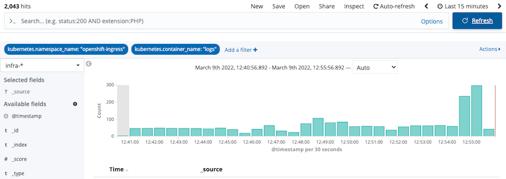
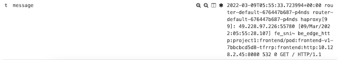

# Deployment Strategy with OpenShift Route
<!-- TOC -->

- [Deployment Strategy with OpenShift Route](#deployment-strategy-with-openshift-route)
  - [Application Deployment](#application-deployment)
  - [Blue/Green Deployment](#bluegreen-deployment)
  - [Canary Deployment](#canary-deployment)
  - [Restrict TLS to v1.2](#restrict-tls-to-v12)
    - [Test TLS/SSL](#test-tlsssl)
  - [Access Log](#access-log)
    - [Verify Access Log](#verify-access-log)
      - [Sidecar](#sidecar)
      - [Kibana](#kibana)

<!-- /TOC -->
## Application Deployment
Deploy 2 version of frontend app. Each deployment and service use label **app** and **version** for select each version. 
Initial Route will routing all traffic to v1.

- Deploy frontend v1 and v2 and create route [frontend.yaml](manifests/frontend.yaml)
  
  ```bash
  oc apply -f manifests/frontend.yaml -n project1
  ```

## Blue/Green Deployment
- Test Route
  
  ```bash
  FRONTEND_URL=https://$(oc get route frontend -n project1 -o jsonpath='{.spec.host}')
  while [ 1 ];
  do
     curl -k $FRONTEND_URL/version
     echo
     sleep 1
  done
  ```

- Use another terminal to patch route to frontend v2
  
  ```bash
  oc patch route frontend  -p '{"spec":{"to":{"name":"frontend-v2"}}}' -n project1
  ```

- Check output from cURL that response is from frontend-v2
- Set route back to v1
  
  ```bash
  oc patch route frontend  -p '{"spec":{"to":{"name":"frontend-v1"}}}' -n project1
  ```

- Check output from cURL that response is from frontend-v1

## Canary Deployment
- Apply route for Canary deployment to v1 and v2 with 80% and 20% ratio [route-with-alternate-backend.yaml](manifests/route-with-alternate-backend.yaml)
  
  ```bash
  oc apply -f manifests/route-with-alternate-backend.yaml -n project1
  ```

- Call frontend for 10 times. You will get 8 responses from v1 and 2 responses from v2
  
  ```bash
  FRONTEND_URL=https://$(oc get route frontend -n project1 -o jsonpath='{.spec.host}')
  COUNT=0
  while [ $COUNT -lt 10 ];
  do
    curl -k $FRONTEND_URL/version
    echo
    sleep .2
    COUNT=$(expr $COUNT + 1)
  done
  ```

- Update weight to 60% and 40%
  
  ```bash
  oc patch route frontend  -p '{"spec":{"to":{"weight":60}}}' -n project1 
  oc patch route frontend --type='json' -p='[{"op":"replace","path":"/spec/alternateBackends/0/weight","value":40}]' -n project1 
  ```

- Re-run previous bash script to loop frontend. This times you will get 6 responses from v1 and 4 responses from v2
  
## Restrict TLS to v1.2
- Check default ingresscontroller by run command or use OpenShift Web Admin Console

```bash
oc edit ingresscontroller default -n openshift-ingress-operator
```

Use Web Admin Console to search for ingressscontroller and select default


- Minimum TLS version can be specified by attribute **minTLSVersion**


- Also test with custom profile, edit `tlsProfile:` and click **Save**

```yaml
spec:
  replicas: 2
  tlsSecurityProfile:
    type: Custom
    custom:
      ciphers:
        - ECDHE-ECDSA-AES128-GCM-SHA256
        - ECDHE-RSA-AES128-GCM-SHA256
      minTLSVersion: VersionTLS12
```

### Test TLS/SSL

To test TLS/SSL encryption enabled on OpenShift ingresscontroller, use `https://testssl.sh/` testssl.ssh tool to run report for Ingress VIP support of TLS/SSL ciphers and protocols

Run the test

```bash
docker run --rm -ti drwetter/testssl.sh https://frontend-project1.apps.ocp01.example.com
```

Sample results

  - [Default TLS profile](manifests/test-ssl-default.txt)
  - [Google Website](manifests/test-ssl-2.log)


## Access Log

Router's access log can be enabled to syslog or container logging by add spec.logging.acess.destination.type to IngressController in openshift-ingress-operator namespace

Following set default IngressController with access log in container.

```bash
  oc patch IngressController default -n openshift-ingress-operator -p '{"spec":{"logging":{"access":{"destination":{"type":"Container"}}}}}' --type=merge
  oc patch IngressController default -n openshift-ingress-operator -p '{"spec":{"logging":{"access":{"httpLogFormat":"%ci:%cp [%t] %ft %b/%s %B %bq %HM %HU %HV"}}}}' --type=merge
  oc get pods -n openshift-ingress
```

Check output that router pod contains 2 containers

```bash
NAME                              READY   STATUS        RESTARTS   AGE
router-default-64bb598c79-78lks   1/1     Running       0          18m
router-default-64bb598c79-w4mgl   1/1     Terminating   0          18m
router-default-66d57c45c8-2lsvq   2/2     Running       0          15s
router-default-66d57c45c8-hh4n5   2/2     Running       0          15s
```
### Verify Access Log
#### Sidecar 

```bash
ROUTER_POD=$(oc get pods -n openshift-ingress -o 'custom-columns=Name:.metadata.name' --no-headers | head -n 1)
oc log -f $ROUTER_POD -n openshift-ingress -c logs
```

Sample out acesslog

```log
.226:51394 [09/Mar/2022:02:49:20.812] fe_sni~ be_edge_http:project1:frontend/pod:frontend-v2-868959894b-mlld2:frontend:http:10.128.2.47:8080 532 0 GET / HTTP/1.1
```

#### Kibana

Login to Kibana and filter for namespace openshift-logging and container name logs



Sample of message

