# OpenShift Service Mesh
<!-- TOC -->
- [OpenShift Service Mesh](#openshift-service-mesh)
  - [Overview](#overview)
  - [Setup Control Plane and sidecar](#setup-control-plane-and-sidecar)
  - [Traffic Management](#traffic-management)
    - [Destination Rule, Virtual Service and Gateway](#destination-rule-virtual-service-and-gateway)
      - [Kiali](#kiali)
      - [CLI/YAML](#cliyaml)
    - [Test Istio Gateway](#test-istio-gateway)
    - [Weight-Routing with Istio Virtual Service](#weight-routing-with-istio-virtual-service)
    - [Routing by condition based on URI](#routing-by-condition-based-on-uri)
    - [A/B with Istio Virtual Service](#ab-with-istio-virtual-service)
  - [Traffic Mirroring (Dark Launch)](#traffic-mirroring-dark-launch)
  - [Observability](#observability)
    - [Traffic Analysis](#traffic-analysis)
    - [Distributed Tracing](#distributed-tracing)
    - [Envoy Access Log](#envoy-access-log)
  - [Service Resilience](#service-resilience)
    - [Circuit Breaker](#circuit-breaker)
  - [Secure with mTLS](#secure-with-mtls)
    - [Within Service Mesh](#within-service-mesh)
      - [Pod Liveness and Readiness](#pod-liveness-and-readiness)
    - [Istio Gateway with mTLS](#istio-gateway-with-mtls)
  - [JWT Token](#jwt-token)
    - [Red Hat Single Sign-On](#red-hat-single-sign-on)
    - [RequestAuthentication and Authorization Policy](#requestauthentication-and-authorization-policy)
  - [Service Level Objective (SLO)](#service-level-objective-slo)
  - [Control Plane with High Availability](#control-plane-with-high-availability)
    - [OpenShift Service Mesh 1.x](#openshift-service-mesh-1x)
    - [OpenShift Service Mesh 2.x](#openshift-service-mesh-2x)
<!-- /TOC -->

## Overview

Sample application

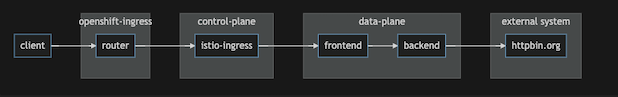

## Setup Control Plane and sidecar

- Install following Operators from OperatorHub
  - ElasticSearch
  - Jaeger
  - Kiali
  - OpenShift Service Mesh
 
- Create control plane by create ServiceMeshControlPlane CRD
  
  - CLI
    
    ```bash
    oc new-project istio-system
    oc create -f manifests/smcp.yaml -n istio-system
    ```

  - OpenShift Administrator Console
    - Switch to Adminstration and navigate to: Operators -> Installed Operators then select Red Hat OpenShift Service Mesh->Service Mesh Control Plane

      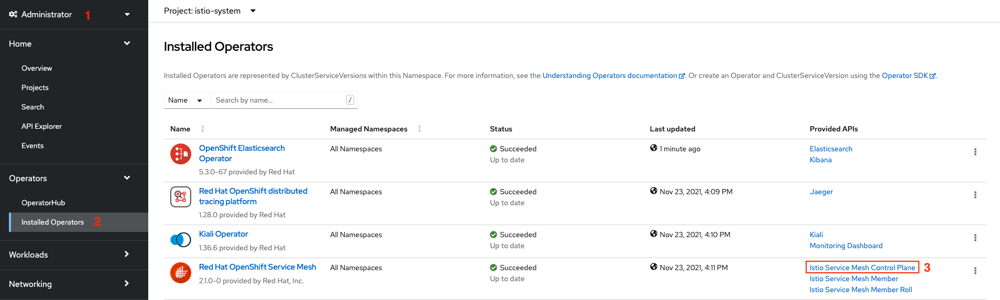

    - Select Create ServiceMeshControlPlane

      


    - Navigate to Proxy and input following values to enable access log at Envoy (sidecar)

      

    - Set outbound traffic policy
  
      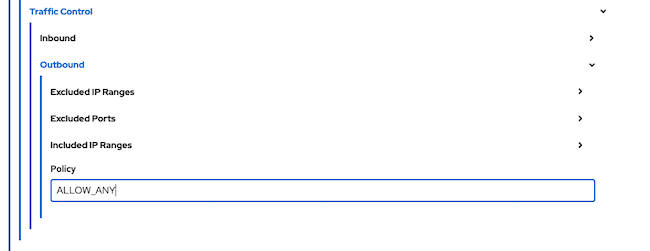
    
    - Set auto mTLS

      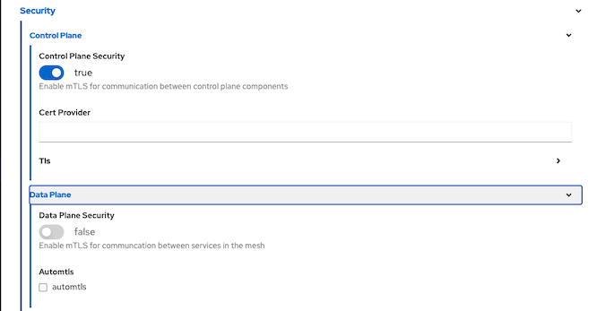
    
    - Verify YAML
  
      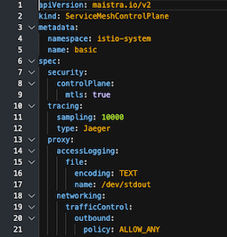

    - Create
  
- Check for control plane([get-smcp-status.sh](bin/get-smcp-status.sh))

  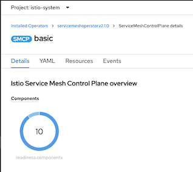

  Or using CLI

  ```bash
  bin/get-smcp-status.sh istio-system
  ```

  or

  ```bash
  oc get smcp/basic -n istio-system
  ```

  Output

  ```bash
  NAME    READY   STATUS            PROFILES      VERSION   AGE
  basic   9/9     ComponentsReady   ["default"]   2.0.7.1   9m54s
  ```
  
- Join project1 into control plane
  - Create data plane project

    ```bash
    oc new-project project1 
    ``` 

  - Review [ServiceMeshMemberRoll CRD](manifests/smcp.yaml)
  
    ```yaml
    apiVersion: maistra.io/v1
    kind: ServiceMeshMemberRoll
    metadata:
      name: default
    spec:
      members:
      - project1
    ```

  - Apply ServiceMeshMemberRoll
    
    ```bash
    oc create -f manifests/smmr.yaml -n istio-system
    ```
  - Check for ServiceMeshMemberRoll status

    ```bash
    oc describe smmr/default -n istio-system | grep -A2 Spec:
    ```
- Deploy sidecar to frontend app in project1
  
  ```bash
  oc apply -f manifests/frontend.yaml -n project1
  oc patch deployment/frontend-v1 -p '{"spec":{"template":{"metadata":{"annotations":{"sidecar.istio.io/inject":"true"}}}}}' -n project1
  oc patch deployment/frontend-v2 -p '{"spec":{"template":{"metadata":{"annotations":{"sidecar.istio.io/inject":"true"}}}}}' -n project1
  ```
  
  
  
  
- Check for sidecar in frontend-v1 and frontend-v2 pods
  
  ```bash
  oc get pods -n project1
  ```

  Sample output
  
  ```bash
  NAME                           READY   STATUS        RESTARTS   AGE
  frontend-v1-577b98f48c-6j5zg   2/2     Running       0          15s
  frontend-v1-c5d4648f9-7jfk2    1/1     Terminating   0          13m
  frontend-v2-5cd968bc59-cwsd8   2/2     Running       0          14s
  frontend-v2-5d4dbdbc9-k6787    1/1     Terminating   0          13m
  ```
  
  Check developer console

  

## Traffic Management

### Destination Rule, Virtual Service and Gateway

#### Kiali

- Open Kiali Console
  
  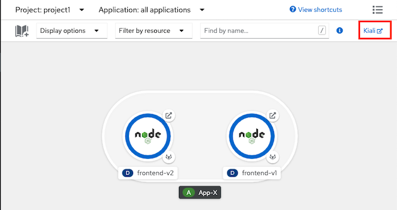

- Navigate to Services and select frontend, Actions-> Request Routing

  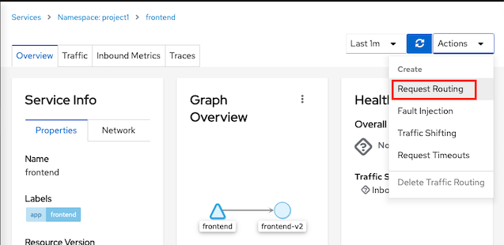

- Click Route To, Set weight of frontend-v1 to 100% then Click Add Rule

  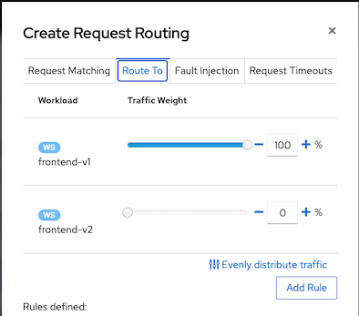

- Click Show Advanced Options
  - Check cluster domain

    ```bash
    DOMAIN=$(oc whoami --show-console|awk -F'apps.' '{print $2}')
    echo $DOMAIN
    ```
  - Virtual Service Hosts frontend.apps.$DOMAIN

    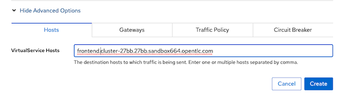
  
  - Gateway
    
    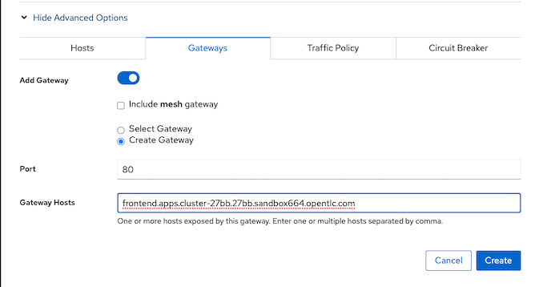

  - Traffic Policy

    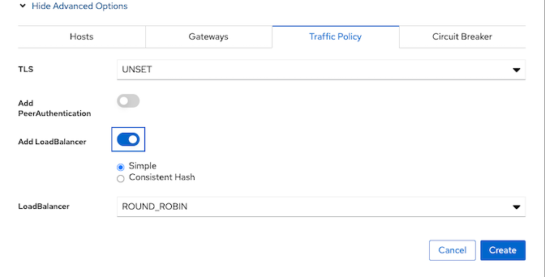

  - Create
  
#### CLI/YAML

- Create Destination Rule for frontend v1 and frontend v2

  - Review [Destination Rule CRD](manifests/frontend-destination-rule.yaml)
  
    ```yaml
    apiVersion: networking.istio.io/v1alpha3
    kind: DestinationRule
    metadata:
        name: frontend
    spec:
        host: frontend
        subsets:
        - name: v1
        labels:
            app: frontend
            version: v1
        trafficPolicy:
            loadBalancer:
            simple: ROUND_ROBIN
        - name: v2
        labels:
            app: frontend
            version: v2
        trafficPolicy:
            loadBalancer:
            simple: ROUND_ROBIN
    ```
  - Create destination rule
  
    ```bash
    oc apply -f manifests/frontend-destination-rule.yaml -n project1
    ```

- Create Virtual Service for frontend app
  - Review [Virtual Service CRD](manifests/frontend-virtual-service.yaml), Replace DOMAIN with cluster's sub-domain.
  
    ```yaml
    apiVersion: networking.istio.io/v1alpha3
    kind: VirtualService
    metadata:
        name: frontend
    spec:
        hosts:
        - frontend.apps.DOMAIN
        gateways:
        - project1/frontend-gateway
        http:
        - route:
        - destination:
            port:
                number: 8080
            host: frontend.project1.svc.cluster.local
    ```
    
  - Replace DOMAIN with cluster DOMAIN and create [virtual service](manifests/frontend-virtual-service.yaml) or run following command

    ```bash
    DOMAIN=$(oc whoami --show-console|awk -F'apps.' '{print $2}')
    cat manifests/frontend-virtual-service.yaml | sed 's/DOMAIN/'$DOMAIN'/'|oc apply -n project1 -f -
    ```
    
- Create Gateway for frontend app
  - Check for cluster's sub-domain

    ```bash
    DOMAIN=$(oc whoami --show-console|awk -F'apps.' '{print $2}')
    echo $DOMAIN
    ```

  - Review [Gateway CRD](manifests/frontend-gateway.yaml), Replaced DOMAIN with cluster's sub-domain
    
    ```yaml
    apiVersion: networking.istio.io/v1alpha3
    kind: Gateway
    metadata:
    name: frontend-gateway
    spec:
    selector:
        istio: ingressgateway # use istio default controller
    servers:
    - port:
        number: 80
        name: http2
        protocol: HTTP
        hosts:
        - 'frontend.apps.DOMAIN'
        
    ```

  - Replace DOMAIN with your clsuter sub-domain and Create [gateway](manifests/frontend-gateway.yaml)
  
    ```bash
    oc apply -f manifests/frontend-gateway.yaml -n project1
    ```

    or use following bash command 

    ```bash
    DOMAIN=$(oc whoami --show-console|awk -F'apps.' '{print $2}')
    cat manifests/frontend-gateway.yaml | sed 's/DOMAIN/'$DOMAIN'/'|oc apply -n project1 -f -
    ```

  - Check that route is automatically created
  
    ```bash
    oc get route -n istio-system | grep frontend-gateway
    ```

    Sample outout

    ```bash
    project1-frontend-gateway-5f5077c573bd9294   frontend.apps.cluster-27bb.27bb.sandbox664.opentlc.com                                   istio-ingressgateway   http2                        None
    ```
<!-- - Create Route (configured with Istio Gateway) for frontend app
  - Review [Route](manifests/frontend-route-istio.yaml), Replace DOMAIN with cluster's DOMAIN
    ```yaml
    apiVersion: v1
    kind: Route
    metadata:
        name: frontend
    spec:
        host: frontend.apps.DOMAIN
        port:
        targetPort: http2
        to:
        kind: Service
        name: istio-ingressgateway
        weight: 100
        wildcardPolicy: None

    ```
  - Replace DOMAIN with cluster DOMAIN then create Route
  
    ```bash
    oc apply -f manifests/frontend-route-istio.yaml -n istio-system
    ```
    or use following bash command 

    ```bash
    DOMAIN=$(oc whoami --show-console|awk -F'apps.' '{print $2}')
    cat manifests/frontend-route-istio.yaml | sed 's/DOMAIN/'$DOMAIN'/'|oc apply -n project1 -f -
    ``` -->

### Test Istio Gateway
- Test with cURL  
  
  ```bash
  FRONTEND_ISTIO_ROUTE=$(oc get route -n istio-system|grep frontend-gateway |awk '{print $2}')
  curl http://$FRONTEND_ISTIO_ROUTE
  ```

### Weight-Routing with Istio Virtual Service

- Set weight routing between 2 services with virtual service
  Remark: if you use above Kiali steps then you already set 100% traffic to frontend-v1
  
  - Check for [virtual service with weight routing](manifests/frontend-virtual-service-with-weight-routing.yaml), Replace DOMAIN with cluster's DOMAIN
  ```yaml
  apiVersion: networking.istio.io/v1alpha3
  kind: VirtualService
  metadata:
    name: frontend
  spec:
    hosts:
    - frontend.apps.DOMAIN
    gateways:
    - project1/frontend-gateway
    http:
    - route:
      - destination:
          port:
            number: 8080
          host: frontend.project1.svc.cluster.local
          subset: v1
        weight: 100
      - destination:
          port:
            number: 8080
          host: frontend.project1.svc.cluster.local
          subset: v2
        weight: 0
  ```
  
   - Apply [virtual service](manifests/frontend-virtual-service-with-weight-routing.yaml) for Blue/Green deployment with route all traffic to v1
    
    ```bash
    DOMAIN=$(oc whoami --show-console|awk -F'apps.' '{print $2}')
    cat manifests/frontend-virtual-service-with-weight-routing.yaml | sed 's/DOMAIN/'$DOMAIN'/'|oc apply -n project1 -f -
    ```
    
  - Test with cURL to verify that all requests are routed to v1
  - Blue/Green deployment by route all requests to v2
   
    ```bash
    oc patch virtualservice frontend --type='json' -p='[{"op":"replace","path":"/spec/http/0","value":{"route":[{"destination":{"host":"frontend.project1.svc.cluster.local","port":{"number":8080},"subset":"v1"},"weight":0},{"destination":{"host":"frontend.project1.svc.cluster.local","port":{"number":8080},"subset":"v2"},"weight":100}]}}]' -n project1
    ```

  - Test with cURL to verify that all requests are routed to v2
  - Canary deployment by weight requests between v1 and v2 with 70% and 30%
    
    ```bash
    oc patch virtualservice frontend --type='json' -p='[{"op":"replace","path":"/spec/http/0","value":{"route":[{"destination":{"host":"frontend.project1.svc.cluster.local","port":{"number":8080},"subset":"v1"},"weight":70},{"destination":{"host":"frontend.project1.svc.cluster.local","port":{"number":8080},"subset":"v2"},"weight":30}]}}]' -n project1
    ```
    
- Test canary deployment
  - Run 100 requests
  
    ```bash
    FRONTEND_ISTIO_ROUTE=$(oc get route -n istio-system|grep frontend-gateway |awk '{print $2}')
    COUNT=0
    rm -f result.txt
    while [ $COUNT -lt 100 ];
    do
        OUTPUT=$(curl -s $FRONTEND_ISTIO_ROUTE/version)
        printf "%s\n" $OUTPUT >> result.txt
        printf "%s\n" $OUTPUT
        sleep .2
        COUNT=$(expr $COUNT + 1)
    done
    ```

  - Check result for comparing percentage of requests to v1 and v2
    
    ```bash
    printf "Version 1: %s\n" $(cat result.txt | grep "1.0.0" | wc -l)
    printf "Version 2: %s\n" $(cat result.txt | grep "2.0.0" | wc -l)
    rm -f result.txt
    ```
    
### Routing by condition based on URI
- Set conditional routing between 2 services with virtual service
  - Check for [virtual service by URI](manifests/frontend-virtual-service-with-uri.yaml), Replace DOMAIN with cluster's DOMAIN. Condition with regular expression
      - Route to v1 if request URI start with "/ver" and end with "1"
        
        ```yaml
        apiVersion: networking.istio.io/v1alpha3
        kind: VirtualService
        metadata:
          name: frontend
        spec:
          hosts:
          - frontend.apps.SUBDOMAIN
          gateways:
          - project1/frontend-gateway
          http:
          - match:
            - uri:
                regex: /ver(.*)1
            # Rewrite URI back to / because frontend app not have /ver(*)1
            rewrite:
              uri: "/"
            route:
            - destination:
                host: frontend
                port:
                  number: 8080
                subset: v1
          - route:
            - destination:
                host: frontend
                port:
                  number: 8080
                subset: v2
        ```

- Apply virtual service
  
  ```bash
  oc apply -f manifests/frontend-virtual-service-with-uri.yaml -n project1
  ```
  
  or use following bash command 

  ```bash
  DOMAIN=$(oc whoami --show-console|awk -F'apps.' '{print $2}')
  cat manifests/frontend-virtual-service-with-uri.yaml | sed 's/DOMAIN/'$DOMAIN'/'|oc apply -n project1 -f -
  ```

- Test with URI /version1 and /ver1
  
  ```bash
  FRONTEND_ISTIO_ROUTE=$(oc get route -n istio-system|grep istio-system-frontend-gateway |awk '{print $2}')
  curl $FRONTEND_ISTIO_ROUTE/version1
  curl $FRONTEND_ISTIO_ROUTE/vers1
  curl $FRONTEND_ISTIO_ROUTE/ver1
  ```
  
- Test with URI /
  
  ```bash
  FRONTEND_ISTIO_ROUTE=$(oc get route -n istio-system|grep istio-system-frontend-gateway |awk '{print $2}')
  curl $FRONTEND_ISTIO_ROUTE/
  ```
  
### A/B with Istio Virtual Service
- A/B testing by investigating User-Agent header with [Virtual Service](manifests/frontend-virtual-service-with-header.yaml), Replace DOMAIN with cluster's sub-domain.
  - If HTTP header User-Agent contains text Firewall, request will be routed to frontend v2
   
  ```yaml
  apiVersion: networking.istio.io/v1alpha3
  kind: VirtualService
  metadata:
    name: frontend
  spec:
    hosts:
    - frontend.apps.DOMAIN
    gateways:
    - project1/frontend-gateway
    http:
    - match:
      - headers:
          user-agent:
            regex: (.*)Firefox(.*)
      route:
      - destination:
          host: frontend
          port:
            number: 8080
          subset: v2
    - route:
      - destination:
          host: frontend
          port:
            number: 8080
          subset: v1
  ```
## Traffic Mirroring (Dark Launch)

- Deploy backend application
  
  ```bash
  oc apply -f manifests/backend.yaml -n project1
  oc apply -f manifests/backend-destination-rule.yaml -n project1
  oc apply -f manifests/backend-virtual-service-v1-v2-50-50.yaml -n project1
  oc get pods -n project1
  ```
  
- **Optional**: Draw connetion from frontend to backend in Developer Console

  ```bash
  oc annotate deployment frontend-v1 'app.openshift.io/connects-to=[{"apiVersion":"apps/v1","kind":"Deployment","name":"backend-v1"},{"apiVersion":"apps/v1","kind":"Deployment","name":"backend-v2"}]' -n project1
  oc annotate deployment frontend-v2 'app.openshift.io/connects-to=[{"apiVersion":"apps/v1","kind":"Deployment","name":"backend-v1"},{"apiVersion":"apps/v1","kind":"Deployment","name":"backend-v2"}]' -n project1
  ```
  
  

- Configure frontend to request to backend
  
  ```bash
  oc set env deployment/frontend-v1 BACKEND_URL=http://backend:8080/ -n project1
  oc set env deployment/frontend-v2 BACKEND_URL=http://backend:8080/ -n project1
  ```

- Deploy audit app and mirror every requests that frontend call backend to audit app
  
  ```bash
  oc apply -f manifests/audit-app.yaml -n project1
  oc get pods -n project1
  ```

- Update [backend virtual service](manifests/backend-virtual-service-mirror.yaml) to mirror requests to audit app.
  
  ```bash
  oc apply -f manifests/backend-virtual-service-mirror.yaml -n project1
  ```
  
- Use cURL to call frontend and check audit's pod log by CLI (with another terminal) or Web Console
  - cURL frontend
  
  ```bash
  FRONTEND_ISTIO_ROUTE=$(oc get route -n istio-system|grep istio-system-frontend-gateway |awk '{print $2}')
  curl $FRONTEND_ISTIO_ROUTE
  ```

  - View audit log 
  
  ```bash
  oc logs -f $(oc get pods --no-headers | grep audit|head -n 1|awk '{print $1}') -c backend -n project1
  ```
  
  

- Apply [Virtual Service](manifests/frontend-virtual-service-with-header.yaml)
  
  ```bash
  oc apply -f manifests/frontend-virtual-service-with-header.yaml -n project1
  ```
  
  or use following bash command 

  ```bash
  DOMAIN=$(oc whoami --show-console|awk -F'apps.' '{print $2}')
  cat manifests/frontend-virtual-service-with-header.yaml | sed 's/DOMAIN/'$DOMAIN'/'|oc apply -n project1 -f -
  ```
  
- Test with cURL with HTTP header User-Agent contains Firefox
```bash
FRONTEND_ISTIO_ROUTE=$(oc get route -n istio-system|grep istio-system-frontend-gateway |awk '{print $2}')
  curl -H "User-Agent:Mozilla/5.0 (Macintosh; Intel Mac OS X 10.15; rv:78.0) Gecko/20100101 Firefox/78.0" $FRONTEND_ISTIO_ROUTE
```

## Observability

### Traffic Analysis

  
- Check Kiali Console
- login to OpenShift Developer Console, select project istio-system and open Kiali console 

  

- Login to Kiali Console and select Graph
  -  Namespace: select checkbox "project1"
  -  Display: select checkbox "Requests percentage" and "Traffic animation"

- Run following command

  ```bash
  oc patch virtualservice frontend --type='json' -p='[{"op":"replace","path":"/spec/http/0","value":{"route":[{"destination":{"host":"frontend.project1.svc.cluster.local","port":{"number":8080},"subset":"v1"},"weight":70},{"destination":{"host":"frontend.project1.svc.cluster.local","port":{"number":8080},"subset":"v2"},"weight":30}]}}]' -n project1
  FRONTEND_ISTIO_ROUTE=$(oc get route -n istio-system|grep istio-system-frontend-gateway |awk '{print $2}')
  while [ 1 ];
  do
          OUTPUT=$(curl -s $FRONTEND_ISTIO_ROUTE)
          printf "%s\n" $OUTPUT
          sleep .2
  done
  ```
- Check Kiali Console

  

- Traffic analysis for frontend app. Select Application->frontend->inbound traffic and outbound traffic
  
  

### Distributed Tracing

- Distributed tracing with Jaeger. Select tab Tracing
  
  - Overall tracing for frontend app

    
    
  - Login to Jaeger by select "View in Tracing"
  
    
    
  - Drill down to tracing information

     
  
  - Simulate error on backend app 
    - set backend pod to 
      
      ```bash
      oc exec backend-v1-7c7d56c9d5-gvkbr -- curl http://localhost:8080/stop
      ```

    - Request to frontend app

      ```bash
      curl -s $FRONTEND_ISTIO_ROUTE
      ```

    - Query Jaeger with tag http.status_code=504
      
      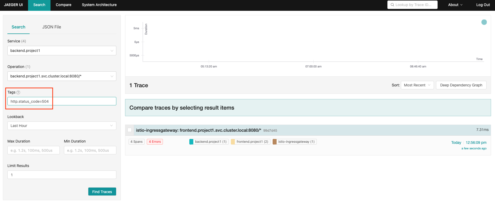
    
  
### Envoy Access Log
- Envoy access log already enabled with [ServiceMeshControlPlane CRD](manifests/smcp.yaml)
  
  ```yaml
    proxy:
    accessLogging:
      envoyService:
        enabled: false
      file:
        encoding: TEXT
        name: /dev/stdout
  ```
- Check access log
  ```bash
  oc logs -f $(oc get pods -n project1 --no-headers|grep frontend|head -n 1|awk '{print $1}') -c istio-proxy -n project1
  ```
  
  Sample output

  ```log
  [2020-12-25T10:33:04.848Z] "GET / HTTP/1.1" 200 - "-" "-" 0 103 5750 5749 "-" "-" "0c3ce34a-f5a0-9340-b84f-3631cd8eb444" "backend:8080" "10.128.2.133:8080" outbound|8080|v2|backend.project1.svc.cluster.local 10.128.2.131:48300 172.30.116.252:8080 10.128.2.131:36992 - -
  [2020-12-25T10:33:04.846Z] "GET / HTTP/1.1" 200 - "-" "-" 0 184 5756 5755 "184.22.250.124,10.131.0.4" "curl/7.64.1" "0c3ce34a-f5a0-9340-b84f-3631cd8eb444" "frontend.apps.cluster-1138.1138.example.opentlc.com" "127.0.0.1:8080" inbound|8080|http|frontend-v1.project1.svc.cluster.local 127.0.0.1:56540 10.128.2.131:8080 10.131.0.4:0 outbound_.8080_.v1_.frontend.project1.svc.cluster.local default
  ```

## Service Resilience

- Configure our application to contains only frontend-v1 and backend-v1 and scale backend to 3 pods.

  ```bash
  oc delete all --all -n project1
  oc delete gateway --all -n project1
  oc delete dr,vs --all -n project1
  oc apply -f manifests/frontend.yaml -n project1
  oc patch deployment/frontend-v1 -p '{"spec":{"template":{"metadata":{"annotations":{"sidecar.istio.io/inject":"true"}}}}}' -n project1
  oc apply -f manifests/backend.yaml -n project1
  oc delete deployment/frontend-v2 -n project1
  oc delete deployment/backend-v2 -n project1
  oc delete route frontend -n project1
  oc set env deployment/frontend-v1 BACKEND_URL=http://backend:8080/ -n project1
  oc annotate deployment frontend-v1 'app.openshift.io/connects-to=[{"apiVersion":"apps/v1","kind":"Deployment","name":"backend-v1"},{"apiVersion":"apps/v1","kind":"Deployment","name":"backend-v2"}]' -n project1
  oc scale deployment backend-v1 --replicas=3 -n project1
  oc apply -f manifests/backend-destination-rule-v1-only.yaml -n project1
  oc apply -f manifests/backend-virtual-service.yaml -n project1
  oc apply -f manifests/frontend-destination-rule-v1-only.yaml -n project1
  DOMAIN=$(oc whoami --show-console|awk -F'apps.' '{print $2}')
  cat manifests/frontend-virtual-service.yaml | sed 's/DOMAIN/'$DOMAIN'/'|oc apply -n project1 -f -
  cat manifests/frontend-gateway.yaml | sed 's/DOMAIN/'$DOMAIN'/'|oc apply -n project1 -f -
  watch oc get pods -n project1
  ```

  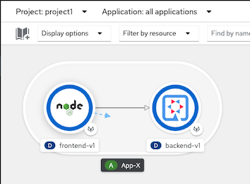


- Test with cURL

  ```bash
  FRONTEND_ISTIO_ROUTE=$(oc get route -n istio-system|grep frontend-gateway |awk '{print $2}')
  curl http://$FRONTEND_ISTIO_ROUTE
  ```

  Sample output - Check for field Host that is backend pod that processed for this request

  ```bash
  Frontend version: 1.0.0 => [Backend: http://backend:8080/, Response: 200, Body: Backend version:v1, Response:200, Host:backend-v1-f4dbf777f-h7rwg, Status:200, Message: Hello, Quarkus]
  ```

- Loop 6 times. Result from backend will be round robin.
  
  - Create bash function
  ```bash
    function loop_frontend(){
      FRONTEND_ISTIO_ROUTE=$(oc get route -n istio-system|grep frontend-gateway |awk '{print $2}')
      COUNT=0
      MAX=$1
      while [ $COUNT -lt $MAX ];
      do
        curl -s http://$FRONTEND_ISTIO_ROUTE | awk -F',' '{print $5 "=>" $6}'
        COUNT=$(expr $COUNT + 1 )
      done
    }
    ```

  - Run function with input paramter 6
    
  ```bash
  loop_frontend 6
  ```

  Sample output
    
  ```bash
  Host:backend-v1-7779cb476b-6wbsp=> Status:200
  Host:backend-v1-7779cb476b-q2hz9=> Status:200
  Host:backend-v1-7779cb476b-6wbsp=> Status:200
  Host:backend-v1-7779cb476b-q2hz9=> Status:200
  Host:backend-v1-7779cb476b-6wbsp=> Status:200
  Host:backend-v1-7779cb476b-q2hz9=> Status:200
  Host:backend-v1-7779cb476b-6wbsp=> Status:200
  Host:backend-v1-7779cb476b-q2hz9=> Status:200
  Host:backend-v1-7779cb476b-6wbsp=> Status:200
  Host:backend-v1-7779cb476b-q2hz9=> Status:200
  ```

- Check that pods run on which node
  
  ```bash
  oc get pods -o=custom-columns="NAME:.metadata.name,AZ:.metadata.labels['topology\.kubernetes\.io/zone']" -n project1
  ```

  Sample output

  ```bash
  NAME                          AZ
  backend-v1-7779cb476b-6wbsp   us-east-2a
  backend-v1-7779cb476b-bgk22   us-east-2a
  backend-v1-7779cb476b-q2hz9   us-east-2b
  frontend-v1-d6dc6768-vbzcc    us-east-2a
  ```

  Envoy has **Localcity Load Balancing** feature and this feature is enabled by default. A locality defines geographic location by region, zone and subzone. Envoy will try to send request to pod within defined geographic if avilable In this case is within same AZ

  *Notice that response came frome 2 pods in AZ us-east-2a same AZ with frontend*

- By default, Envoy will automatically retry if it get response with code 503

- Force one backend pod to return 503 

  - by command line.
    <!-- $(oc get pod -n project1 | grep -m1 backend | cut -d " " -f1) -->
    ```bash
    oc exec -n project1 -c backend <backend pod same zone with frontend> -- curl -s http://localhost:8080/not_ready
    ```

    Sample output
    
    ```bash
    Backend version:v1, Response:200, Host:backend-v1-7779cb476b-bgk22, Status:200, Message: Readiness: false
    ```
    
  - by Web Console
    
      
  
- Verify response from that pod.
 
  ```bash
    oc exec -n project1 -c backend   <backend pod same zone with frontend> -- curl -sv http://localhost:8080/
  ```

  Sample Output

  ```bash
    < HTTP/1.1 503 Service Unavailable
    < Content-Encoding: text/plain
    < Expires: Wed, 08 Sep 2021 12:46:28 GMT
    < Content-Length: 126
    < Content-Type: text/plain;charset=UTF-8
    <
    { [126 bytes data]
    * Connection #0 to host localhost left intact
    Backend version:v1, Response:503, Host:backend-v1-7779cb476b-bgk22, Status:503, Message: Application readiness is set to false
  ```
    
- Test with cURL again. You will get only status 200
    
    ```bash
    loop_frontend 10
    ```

    Sample Output

    ```bash
    Host:backend-v1-7779cb476b-6wbsp=> Status:200
    Host:backend-v1-7779cb476b-q2hz9=> Status:200
    Host:backend-v1-7779cb476b-6wbsp=> Status:200
    Host:backend-v1-7779cb476b-q2hz9=> Status:200
    Host:backend-v1-7779cb476b-6wbsp=> Status:200
    Host:backend-v1-7779cb476b-q2hz9=> Status:200
    Host:backend-v1-7779cb476b-6wbsp=> Status:200
    Host:backend-v1-7779cb476b-q2hz9=> Status:200
    Host:backend-v1-7779cb476b-6wbsp=> Status:200
    Host:backend-v1-7779cb476b-q2hz9=> Status:200
    ```
- Check tracing in Jaeger by query with http.response_code=503
  
  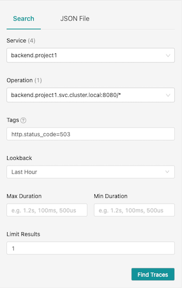

  Drill down to check that envoy retry request to backend after it got 503 response.

   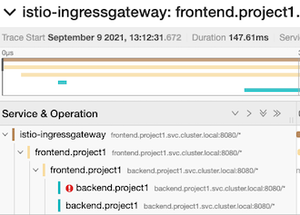
   
- Set backend pod to return 200
  
    ```bash
    oc exec -n project1 -c backend  <backend pod same zone with frontend> -- curl -s http://localhost:8080/ready
    ```  

### Circuit Breaker

- Update destination rule with circuit breaker
  
  ```bash
  oc apply -f manifests/backend-destination-rule-circuit-breaker.yaml -n project1
  ```

- Review Circuit Breaker configuration in [deatination rule](manifests/backend-destination-rule-circuit-breaker.yaml)
  -  If found error 1 times (consecutiveErrors)
  -  then eject that pod from pool for 15 mintues (baseEjectionTime)
  -  Maximum number of pod that can be ejected is 100% (maxEjectionPercent)
  -  Check this every 15 min (interval)
  
  ```yaml
  outlierDetection:
        baseEjectionTime: 15m
        consecutiveErrors: 1
        interval: 15m
        maxEjectionPercent: 100
  ```
  
- Set one backend pod to return 504 and verify that pod return 504
  
  ```bash
  oc exec -n project1 -c backend <backend pod same zone with frontend> -- curl -s http://localhost:8080/stop
  ```

  Sample output
  
  ```bash
  Backend version:v1, Response:200, Host:backend-v1-7779cb476b-bgk22, Status:200, Message: Liveness: false
  ```

- Verify that backend pod return 504

  ```bash
  oc exec -n project1 -c backend <backend pod same zone with frontend> -- curl -s http://localhost:8080/
  ```

  Sample output

  ```bash
  Backend version:v1, Response:504, Host:backend-v1-7779cb476b-bgk22, Status:504, Message: Application liveness is set to fasle
  ```  

- Test again with cURL. You will get 504 just one times.
  
  ```bash
  loop_frontend 15
  ```

  Sample output

  ```bash
  Host:backend-v1-7779cb476b-6wbsp=> Status:200
  Host:backend-v1-7779cb476b-6wbsp=> Status:200
  Host:backend-v1-7779cb476b-q2hz9=> Status:504
  Host:backend-v1-7779cb476b-6wbsp=> Status:200
  Host:backend-v1-7779cb476b-6wbsp=> Status:200
  Host:backend-v1-7779cb476b-6wbsp=> Status:200
  Host:backend-v1-7779cb476b-6wbsp=> Status:200
  Host:backend-v1-7779cb476b-6wbsp=> Status:200
  Host:backend-v1-7779cb476b-6wbsp=> Status:200
  Host:backend-v1-7779cb476b-6wbsp=> Status:200
  Host:backend-v1-7779cb476b-6wbsp=> Status:200
  Host:backend-v1-7779cb476b-6wbsp=> Status:200
  Host:backend-v1-7779cb476b-6wbsp=> Status:200
  Host:backend-v1-7779cb476b-6wbsp=> Status:200
  Host:backend-v1-7779cb476b-6wbsp=> Status:200
  ```

- Check Kiali Console. Remark that there is lightning icon at backend service. This is represent for circuit breaker.
  
  

- Set backend pod to normal status

  ```bash
  oc exec -n project1 -c backend $(oc get pod -n project1 | grep -m1 backend | cut -d " " -f1) -- curl -sv http://localhost:8080/start
  ```

## Secure with mTLS

### Within Service Mesh
- Enable data plane mTLS by edit ServiceMeshControlPlane with following configuration

  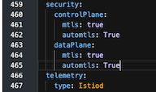

- Deploy another pod without sidecar and try to connect to anther services that is part of mesh
  
  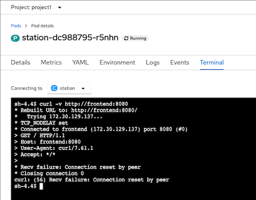

#### Pod Liveness and Readiness

- Enable Liveness nad Readiness on backend-v1
  
  ```bash
  oc set probe deployment backend-v1 \
   --readiness --get-url=http://:8080/q/health/ready \
   --initial-delay-seconds=5 --failure-threshold=1 --period-seconds=5 -n project1
    oc set probe deployment backend-v1 \
   --liveness --get-url=http://:8080/q/health/live \
   --initial-delay-seconds=5 --failure-threshold=1 --period-seconds=5 -n project1
  ```
- Check for pod status
  
  ```bash
  watch oc get pods -l app=backend,version=v1 -n project1
  ```
  
  Example of output

  ```bash
  NAME                          READY   STATUS            RESTARTS   AGE
  backend-v1-5846f59c84-p6tn5   1/2     CrashLoopBackOff   4          68s
  ```
  
  Remark: Liveness and Readiness probe fail because kubelet cannot connect to port 8080 anymore.

- Rewrite HTTP probe by annotation to deployment 

  ```bash
  oc patch deployment/backend-v1 \
  -n project1 \
  -p '{"spec":{"template":{"metadata":{"annotations":{"sidecar.istio.io/rewriteAppHTTPProbers":"true"}}}}}'
  ```

- Remove Liveness and Readiness probe
  
  ```bash
  oc set probe deployment backend-v1 --remove --readiness --liveness -n project1
  ```

### Istio Gateway with mTLS

* Create certificates and private key
  
  ```bash
  mkdir -p certs
  DOMAIN=$(oc whoami --show-console  | awk -F'apps.' '{print $2}')
  CN=frontend.apps.$SDOMAIN
  echo "Create Root CA and Private Key"
  openssl req -x509 -sha256 -nodes -days 365 -newkey rsa:2048 -subj '/O=example Inc./CN=example.com' \
  -keyout certs/example.com.key -out certs/example.com.crt
  echo "Create Certificate and Private Key for $CN"
  openssl req -out certs/frontend.csr -newkey rsa:2048 -nodes -keyout certs/frontend.key -subj "/CN=${CN}/O=Great Department"
  openssl x509 -req -days 365 -CA certs/example.com.crt -CAkey certs/example.com.key -set_serial 0 -in certs/frontend.csr -out certs/frontend.crt
  ```

* Create secret to store private key and certificate
  
  ```bash
  oc create secret generic frontend-credential \
  --from-file=tls.key=certs/frontend.key \
  --from-file=tls.crt=certs/frontend.crt \
  -n istio-system
  ```

* Update [Gateway](manifests/gateway-tls.yaml)
  
  ```bash
  cat manifests/gateway-tls.yaml|sed s/DOMAIN/$DOMAIN/g|oc apply -n project1 -f -
  ```

* Verify updated gateway configuration
  
  ```bash
  oc get gateway frontend-gateway -n project1 -o yaml
  ```
  
  Example of output
  
  ```bash
  spec:
    selector:
      istio: ingressgateway
    servers:
    - hosts:
      - frontend.apps.cluster-27bb.27bb.sandbox664.opentlc.com
      port:
        name: https
        number: 443
        protocol: HTTPS
      tls:
        credentialName: frontend-credential
        mode: SIMPLE
  ```

  - port is changed to 443 with protocol HTTPS
  - TLS mode is SIMPLE and use private key and certificate from secret name *frontend-credential* in control plane namespace
  - SIMPLE mode is for TLS. For mutual TLS use MUTUAL

* Check that route created by Istio Gateway is updated to passthrough mode
  
  ```bash
  oc get route \
  $(oc get route -n istio-system --no-headers -o=custom-columns="NAME:.metadata.name" | grep frontend) \
  -n istio-system -o jsonpath='{.spec.tls.termination}'
  ```

  Example of output

  ```bash
  passthrough
  ```
* Test with cURL

  ```bash
  export GATEWAY_URL=$(oc get route $(oc get route -n istio-system | grep frontend | awk '{print $1}') -n istio-system -o yaml  -o jsonpath='{.spec.host}')
  curl -kv https://$GATEWAY_URL
  ```

  Example of output

  ```bash
  * SSL connection using TLSv1.2 / ECDHE-RSA-AES256-GCM-SHA384
  * ALPN, server accepted to use h2
  * Server certificate:
  *  subject: CN=frontend-istio-user1.apps.; O=Great Department
  *  start date: Sep  1 12:10:22 2021 GMT
  *  expire date: Sep  1 12:10:22 2022 GMT
  *  issuer: O=example Inc.; CN=example.com
  *  SSL certificate verify result: unable to get local issuer certificate (20), continuing anyway.
  * Using HTTP2, server supports multi-use
  * Connection state changed (HTTP/2 confirmed)
  ```

- Create client certificate

  ```bash
  CN=great-partner.apps.acme.com
  echo "Create Root CA and Private Key"
  openssl req -x509 -sha256 -nodes -days 365 -newkey rsa:2048 -subj '/O=Acme Inc./CN=acme.com' \
  -keyout certs/acme.com.key -out certs/acme.com.crt
  echo "Create Certificate and Private Key for $CN"
  openssl req -out certs/great-partner.csr -newkey rsa:2048 -nodes -keyout certs/great-partner.key -subj "/CN=${CN}/O=Great Department"
  openssl x509 -req -days 365 -CA certs/acme.com.crt -CAkey certs/acme.com.key -set_serial 0 -in certs/great-partner.csr -out certs/great-partner.crt
  ```

- Update frontend-credential secret

  ```bash
  oc create secret generic frontend-credential \
  --from-file=tls.key=certs/frontend.key \
  --from-file=tls.crt=certs/frontend.crt \
  --from-file=ca.crt=certs/acme.com.crt \
  -n istio-system --dry-run=client -o yaml \
  | oc replace -n istio-system  secret frontend-credential -f -
  ```

- Update frontend gateway TLS mode to MUTUAL
  
  ```bash
  oc patch gateway frontend-gateway -n project1 \
  --type='json' \
  -p='[{"op":"replace","path":"/spec/servers/0/tls/mode","value":"MUTUAL"}]'
  ```

- Test
  - cURL without client certificate
    
    ```bash
    curl -k https://$GATEWAY_URL
    ```

    You will get following error

    ```bash
    curl: (35) error:1401E410:SSL routines:CONNECT_CR_FINISHED:sslv3 alert handshake failure
    ```

  - cURL with Acme Inc certificate
    
    ```bash
    curl -kv --cacert certs/acme.com.crt \
    --cert certs/great-partner.crt \
    --key certs/great-partner.key \
    https://$GATEWAY_URL
    ```
    
    Example of output
    
    ```bash
    * ALPN, offering h2
    * ALPN, offering http/1.1
    * successfully set certificate verify locations:
    *   CAfile: certs/acme.com.crt
      CApath: none
    ...
    * Server certificate:
    *  subject: CN=frontend-istio-user1.apps.; O=Great Department
    *  start date: Sep  1 12:10:22 2021 GMT
    *  expire date: Sep  1 12:10:22 2022 GMT
    *  issuer: O=example Inc.; CN=example.com
    *  SSL certificate verify result: unable to get local issuer certificate (20), continuing anyway
    ...
    Frontend version: 1.0.0 => [Backend: http://backend:8080, Response: 200, Body: Backend version:v1, Response:200, Host:backend-v1-f4dbf777f-xp65r, Status:200, Message: Hello, Quarkus]
    ```

  - Generate another certificate and private key (Pirate Inc) that frontend gateway not trust
    
    ```bash
    CN=bad-partner.apps.pirate.com
    echo "Create Root CA and Private Key"
    openssl req -x509 -sha256 -nodes -days 365 -newkey rsa:2048 -subj '/O=Pirate Inc./CN=pirate.com' \
    -keyout certs/pirate.com.key -out certs/pirate.com.crt
    echo "Create Certificate and Private Key for $CN"
    openssl req -out certs/bad-partner.csr -newkey rsa:2048 -nodes -keyout certs/bad-partner.key -subj "/CN=${CN}/O=Bad Department"
    openssl x509 -req -days 365 -CA certs/pirate.com.crt -CAkey certs/pirate.com.key -set_serial 0 -in certs/bad-partner.csr -out certs/bad-partner.crt
    ```

  - cURL with Pirate Inc certificate
    
    ```bash
    curl -k --cacert certs/pirate.com.crt \
    --cert certs/bad-partner.crt \
    --key certs/bad-partner.key \
    https://$GATEWAY_URL
    ```

    You will get error alert unknown ca

    ```bash
    curl: (35) error:1401E418:SSL routines:CONNECT_CR_FINISHED:tlsv1 alert unknown ca
    ```
  
  - Update frontend gateway to trust Pirate Inc by update frontend-credential secret
  
    ```bash
    cat certs/acme.com.crt > certs/trusted.crt
    cat certs/pirate.com.crt >> certs/trusted.crt
    oc create secret generic frontend-credential \
      --from-file=tls.key=certs/frontend.key \
      --from-file=tls.crt=certs/frontend.crt \
      --from-file=ca.crt=certs/trusted.crt \
      -n istio-system --dry-run=client -o yaml \
      | oc replace -n istio-system secret frontend-credential -f -
    ```
  
  - Test with Pirate Inc certificate
    
    ```bash
    curl -k --cacert certs/pirate.com.crt \
    --cert certs/bad-partner.crt \
    --key certs/bad-partner.key \
    https://$GATEWAY_URL
    ```

  - Recheck that Acme Inc can acess frontend app
    
    ```bash
    curl -kv --cacert certs/acme.com.crt \
    --cert certs/great-partner.crt \
    --key certs/great-partner.key \
    https://$GATEWAY_URL
    ```
- Update frontend gateway TLS mode to SIMPLE
  
  ```bash
  oc patch gateway frontend-gateway -n project1 \
  --type='json' \
  -p='[{"op":"replace","path":"/spec/servers/0/tls/mode","value":"SIMPLE"}]'
  ```

## JWT Token

### Red Hat Single Sign-On

- Setup Red Hat Single Sign-On (Keycloak)
  - Create namespace
  
    ```bash
    oc new-project sso --description="Red Hat Single Sign-On" --display-name="Red Hat Single Sign-On"
    ```
  - Install Red Hat Single Sign-On Operator
    
    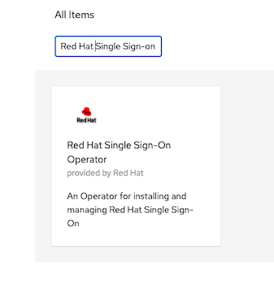

    Install to namespace sso

    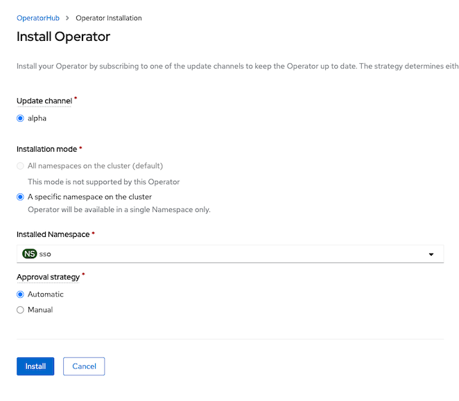

  - Create Keycloak instance

    ```bash
    oc create -f manifests/keycloak.yaml -n sso
    watch oc get pods -n sso
    ```

  - Cosmetic topology view 
  
    ```bash
    oc label deployment/keycloak-postgresql app.kubernetes.io/name=postgresql -n sso
    oc annotate statefulset/keycloak 'app.openshift.io/connects-to=[{"apiVersion":"apps/v1","kind":"Deployment","name":"keycloak-postgresql"}]' -n sso
    ```

  - Extract admin password
  
    ```bash
    KEYCLOAK_ADMIN_PASSWORD=$(oc extract secret/credential-keycloak -n sso --to=- --keys=ADMIN_PASSWORD  2>/dev/null)
    ```

  - Create Realm and Keycloak Client with Client Credential
  
    ```bash
    oc create -f manifests/keycloak-realm.yaml -n sso
    oc create -f manifests/keycloak-client.yaml -n sso
    ```

  - Client secret
    
    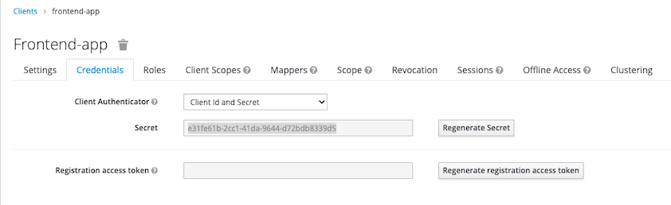

  - Test login with client secret
  
    ```bash
    KEYCLOAK=$(oc get route/keycloak -n sso -o jsonpath='{.spec.host}')
    CLIENT_SECRET=e31fe61b-2cc1-41da-9644-d72bdb8339d5
    TOKEN=$(curl -s  --location --request  \
    POST https://$KEYCLOAK/auth/realms/demo/protocol/openid-connect/token \
    --header 'Content-Type: application/x-www-form-urlencoded' \
    --data-urlencode client_id=frontend-app \
    --data-urlencode client_secret=$CLIENT_SECRET \
    --data-urlencode scope=email \
    --data-urlencode grant_type=client_credentials  | jq .access_token | sed s/\"//g)
    ```

### RequestAuthentication and Authorization Policy

- Create [RequestAuthentication and AuthorizationPolicy](manifests/frontend-jwt.yaml)
  
  ```bash
  oc apply -f manitests/frontend-jwt -n project1
  ```

- Test without JWT token. You will get HTTP resonse code 403
  
  ```bash
  curl -kv https://frontend-user1.apps.cluster-7bbc.7bbc.sandbox1708.opentlc.com
  ```
- Test with invalid JWT token. You will get HTTP resonse code 401
- Test with valid JWT token
  
  ```bash
  TOKEN=$(curl -s  --location --request  \
    POST https://$KEYCLOAK/auth/realms/demo/protocol/openid-connect/token \
    --header 'Content-Type: application/x-www-form-urlencoded' \
    --data-urlencode client_id=frontend-app \
    --data-urlencode client_secret=$CLIENT_SECRET \
    --data-urlencode scope=email \
    --data-urlencode grant_type=client_credentials  | jq .access_token | sed s/\"//g)
    curl --header 'Authorization: Bearer '$TOKEN -kv https://frontend-user1.apps.cluster-7bbc.7bbc.sandbox1708.opentlc.com
  ```
- Test with expired JWT token (token life is 5 minutes). You will get HTTP response code 401 with following message
  
  ```bash
  Jwt is expired* Closing connection 0
  ```

## Service Level Objective (SLO)

We can use Service Level Indicator (SLI) and Service Level Objective (SLO) to determine and measure availability of services. For RESTful Web Service we can use HTTP response code to measure for SLI

- Deploy applicaition
  
  ```bash
  oc delete all --all -n project1
  oc delete gateway --all -n project1
  oc delete dr,vs --all -n project1
  oc apply -f manifests/frontend.yaml -n project1
  oc patch deployment/frontend-v1 -p '{"spec":{"template":{"metadata":{"annotations":{"sidecar.istio.io/inject":"true"}}}}}' -n project1
  oc apply -f manifests/backend.yaml -n project1
  oc scale deployment/frontend-v1 --replicas=5 -n project1
  oc scale deployment/backend-v1 --replicas=10 -n project1
  oc scale deployment/backend-v2 --replicas=10 -n project1
  oc delete deployment/frontend-v2 -n project1
  oc delete route frontend -n project1
  oc set env deployment/frontend-v1 BACKEND_URL=http://backend:8080/ -n project1
  oc annotate deployment frontend-v1 'app.openshift.io/connects-to=[{"apiVersion":"apps/v1","kind":"Deployment","name":"backend-v1"},{"apiVersion":"apps/v1","kind":"Deployment","name":"backend-v2"}]' -n project1
  oc apply -f manifests/backend-destination-rule.yaml -n project1
  oc apply -f manifests/backend-virtual-service-v1-v2-50-50.yaml -n project1
  oc apply -f manifests/frontend-destination-rule-v1-only.yaml -n project1
  DOMAIN=$(oc whoami --show-console|awk -F'apps.' '{print $2}')
  cat manifests/frontend-virtual-service.yaml | sed 's/DOMAIN/'$DOMAIN'/'|oc apply -n project1 -f -
  cat manifests/frontend-gateway.yaml | sed 's/DOMAIN/'$DOMAIN'/'|oc apply -n project1 -f -
  oc patch virtualservice backend --type='json' -p='[{"op":"replace","path":"/spec/http/0","value":{"route":[{"destination":{"host":"backend.project1.svc.cluster.local","port":{"number":8080},"subset":"v1"},"weight":100},{"destination":{"host":"backend.project1.svc.cluster.local","port":{"number":8080},"subset":"v2"},"weight":0}]}}]' -n project1
  watch oc get pods -n project1
  ```

- Generate load
  - Create namespace

    ```bash
    oc new-project load-test
    ```  

  - Run K6 with 15 threads for 10 minutes to simulate workload
  
    ```bash
      FRONTEND_ISTIO_ROUTE=$(oc get route -n istio-system|grep frontend-gateway |awk '{print $2}')
      oc run load-test -n load-test -i --rm \
      --image=loadimpact/k6 --rm=true --restart=Never \
      --  run -  < manifests/load-test-k6.js \
      -e URL=http://$FRONTEND_ISTIO_ROUTE -e THREADS=15 -e DURATION=10m -e RAMPUP=1s -e RAMPDOWN=0s
    ```

- Prometheus in Service Mesh's control plane contains information about HTTP responses then we can use following PromQL to check for the sucessfull request and total request of backend service

  Use OpenShift Developer Console, select project istio-system and open Prometheus console

    - Success Rate
      - Successful request for last 5 minutes
        
        ```
        sum(increase(istio_requests_total{destination_service_name="backend",response_code!~"5*"}[5m]))
        ```

        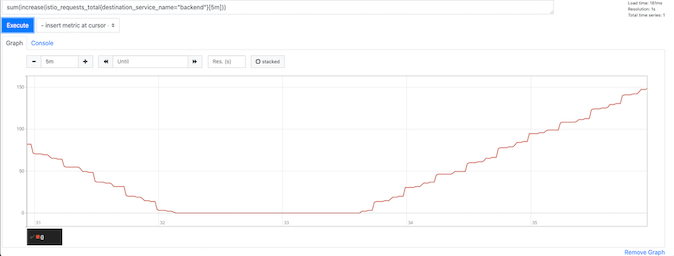

      - Total requests for last 5 minutes
        
        ```
        sum(increase(istio_requests_total{destination_service_name="backend"}[5m]))
        ```
        <!-- Sample data provided by Prometheus
        
        ```
        istio_requests_total{connection_security_policy="unknown",destination_app="backend",destination_canonical_revision="v1",destination_canonical_service="backend",destination_principal="spiffe://cluster.local/ns/user1/sa/default",destination_service="backend.user1.svc.cluster.local",destination_service_name="backend",destination_service_namespace="user1",destination_version="v1",destination_workload="backend-v1",destination_workload_namespace="user1",instance="10.128.2.42:15090",job="envoy-stats",namespace="user1",pod_name="frontend-v1-66fbd89459-8ksr8",reporter="source",request_protocol="http",response_code="503",response_flags="URX",source_app="frontend",source_canonical_revision="v1",source_canonical_service="frontend",source_principal="spiffe://cluster.local/ns/user1/sa/default",source_version="v1",source_workload="frontend-v1",source_workload_namespace="user1"}
        ``` -->

    - Latency
      - 99th Percentile of response time in sec of frontend service
  
        ```
        histogram_quantile(0.99, sum(rate(istio_request_duration_milliseconds_bucket{destination_service_name="frontend",response_code!~"5*"}[5m])) by (le))/1000
        ```

- SLO for success rate can be calculated by following PromQL and compare this to your desired service level e.g. 99.9%
  ```
  sum(increase(istio_requests_total{destination_service_name="backend",response_code!~"5*"}[5m])) / sum(increase(istio_requests_total{destination_service_name="backend"}[5m]))*100
  ```
- Login to Grafana Dashbaord in control plane and import [SLO Dashbaord](manifests/grafana-slo-dashboard.json)
  
  - Backend Application service %availability
  
    ```
    sum(increase(istio_requests_total{destination_service_name="backend",response_code!~"5.*"}[5m])) / sum(increase(istio_requests_total{destination_service_name="backend"}[5m])) *100
    ```
  
  - Frontend 99th percentile response time in second
  
    ```
    histogram_quantile(0.99, sum(rate(istio_request_duration_milliseconds_bucket{destination_service_name="frontend",response_code!~"5*"}[5m])) by (le))/1000
    ```
  
  - Backend 99th percentile response time in second
  
    ```
    histogram_quantile(0.99, sum(rate(istio_request_duration_milliseconds_bucket{destination_service_name="backend",response_code!~"5*"}[5m])) by (le))/1000
    ```

    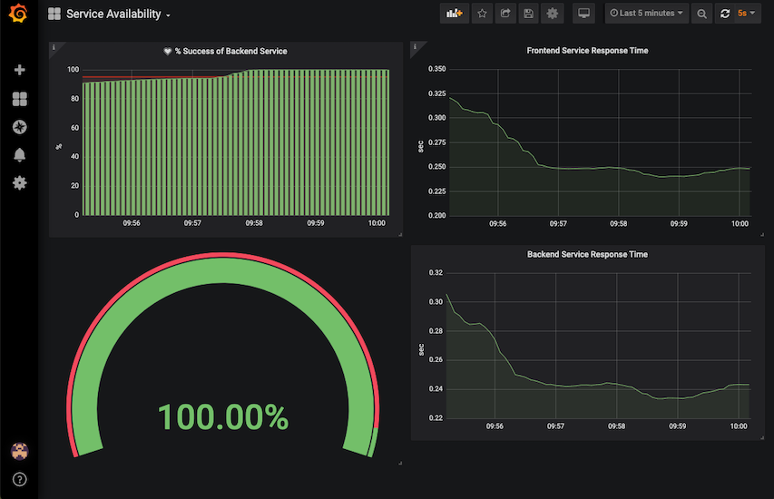


- Run following bash script to force 5 backend-v1 pod to return 504 then set those pods to return to 200 OK.
  
  ```bash
  for pod in $(oc get pods -l app=backend,version=v1 --no-headers  -o=custom-columns="NAME:.metadata.name" -n project1|head -n 5|sort)
  do
    oc exec -n project1 -c backend $pod -- curl -s http://localhost:8080/stop -w "\n"
    sleep 1
  done
  sleep 10
  for pod in $(oc get pods -l app=backend,version=v1 --no-headers  -o=custom-columns="NAME:.metadata.name" -n project1|head -n 5|sort)
  do
    oc exec -n project1 -c backend $pod -- curl -s http://localhost:8080/start -w "\n"
  done
  ```

  
   
- Run following bash script to set traffic to backend-v2 and check both frontend and backend response time increasing. 
  
  ```bash
    oc patch virtualservice backend --type='json' -p='[{"op":"replace","path":"/spec/http/0","value":{"route":[{"destination":{"host":"backend.project1.svc.cluster.local","port":{"number":8080},"subset":"v1"},"weight":30},{"destination":{"host":"backend.project1.svc.cluster.local","port":{"number":8080},"subset":"v2"},"weight":70}]}}]' -n project1
  ```

  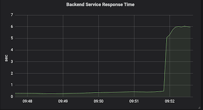

## Control Plane with High Availability

### OpenShift Service Mesh 1.x

[ServiceMeshControlPlane](manifests/smcp-v1-ha.yaml) with high availability configuration

- Configure Horizontal Pod Autoscaler (HPA) for ingress-gateway
  - Set request and limit
  - Set autoscaling to true
  - Set number of min and max replicas with target CPU utilization to trigger HPA
    
    ```yaml
    ingress:
        enabled: true
        ingress: false
        runtime:
          container:
            resources:
              requests:
                cpu: 10m
                memory: 128Mi
              limits:
                cpu: 2000m
                memory: 2048Mi
    ```

- For others components 
  - Set number of replicas to 2
  
    ```yaml
        deployment:
          autoScaling:
            enabled: false
          replicas: 2
    ```

  - Set pod anti-affinity to prevent scheduler to place pods to the same node
    
    *Remark: namespaces in podAntiAffinity is needed to support multiples control planes in the same OpenShift cluster. Change this to match name of control plane's namespace* 

    ```yaml
        pod:
          tolerations:
          - key: node.kubernetes.io/unreachable
            operator: Exists
            effect: NoExecute
            tolerationSeconds: 60
          affinity:
            podAntiAffinity:
              requiredDuringScheduling:
              - key: istio
                topologyKey: kubernetes.io/hostname
                operator: In
                values:
                - galley
                namespaces: istio-system
    ```

- Check that pods of each deployment run on different nodes

  ```bash
  oc get pods -o wide -n istio-system -o custom-columns=NAME:.metadata.name,NODE:.spec.nodeName,PHASE:.status.phase
  ```

  Output

  ```bash
  NAME                                    NODE                                        PHASE
  grafana-7bdb4fb848-847c8                ip-10-0-160-48.us-east-2.compute.internal   Running
  istio-citadel-6668b5b947-njgbb          ip-10-0-160-48.us-east-2.compute.internal   Running
  istio-citadel-6668b5b947-nk9dz          ip-10-0-137-21.us-east-2.compute.internal   Running
  istio-galley-6dc7f9c496-hkm57           ip-10-0-137-21.us-east-2.compute.internal   Running
  istio-galley-6dc7f9c496-qcw9q           ip-10-0-160-48.us-east-2.compute.internal   Running
  istio-ingressgateway-6bcd484457-25tq7   ip-10-0-137-21.us-east-2.compute.internal   Running
  istio-ingressgateway-6bcd484457-nvfb9   ip-10-0-160-48.us-east-2.compute.internal   Running
  istio-pilot-74d5db759c-m9jxm            ip-10-0-137-21.us-east-2.compute.internal   Running
  istio-pilot-74d5db759c-rcdxj            ip-10-0-160-48.us-east-2.compute.internal   Running
  istio-policy-58ff56d7dc-26wsq           ip-10-0-137-21.us-east-2.compute.internal   Running
  istio-policy-58ff56d7dc-62gwl           ip-10-0-160-48.us-east-2.compute.internal   Running
  istio-sidecar-injector-ffc58c87-4t5gc   ip-10-0-137-21.us-east-2.compute.internal   Running
  istio-sidecar-injector-ffc58c87-rjz7l   ip-10-0-160-48.us-east-2.compute.internal   Running
  istio-telemetry-646d7cf56c-fz72g        ip-10-0-137-21.us-east-2.compute.internal   Running
  istio-telemetry-646d7cf56c-lctxg        ip-10-0-160-48.us-east-2.compute.internal   Running
  jaeger-7b866d475f-nhrp5                 ip-10-0-160-48.us-east-2.compute.internal   Running
  kiali-75dc58b5f6-bwk7q                  ip-10-0-137-21.us-east-2.compute.internal   Running
  prometheus-85db9d786b-vzskf             ip-10-0-160-48.us-east-2.compute.internal   Running
  prometheus-85db9d786b-wgrwz             ip-10-0-137-21.us-east-2.compute.internal   Running
  ```
- Verify HPA for ingress gateway
  
  ```bash
  oc get hpa -n istio-system
  ```

  Output

  ```bash
  NAME                   REFERENCE                         TARGETS   MINPODS   MAXPODS   REPLICAS   AGE
  istio-ingressgateway   Deployment/istio-ingressgateway   0%/85%    2         4         2          10m
  ```

### OpenShift Service Mesh 2.x

[ServiceMeshControlPlane](manifests/smcp-ha.yaml) with high availability configuration

- Configure Horizontal Pod Autoscaler (HPA) for ingress-gateway
  - Set request and limit
  - Set autoscaling to true
  - Set number of min and max replicas with target CPU utilization to trigger HPA

    ```yaml
    ingress:
      enabled: true
      runtime:
        container:
          resources:
            requests:
              cpu: 500m
              memory: 300Mi
            limits:
              cpu: 2
              memory: 1Gi
        deployment:
          autoScaling:
            enabled: true
            maxReplicas: 4
            minReplicas: 2
            targetCPUUtilizationPercentage: 85
    ```

- For others components 
  - Set number of replicas to 2
  
    ```yaml
    pilot:
      deployment:
        replicas: 2
    ```

  <!-- - Set Pod Disruption Budget (PDB) with minAvailable to 1
  
    ```yaml
    defaults:
      deployment:
        podDisruption:
          enabled: true
          minAvailable: 1
    ``` -->

- Check that pods of each deployment run on different nodes

  ```bash
  oc get pods -n istio-system
  ```

  Output

  ```bash
  grafana-78f656547-gkm92                 2/2     Running   0          54s
  istio-ingressgateway-667749f4bd-pfl2l   1/1     Running   0          54s
  istio-ingressgateway-667749f4bd-sfwx4   1/1     Running   0          39s
  istiod-basic-install-6994d86579-4n8jf   1/1     Running   0          77s
  istiod-basic-install-6994d86579-b5bgv   1/1     Running   0          77s
  jaeger-85d4744d8b-krqfl                 2/2     Running   0          54s
  kiali-784df775f8-xccsw                  1/1     Running   0          28s
  prometheus-79ff59d59f-6j99k             3/3     Running   0          65s
  prometheus-79ff59d59f-msrpb             3/3     Running   0          65s
  ```

- Verify HPA for ingress gateway
  
  ```bash
  oc get hpa -n istio-system
  ```

  Output

  ```bash
  NAME                   REFERENCE                         TARGETS   MINPODS   MAXPODS   REPLICAS   AGE
  istio-ingressgateway   Deployment/istio-ingressgateway   0%/85%    2         4         2          10m
  ```
- Check that pods of each deployment run on different nodes

  ```bash
  oc get pods -o wide -n istio-system -o custom-columns=NAME:.metadata.name,NODE:.spec.nodeName,PHASE:.status.phase
  ```

  Output

  ```bash
  NAME                                    NODE                                         PHASE
  grafana-99f7c499f-jnd9k                 ip-10-0-166-202.us-east-2.compute.internal   Running
  istio-ingressgateway-5fc94885b5-hjhqw   ip-10-0-166-202.us-east-2.compute.internal   Running
  istio-ingressgateway-5fc94885b5-hxn9r   ip-10-0-151-28.us-east-2.compute.internal    Running
  istiod-basic-install-58c9bc5bf8-4wbhq   ip-10-0-151-28.us-east-2.compute.internal    Running
  jaeger-596448d54d-gwn97                 ip-10-0-166-202.us-east-2.compute.internal   Running
  kiali-85c677967c-k7767                  ip-10-0-166-202.us-east-2.compute.internal   Running
  prometheus-565c997f45-plqqb             ip-10-0-151-28.us-east-2.compute.internal    Running
  prometheus-565c997f45-s7q2t             ip-10-0-166-202.us-east-2.compute.internal   Running
  ```

<!-- - Verify PDB for istiod

  ```bash
  oc describe pdb/istiod-basic-install
  ```

  Output

  ```bash
  Name:           istiod-basic-install
  Namespace:      istio-system
  Min available:  1
  Selector:       app=istiod,istio.io/rev=basic-install
  Status:
      Allowed disruptions:  1
      Current:              2
      Desired:              1
      Total:                2
  Events:
    Type    Reason  Age                    From               Message
    ----    ------  ----                   ----               -------
    Normal  NoPods  2m17s (x2 over 2m17s)  controllermanager  No matching pods found
  ``` -->