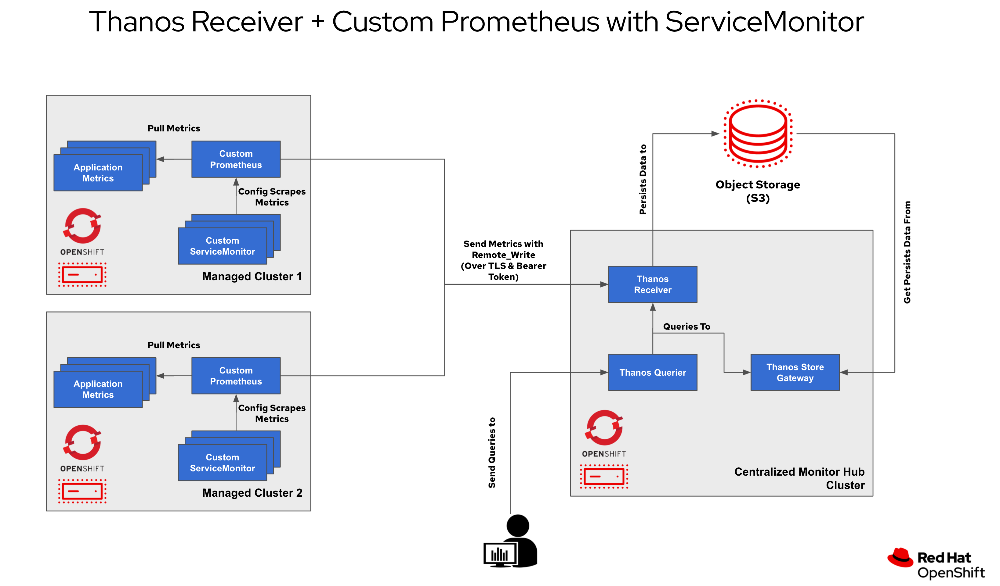
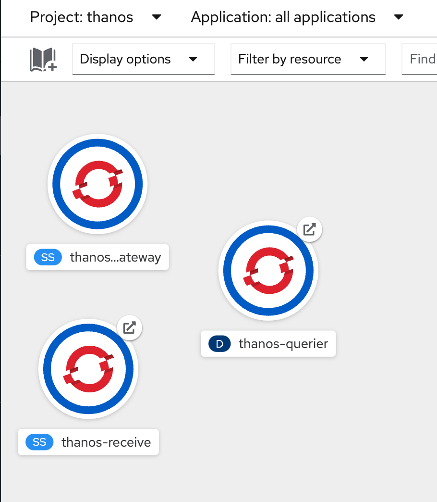
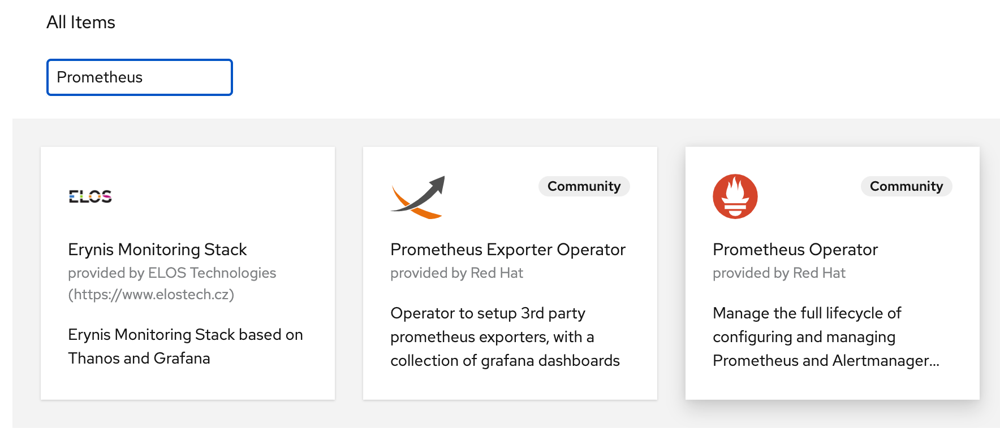
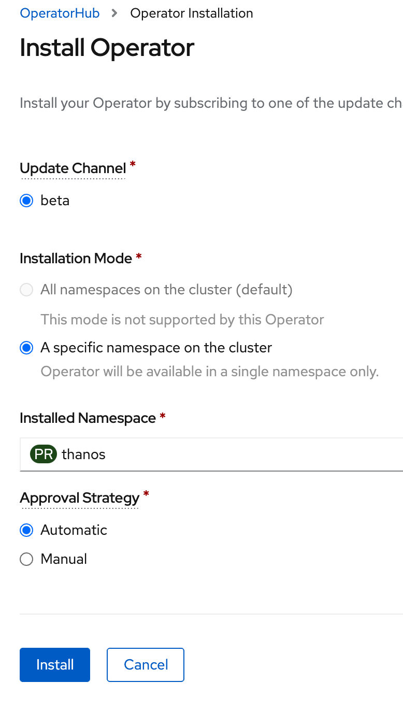
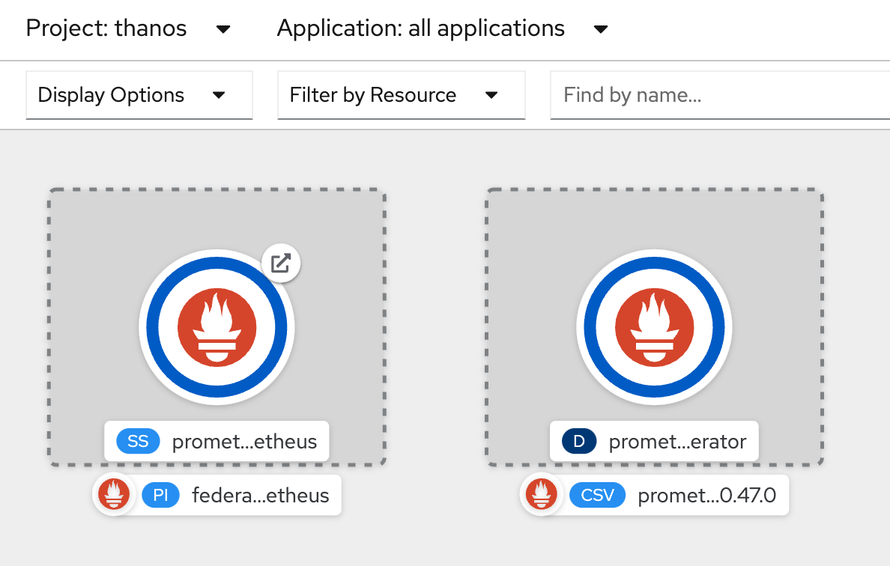
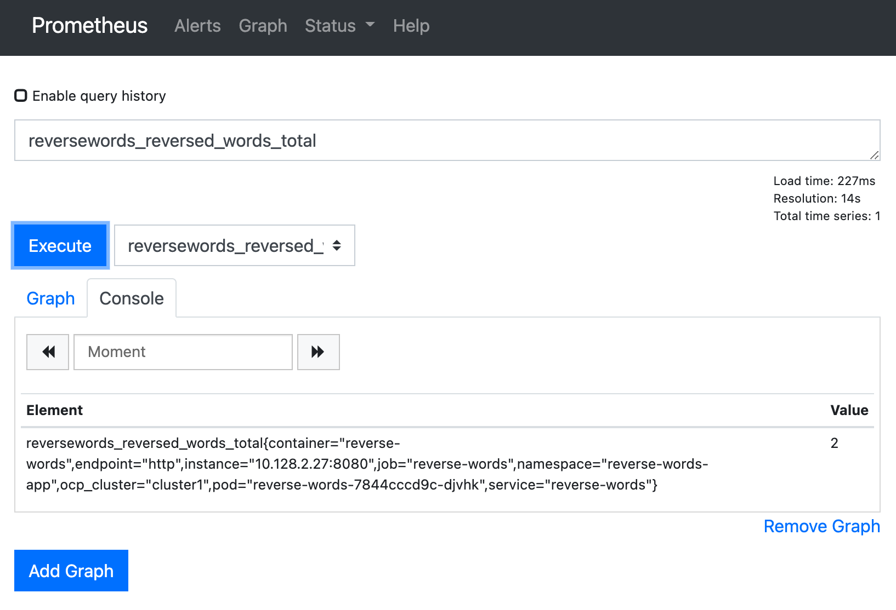
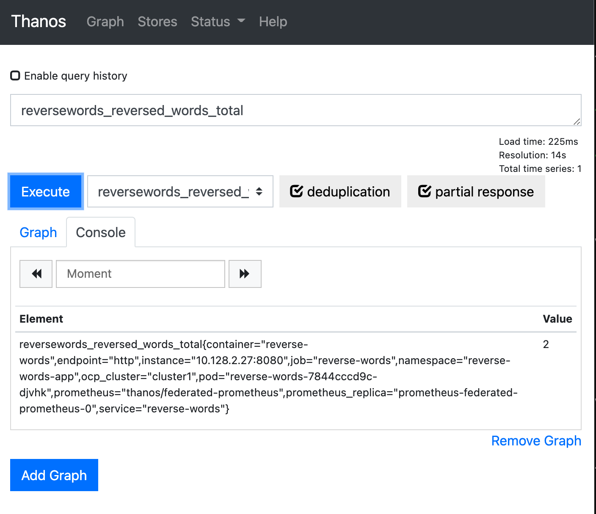

# Managed Multi-Cluster Application Metrics with Prometheus & Thanos
<!-- TOC -->

- [Managed Multi-Cluster Application Metrics with Prometheus & Thanos](#managed-multi-cluster-application-metrics-with-prometheus--thanos)
  - [Overview](#overview)
  - [Prerequisite](#prerequisite)
  - [Create Thanos Store,Thanos Receiver & Thanos Querier at Hub Cluster](#create-thanos-storethanos-receiver--thanos-querier-at-hub-cluster)
  - [Create Prometheus at Managed Cluster](#create-prometheus-at-managed-cluster)
  - [Add ServiceMonitor to Managed Application in Managed Cluster & Test Solution](#add-servicemonitor-to-managed-application-in-managed-cluster--test-solution)
  - [Optional:](#optional)

<!-- /TOC -->

## Overview

Solutions



## Prerequisite

- Centralized Monitor Hub
  - OCP 4.6+
  - rename kube context to 'hub'
    
    ```bash
    oc login --token=xxx --server=https://api.xxx:6443
    oc config rename-context $(oc config current-context) hub
    ```
- Managed Cluster
  - OCP 4.6+
  - renate kube context to 'cluster1'
    ```bash
    oc login --token=xxx --server=https://api.xxx:6443
    oc config rename-context $(oc config current-context) cluster1
    ```
      
- S3 Storage Bucket
  - Run the following command to login to AWS:  
    ```bash
    aws configure
    ```
    and enter your AWS access key, secret key when prompted. Default region: us-east-2 or your required region
  - Then run the following command to create the S3 bucket:  
    ```bash
    aws s3 mb s3://grafana-cck
    ```
  - Please take note of the bucket name. (you can change bucket name)
  - check bucket name with
    ```bash
    aws s3 ls
    2021-07-07 17:02:37 grafana-cck
    2021-07-07 14:27:19 grafana-dw6n5
    ```
  - create [store-s3-secret.yaml](manifest/../manifests/thanos-receive/store-s3-secret.yaml) for thanos receiver
    ```yaml
    type: S3
    config:
        bucket: grafana-cck
        endpoint: s3.amazonaws.com
        region: us-east-2
        access_key: key
        secret_key: secret
        insecure: false
    ```
  - can use another object storage, see detail at https://thanos.io/tip/thanos/storage.md/#supported-clients
    
## Create Thanos Store,Thanos Receiver & Thanos Querier at Hub Cluster
- Create Thanos Store Gateway
  - create namespace 'thanos'
    ```bash
    oc --context hub create namespace thanos
    ```
  - create secret s3 object store
    ```bash
    oc --context hub -n thanos create secret generic store-s3-credentials --from-file=store-s3-secret.yaml
    ```
  - create serviceaccount, add policy for thanos-store-gateway
    ```bash
    oc --context hub -n thanos create serviceaccount thanos-store-gateway
    oc --context hub -n thanos adm policy add-scc-to-user anyuid -z thanos-store-gateway
    ```
  - create thanos store gateway from [store-gateway.yaml](manifest/../manifests/thanos-receive/store-gateway.yaml)
    ```bash
    oc --context hub -n thanos create -f store-gateway.yaml
    oc --context hub -n thanos get pods -l "app=thanos-store-gateway"
    ```
- Create Thanos Receiver
  - create thaos-receive service account
    ```bash
    oc --context hub -n thanos create serviceaccount thanos-receive
    ```
  - create thanos-receive-proxy secret
    ```bash
    oc --context hub -n thanos create secret generic thanos-receive-proxy --from-literal=session_secret=$(head /dev/urandom | tr -dc A-Za-z0-9 | head -c43)
    ```
  - create thanos-receive service account, add policy
    ```bash
    oc --context hub -n thanos annotate serviceaccount thanos-receive serviceaccounts.openshift.io/oauth-redirectreference.thanos-receive='{"kind":"OAuthRedirectReference","apiVersion":"v1","reference":{"kind":"Route","name":"thanos-receive"}}'
    
    oc --context hub -n thanos adm policy add-cluster-role-to-user system:auth-delegator -z thanos-receive    
    ```
  - create thanos-receive from [thanos-receive.yaml](manifest/../manifests/thanos-receive/thanos-receive.yaml)
  - create route, service account cluster1-metrics for managed cluster (cluster1), you can create service account per managed cluster
  - add policy to service account
    ```bash
    oc --context hub -n thanos create -f thanos-receive.yaml
    oc --context hub -n thanos create route reencrypt thanos-receive --service=thanos-receive --port=web-proxy --insecure-policy=Redirect
    oc --context hub -n thanos create serviceaccount cluster1-metrics
    oc --context hub -n thanos adm policy add-role-to-user view -z cluster1-metrics
    ```
- Create Thanos Querier
  - create secret thanos-querier-proxy, service account, thanos-querier from [thanos-querier-thanos-receive.yaml](manifest/../manifests/thanos-receive/thanos-querier-thanos-receive.yaml), route
    ```bash
    oc --context hub -n thanos create secret generic thanos-querier-proxy --from-literal=session_secret=$(head /dev/urandom | tr -dc A-Za-z0-9 | head -c43)

    oc --context hub -n thanos create serviceaccount thanos-querier

    oc --context hub -n thanos create -f thanos-querier-thanos-receive.yaml

    oc --context hub -n thanos annotate serviceaccount thanos-querier serviceaccounts.openshift.io/oauth-redirectreference.thanos-querier='{"kind":"OAuthRedirectReference","apiVersion":"v1","reference":{"kind":"Route","name":"thanos-querier"}}'

    oc --context hub -n thanos create route reencrypt thanos-querier --service=thanos-querier --port=web-proxy --insecure-policy=Redirect
    ```  
- Final Topology
  
  
  
## Create Prometheus at Managed Cluster
- Create Project 'thanos'
  ```bash
  oc --context cluster1 new-project thanos
  ```
- install Prometheus Operator at thanos namespace/project from operatorhub
  - go to OperatorHub, search with 'Prometheus', select Prometheus Operator Community
  
  
  - install to 'thanos' namespace
  
  
- Configuring serving ca to connect to cluster managed prometheus
  
  If Our Prometheus instance needs to connect to the Cluster Managed Prometheus instance in order to gather the cluster-related metrics, this connection uses TLS, so we will use the Serving CA to validate the Targets endpoints (Cluster Managed Prometheus or prometheus-k8s). 

  - The Serving CA is located in the openshift-monitoring namespace, we will create a copy into our namespace so we can use it in our Prometheus instances:
  
    ```bash
    oc --context cluster1 -n openshift-monitoring get configmap serving-certs-ca-bundle -o yaml > serving-certs-ca-bundle.yaml 
    ...
    data:
      service-ca.crt: |
        -----BEGIN CERTIFICATE-----
        MIIDUTCCAjmgAwIBAgIIQxa8rSmYgk4wDQYJKoZIhvcNAQELBQAwNjE0MDIGA1UE
        Awwrb3BlbnNoaWZ0LXNlcnZpY2Utc2VydmluZy1zaWduZXJAMTYyNTU4Njc0NDAe
        Fw0yMTA3MDYxNTUyMjNaFw0yMzA5MDQxNTUyMjRaMDYxNDAyBgNVBAMMK29wZW5z
        ...
        IMB/vwrcn/TNxll2IkHSCWNhYgmx//8KWkzm8O9K6CLhuOpyVGm1p9utSpqL86N7
        P4wBwnN2MUlg1rcdUxfYNmmvnNVIDeBYeMT8BX3TJBh1cX8itwfAWBhrX3dqCtcv
        VusSpajyvYZPOyClYyEaYZ0bKxKZtDRfN0K5ygnVNOYaYrJx4nrapJyD/mMIPK55
        M0oFOBkNSlUFg0wYq5huAo3eldNylgpiLmNOipoYoiJ3aaWBjA==
        -----END CERTIFICATE-----
    ...
    ```
  - copy data section from above command, and create this configmap in thanos namespace (create file serving-certs-ca-bundle.yaml)
    
    ```yaml
    apiVersion: v1
    kind: ConfigMap
    metadata:
      name: serving-certs-ca-bundle
      namespace: thanos
    data:
      service-ca.crt: |
        -----BEGIN CERTIFICATE-----
        MIIDUTCCAjmgAwIBAgIIQxa8rSmYgk4wDQYJKoZIhvcNAQELBQAwNjE0MDIGA1UE
        Awwrb3BlbnNoaWZ0LXNlcnZpY2Utc2VydmluZy1zaWduZXJAMTYyNTU4Njc0NDAe
        Fw0yMTA3MDYxNTUyMjNaFw0yMzA5MDQxNTUyMjRaMDYxNDAyBgNVBAMMK29wZW5z
        aGlmdC1zZXJ2aWNlLXNlcnZpbmctc2lnbmVyQDE2MjU1ODY3NDQwggEiMA0GCSqG
        SIb3DQEBAQUAA4IBDwAwggEKAoIBAQDLirU9u8CyUGd5tQD2LFUm/AmwikIEfVuU
        ...
        lMat1w6COcYwJN7nAwqCnyIjOQSVNl4cp8Oxjwv/NA/w+opmag850hSHmhZzEqKW
        IMB/vwrcn/TNxll2IkHSCWNhYgmx//8KWkzm8O9K6CLhuOpyVGm1p9utSpqL86N7
        P4wBwnN2MUlg1rcdUxfYNmmvnNVIDeBYeMT8BX3TJBh1cX8itwfAWBhrX3dqCtcv
        VusSpajyvYZPOyClYyEaYZ0bKxKZtDRfN0K5ygnVNOYaYrJx4nrapJyD/mMIPK55
        M0oFOBkNSlUFg0wYq5huAo3eldNylgpiLmNOipoYoiJ3aaWBjA==
        -----END CERTIFICATE-----
    ```
    ```bash
    oc --context cluster1 -n thanos apply -f serving-certs-ca-bundle.yaml
    ```
- Create Prometheus Instance in Manage Cluster
  - create cluster role from [cluster-role.yaml](manifests/thanos-receive/cluster-role.yaml)
  - create secret metrics-bearer-token for call thanos receiver on hub cluster
  - create secret prometheus-k8s-proxy with session_secret
  - add oauth to service account prometheus-k8s
  - edit [prometheus-thanos-receive.yaml](manifest/../manifests/thanos-receive/prometheus-thanos-receive.yaml) with Thanos reciever hostname
  - create prometheus with [prometheus-thanos-receive.yaml](manifest/../manifests/thanos-receive/prometheus-thanos-receive.yaml)
  - create route for prometheus
    ```bash
    oc --context cluster1 -n thanos create -f cluster-role.yaml

    oc --context cluster1 -n thanos create secret generic metrics-bearer-token --from-literal=metrics_bearer_token=$(oc --context hub -n thanos serviceaccounts get-token cluster1-metrics)

    oc --context cluster1 -n thanos create secret generic prometheus-k8s-proxy --from-literal=session_secret=$(head /dev/urandom | tr -dc A-Za-z0-9 | head -c43)

    oc --context cluster1 -n thanos annotate serviceaccount prometheus-k8s serviceaccounts.openshift.io/oauth-redirectreference.prometheus-k8s='{"kind":"OAuthRedirectReference","apiVersion":"v1","reference":{"kind":"Route","name":"federated-prometheus"}}'

    THANOS_RECEIVE_HOSTNAME=$(oc --context hub -n thanos get route thanos-receive -o jsonpath='{.status.ingress[*].host}')

    sed -i.orig "s/<THANOS_RECEIVE_HOSTNAME>/${THANOS_RECEIVE_HOSTNAME}/g" prometheus-thanos-receive.yaml

    oc --context cluster1 -n thanos create -f prometheus-thanos-receive.yaml

    oc --context cluster1 -n thanos create route reencrypt federated-prometheus --service=prometheus-k8s --port=web-proxy --insecure-policy=Redirect
    ```
- Final Topology
  
  
    
## Add ServiceMonitor to Managed Application in Managed Cluster & Test Solution
- Create Sample Application
- Create ServiceMonitor for Sample App with [service-monitor-reversewords-cluster1.yaml](manifest/../manifests/thanos-receive/service-monitor-reversewords-cluster1.yaml)
  ```bash
  oc --context cluster1 create namespace reverse-words-app

  oc --context cluster1 -n reverse-words-app create -f reversewords.yaml

  oc --context cluster1 -n reverse-words-app create route edge reverse-words --service=reverse-words --port=http --insecure-policy=Redirect

  oc --context cluster1 -n thanos create -f service-monitor-reversewords-cluster1.yaml
  ```
- Test Call App and Metrics, Change URL to your application route
  ```bash
  curl -ks https://reverse-words-reverse-words-app.apps.cluster-ab02.ab02.example.opentlc.com/ -X POST -d '{"word": "PALC"}'
  
  {"reverse_word":"CLAP"}
  
  curl -ks https://reverse-words-reverse-words-app.apps.cluster-ab02.ab02.example.opentlc.com/metrics | grep reversewords_reversed_words_total

  # HELP reversewords_reversed_words_total Total number of reversed words
  # TYPE reversewords_reversed_words_total counter
  reversewords_reversed_words_total 1

  curl -ks https://reverse-words-reverse-words-app.apps.cluster-ab02.ab02.example.opentlc.com/ -X POST -d '{"word": "chatchai"}'
  
  {"reverse_word":"iahctahc"}
  
  curl -ks https://reverse-words-reverse-words-app.apps.cluster-ab02.ab02.example.opentlc.com/metrics | grep reversewords_reversed_words_total

  # HELP reversewords_reversed_words_total Total number of reversed words
  # TYPE reversewords_reversed_words_total counter
  reversewords_reversed_words_total 2

  ```

- open prometheus at cluster1, query with reversewords_reversed_words_total
  
- open thanos at hub, query with reversewords_reversed_words_total
  

## Optional: 
- Federate data from openshift-monitoring
  - create service monitr for openshift-monitoring from [service-monitor-cluster1.yaml](manifest/../manifests/thanos-receive/service-monitor-cluster1.yaml)
  - use /federate for gathering metrics to thanos
  - add cluster-monitoring-view to prometheus-k8s serviceaccount
    ```bash 
    oc --context cluster1 -n thanos create -f service-monitor-cluster1.yaml

    oc adm policy add-cluster-role-to-user cluster-monitoring-view \
    -z prometheus-k8s -n thanos

    oc adm policy add-cluster-role-to-user cluster-monitoring-view \
    -z prometheus-operator -n thanos
    ```

- config for see write data to s3
  - at thanos receive in hub cluster
  - change log level with '--log.level=debug'
  - add block duration min/max
  - see flag info at: https://thanos.io/tip/components/receive.md/#flags
  ```yaml
    - receive
    - '--tsdb.path=/data/remote-write-receive-data'
    - '--debug.name=receive'
    - '--tsdb.min-block-duration=5m'
    - '--tsdb.max-block-duration=5m'
    - '--log.level=debug'
    - '--grpc-address=0.0.0.0:19891'
    - '--http-address=0.0.0.0:18091'
    - '--remote-write.address=0.0.0.0:19291'
    - '--objstore.config-file=/etc/prometheus/store-s3-secret.yaml'
    - '--receive.replication-factor=1'
    - '--label=receive_cluster="eu1"'
  ```
  
- delete data on aws s3
  ```bash
  aws s3 rm --recursive s3://your_bucket_name
  ```